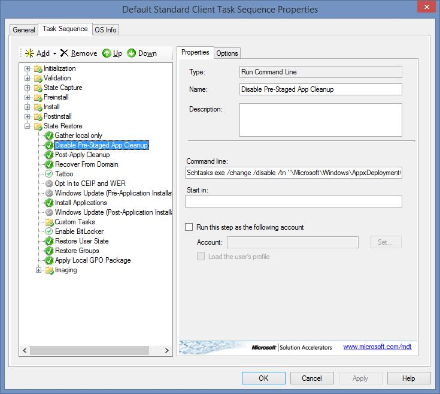
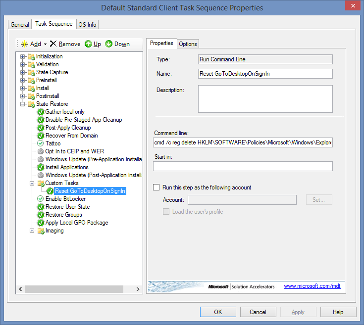

---

title: "Release notes"
titleSuffix: "MDT 2013 release notes"
description: "Understand prerequisites and limitations of Microsoft Deployment Toolkit 2013. "
ms.date:  09/09/2016
ms.prod: configuration-manager
ms.technology:
  - configmgr-osd
ms.topic: article
ms.assetid:  6e32ce6d-585d-4801-a345-ff0f6f2d90ad

author: aczechowski  
ms.author: aaroncz 
manager: angrobe

---


# Microsoft Deployment Toolkit 2013 Release Notes  
 Welcome to the release notes for Microsoft® Deployment Toolkit (MDT) 2013. Read these release notes thoroughly before you install MDT 2013, as they contain information you need to successfully install the toolkit that the MDT 2013 help documentation may not cover.  

 This release supports the deployment of the Windows 8.1, Windows 8, Windows 7, Windows Thin PC, Windows Embedded POSReady 7 (POSReady 7), Windows Server 2012 R2, Windows Server 2012, and Windows Server 2008 R2 operating systems. See the Microsoft Deployment Toolkit Documentation Library, which is included with MDT 2013, for the complete documentation for this release.  

> [!NOTE]
>  In this document, *Windows* applies to the Windows 8.1, Windows 8, Windows 7, Windows Server 2012 R2, Windows Server 2012, and Windows Server 2008 R2 operating systems unless otherwise noted. MDT does not support ARM processor–based versions of Windows. Similarly, *MDT* refers to MDT 2013 unless otherwise stated.  

## Prerequisites  
 For Lite Touch Installation (LTI) deployments, MDT requires the following components:  

 To install MDT on:  

-   Windows 7 or Windows Server 2008 R2 install or enable the following components on the computer on which you install MDT:  

    -   Microsoft Management Console version 3.0  

    -   Microsoft .NET Framework  3.5 with Service Pack 1 (SP1)  

    -   Windows PowerShell™ version 2.0  

    -   Windows Assessment and Deployment Kit (ADK) for Windows 8.1 (Deployment Tools, Windows PE, and User State Migration Tool components)  

-   Windows 8.1, Windows 8, Windows Server 2012 R2, or Windows Server 2012, install or enable the following components on the computer on which you install MDT:  

    -   Windows ADK for Windows 8.1 (Deployment Tools, Windows PE, and User State Migration Tool components)  

    -   Microsoft .NET Framework  4.0 (which is included in the operating system)  

    -   Windows PowerShell version 3.0 (which is included in the operating system)  

 For Zero Touch Installation (ZTI) deployments, MDT requires the following components:  

-   Microsoft System Center 2012 R2 Configuration Manager  

> [!NOTE]
>  See the Configuration Manager product documentation for additional requirements.  

 For User-Driven Installation (UDI) deployments, MDT requires the following components:  

-   Microsoft System Center 2012 R2 Configuration Manager  

-   Microsoft System Center 2012 Configuration Manager  

-   Microsoft System Center Configuration Manager 2007 R3  

> [!NOTE]
>  See the Configuration Manager product documentation for additional requirements.  

 To initiate Microsoft System Center 2012 R2 Orchestrator runbooks using MDT, install the [ADO.NET Data Services Update for .NET Framework 3.5 SP1 for Windows 7 and Windows Server 2008 R2](http://www.microsoft.com/download/details.aspx?displaylang=en&id=2343).  

## Installing MDT  
 Make sure you have a complete backup of your server before installing MDT on a computer that has an existing installation of MDT.  

 The MDT installation process removes any existing instances of MDT installed on the same computer. Existing deployment shares, distribution points, and databases are preserved during this process but must be upgraded when the installation is complete.  

### Support for Upgrading from Previous Versions of MDT  
 MDT 2013 supports upgrading from the following versions of MDT:  

-   MDT 2012 Update 1  

> [!NOTE]
>  Create a backup of the existing MDT infrastructure before attempting an upgrade.  

### USMT Download Requirements  
 You no longer need to separately download the Windows User State Migration Tool (USMT). USMT version 6 is a part of the Windows ADK for Windows 8.1. USMT 6 supports capturing user state from all versions of Windows 8.1, Windows 8 and Windows 7.  

### The LTI Upgrade Process  
 After installing MDT, you can upgrade an existing deployment share by running the Open Deployment Share Wizard from the Deployment Shares node in the Deployment Workbench. Specify the path to the existing deployment share directory, and then select the **Upgrade** check box. Note that doing so also upgrades existing network deployment shares and media deployment shares, so those should be accessible. Do not perform this upgrade while performing deployments, because in-use files can cause upgrade problems.  

### The ZTI Upgrade Process  
 Existing MDT task sequences present in System Center 2012 Configuration Manager are not modified during the installation process of MDT and should continue to work without any issue. No mechanism is provided to upgrade these task sequences. If you want to use any of the new MDT capabilities, create new task sequences.  

 When the upgrade process is complete:  

-   **Run the Configure ConfigMgr Integration Wizard.** You must run this wizard after the upgrade to register the new components and install the updated ZTI task sequence templates.  

-   **Ensure that you create a new Microsoft Deployment Toolkit Files package for any new ZTI task sequences you create.** You can use the existing Microsoft Deployment Toolkit Files package for any ZTI task sequences created prior to the upgrade, but you must create a new Microsoft Deployment Toolkit Files package for new ZTI task sequences.  

## Known Issues  
 The known issues in MDT 2013 are categorized as follows:  

-   For general issues, as described in [Known General Issues](#KnownIssue)  

-   For LTI deployments only, as described in [Known Issues for LTI Deployments Only](#KnownIssuesLTI)  

-   For LTI and ZTI deployments, as described in [Known Issues for LTI and ZTI Deployments](#KnownIssuesLTIZTI)  

-   For UDI deployments, as described in [Known Issues for UDI Deployments](#KnownIssuesUDI)  

###  <a name="KnownIssue"></a> Known General Issues  
 The following issues are not specific to any deployment method.  

#### Compiled HTML help files are not up to date  
 All compiled HTML help files (.CHM) included with MDT 2013, including “Microsoft Deployment Toolkit Documentation Library.chm” and “Release Notes.chm” are current as of the MDT 2012 Update 1 release. All “Help” links in the Deployment Workbench will open content in these files.  

 WORKAROUND: This document contains the release notes for MDT 2013 and supersedes “Release Notes.chm” in the installation directory.  

 An updated MDT Documentation Library in Microsoft Word format is planned to be available from the Microsoft Download Center.  

#### Modifying key task sequence steps can lead to unpredictable results  
 Modifying the **Install Operating System** task sequence step or the **Apply Operating System Image** task sequence step after the creation of the task sequence step can lead to unpredictable results. For example, if you create a task sequence to deploy a 32-bit Windows 7 image, and then later change the **Install Operating System** task sequence step or the **Apply Operating System Image** task sequence step to reference a 64-bit Windows 7 image, the task sequence may not run successfully.  

 WORKAROUND: Create a new task sequence to deploy a different operating system image.  

#### Domain join fails when an organizational unit (OU) contains special characters  
 Domain join fails when an organizational unit (OU) contains special characters in Unicode format. If the OU name has spaces, the methods described below should function properly. If the OU has other characters, such as language-specific characters, replace the characters with their ANSI equivalent character. For example, you would change Cońtoso to Contoso.  

 WORKAROUND: Select one of the following methods to resolve this problem:  

-   Use the **MachineObjectOU** property, as shown in the following example, to specify the organizational unit for the computer in the CustomSettings.ini file or in the MDT database (MDT DB).  

    ```  
    [Settings]   
    Priority=MacAddress, Default   
    Properties=MyCustomProperty   

    [Default]   
    OSinstall=Y  

    [00:15:1d:ee:2a:aa]   
    OSDComputername=WDG-CLI-01   
    MachineObjectOU=OU=HelpDesk,OU=Corp,DC=Woodgrovebank,DC=com  
    ```  

-   Use the **DomainOUs** property, as shown in the following example, to create a list of OUs in the CustomSettings.ini file or in the MDT DB that can be selected in the Deployment Wizard.  

    ```  
    [Settings]   
    Priority=MacAddress, Default   
    Properties=MyCustomProperty   

    [Default]  
    OSInstall=Y  
    SkipAppsOnUpgrade=YES  
    SkipCapture=YES  
    SkipAdminPassword=NO  
    SkipProductKey=YES  
    DoCapture=YES  
    DomainOUs1=OU=Users,OU=Corp,DC=Woodgrovebank,DC=com   
    DomainOUs2=OU=HelpDesk,OU=corp,DC=Woodgrovebank,DC=com  
    ```  

-   Use the DomainOUList.xml file, as shown in the following example, to create a list of OUs that can be selected in the Deployment Wizard.  

    ```  
    <?xml version="1.0" encoding="utf-8"?>   
    <DomainOUs>   
       <DomainOU>   
          OU=Users,OU=Corp,DC=Woodgrovebank,DC=com  
       </DomainOU>   
       <DomainOU>   
         OU=HelpDesk,OU=corp,DC=Woodgrovebank,DC=com  
       </DomainOU>   
    </DomainOUs>  
    ```  

     You can create the DomainOUList.xml file using any XML editor. Place the DomainOUList.xml file in the Scripts folder in a deployment share for LTI or in the MDT Files package for ZTI and UDI.  

#### Configure ADDS step does not have an option for Windows Server 2012 domain and forest functional levels  
 When configuring Advanced options for the "Configure ADDS" step the Forest Functional Level and Domain Functional Level lists do not have an option for Windows Server 2012.  

 WORKAROUND: Set DomainLevel=5 and/or ForestLevel=5 in CustomSettings.ini. See the Toolkit Reference for more details on these settings.  

#### GPO Packs do not exist  
 The Security Compliance Manager (SCM) GPO Packs are not included with MDT 2013. The "Apply Local GPO Package" step (ZTIApplyGPOPack.wsf) will log an entry similar to one of the following:  

 “The GPO Pack Path – Templates\GPOPacks\ is not valid. The GPO was not applied.”  

 “Default MDT GPO Pack not present for this operating system.”  

 WORKAROUND: Create the GPOPacks subfolder under Templates in the deployment share (for example, C:\DeploymentShare\Templates\GPOPacks). Export a GPO backup from SCM or GPMC and then add the following files from SCM:  

-   GPOPack.wsf  

-   LocalPol.exe  

-   LocalSecurityDB.sdb  

 Create a subfolder under GPOPacks and copy this content. Then specify the directory name in the GPOPackPath property in CustomSettings.ini.  

#### The Configuration Manager console will crash if MDT is uninstalled without removing the console extensions.  
 When running **Configure ConfigMgr Integration**, if you uncheck the option **Remove the MDT extensions for Configuration Manager 2012**, the following error will occur when trying to launch the Configuration Manager console:  

```  
Couldn’t load sqmapi.dll from bin\x86\sqmapi.dll. Last Error = (126)  
```  

 WORKAROUND: None  

#### OOBE settings missing from Windows 8.1 Unattend.xml template  
 Windows 8.1 task sequences use an older Unattend.xml template that does not include several properties in the <OOBE\> section, such as HideWirelessSetupInOOBE, which can require manual interaction with deployments on systems with wireless network adapters.  

 WORKAROUND: Add the following entries to the <OOBE\> section of the Unattend.xml for Windows 8.1 task sequences.  

```  
<OOBE>  
    <HideEULAPage>true</HideEULAPage>  
    <NetworkLocation>Work</NetworkLocation>  
    <ProtectYourPC>1</ProtectYourPC>  
    <HideLocalAccountScreen>true</HideLocalAccountScreen>  
    <HideOnlineAccountScreens>true</HideOnlineAccountScreens>  
    <HideWirelessSetupInOOBE>true</HideWirelessSetupInOOBE>  
</OOBE>  
```  

#### Some features are listed incorrectly for Windows 8.1  
 When using the **Install Roles and Features** or **Uninstall Roles and Features** steps and selecting Windows 8.1 the following issues apply:  

-   **Internet Explorer 10 (x86)**, which refers to the Internet-Explorer-Optional-x86 feature, and **Internet Explorer 10 (amd64)**, which refers to the Internet-Explorer-Optional-amd64 feature, is displayed on Windows 8.1 as “Internet Explorer 11.”  

-   The **Work Folders Client** (WorkFolders-Client) is not included in the list.  

 WORKAROUND: The Internet Explorer 10… selections can still be used but will enable or disable Internet Explorer 11, instead of Internet Explorer 10 as listed.The Work Folders Client must be enabled or disabled in a separate **Run Command Line** step using DISM, for example:  

```  
Dism /online /Enable-Feature /FeatureName:WorkFolders-Client  
```  

###  <a name="KnownIssuesLTI"></a> Known Issues for LTI Deployments Only  
 The following is a list of known issues that relate to LTI deployments only.  

#### Check for Updates downloads an older list of components  
 In the Deployment Workbench, Information Center, Components node, selecting **Check for Updates** from the **Action** menu will download an older version of bddmanifest.cab, reverting the component manifest (ComponentList.xml) to an older version.  

 WORKAROUND: Do not use **Check for Updates**; this feature is deprecated and will be removed in the future.  

#### Windows 8.1 AppX cleanup maintenance task can affect Sysprep  
 After installing Windows 8.1 a built-in maintenance task, Pre-Staged App Cleanup, will run after 60 minutes of machine use, followed by 15 minutes of machine idle time. If Sysprep is run following completion of this maintenance task, it will generate warnings in the setupact.log for Sysprep. If this image is then captured and deployed, the end-user experience may be adversely affected. Specifically resource packs based on Language, Scale and DXFL which were not installed for the current user accounts will be deleted. If this image is deployed to a machine where those resource packages are applicable, they must be installed as an update via the Store or through an enterprise side-loading mechanism.  

 WORKAROUND: There are two options to mitigate this issue. First, ensure that Sysprep is run within 75 minutes of completing the installation of Windows 8.1. Second, if you cannot ensure that Sysprep will run within 75 minutes of completing the installation of Windows 8.1, disable the maintenance task.  

 To automatically disable the maintenance task as part of the MDT build and capture task sequence, immediately following the **Gather local only** step in the **State Restore** group insert a new **Run Command Line** step with the following command line:  

```  
Schtasks.exe /change /disable /tn "\Microsoft\Windows\AppxDeploymentClient\Pre-staged app cleanup"  
```  

 For Example,  

   

 This step should only be added to task sequences that are running Sysprep on Windows 8.1. Windows will automatically re-enable the maintenance task during the Sysprep generalize phase.  

#### Existing databases will retain 50 character application names when upgrading to MDT 2013  
 MDT 2013 includes a change to the database to extend the application name field from 50 to 255 characters. A new database in MDT 2013 will use the 255 character field length. An existing database upgraded from MDT 2012 Update 1 to MDT 2013 will retain the 50 character field length.  

 WORKAROUND: After upgrading to MDT 2013 manually alter the database table with the following SQL commands:  

```  
ALTER TABLE [dbo].[Settings_Applications]   
ALTER COLUMN [Applications] [nvarchar] (256)  
```  

#### The deployment will fail on a legacy BIOS system if BitLocker is enabled and a data partition is created  
 If the deployment enables BitLocker, the default “Format and Partition Disk” step in the task sequence is edited to include an additional data partition (for example, OSDisk [primary] 60%, Data [primary] 100%), and the task sequence is deployed to a legacy BIOS system, the deployment will fail to boot into Windows with the error:  

```  
Boot Device Not Found  
Please install an OS on your hard disk  
Hard Disk - (3F0)  
```  

 WORKAROUND: None  

#### Provisioning of Windows Store applications does not include dependencies  
 Dependencies configured for a Windows Store application (.appx) will not be installed when the task sequence installs applications.  

 WORKAROUND: Directly install the application dependencies in the task sequence.  

#### GPT drives are partitioned as MBR  
 A drive is configured to use the GUID Partition Table (GPT) disk partitioning system in the **Format and Partition Disk** task sequence step but is deployed using the Master Boot Record (MBR) disk partitioning system, instead. This issue can be caused on computers with BIOS that have second drives that are larger than 2 GB and require a GPT partitioning system.  

 WORKAROUND: perform the following steps:  

1.  In the task sequence you want to modify, in the **Preinstall** group, in the **New Computer only** group, immediately before the **Format and Partition Disk** task sequence step for the disk in question, create a task sequence step based on the **Set Task Sequence Variable** task sequence type to force the use of the GPT disk partition system using the following information.

    |For this setting|Use this value|  
    |-|-|  
    |Name|Force Use of GPT Disk Partition System|  
    |Description|Force the following Format and Partition Disk task sequence step to use the GPT disk partition system.|  
    |Task Sequence Variable|OSDDiskType|  
    |Value|GPT|  

2.  Immediately after the **Format and Partition Disk** task sequence step, identified in the previous step, create a task sequence step based on the **Set Task Sequence Variable** task sequence type to reset the use of the GPT disk partition system using the following information.

    |For this setting|Use this value|  
    |-|-|  
    |Name|Reset Use of GPT Disk Partition System|  
    |Description|Allow any subsequent Format and Partition Disk task sequence steps to use the disk partition system specified by the BIOS.|  
    |Task Sequence Variable|OSDDiskType|  
    |Value||  

    > [!NOTE]
    >  Leave the value for the **OSDDiskType** property entered in **Value** blank.  

#### Domain join fails due to default variable values  
 When skipping the input of domain membership values on the **Computer Details** wizard page in the Deployment Wizard (using the **SkipDomainMembership** property), the values for the **DomainAdminDomain**, **DomainAdminUser**, and **DomainAdminPassword** properties are set to default values and the target computer is unable to property join the domain. This issue can be caused by not adding values for these properties in the CustomSettings.ini file or the MDT DB.  

 WORKAROUND: Specify at least one of the following properties in the CustomSettings.ini file or the MDT DB:  

-   **DomainAdminDomain**  

-   **DomainAdminUser**  

-   **DomainAdminPassword**  

 For example, consider the following excerpt from a CustomSettings.ini file:  

```  
SkipDomainMembership=YES  
DomainAdminDomain=Contoso  
JoinDomain=Contoso.com  
```  

 Specifying any one of these properties will allow the user to input domain membership values on the **Computer Details** wizard page in the Deployment Wizard.  

> [!NOTE]
>  You can also fully bypass the **Computer Details** wizard page by specifying all of the properties listed above in the CustomSettings.ini file or the MDT DB. For more information, see the section, "Providing Properties for Skipped Deployment Wizard Pages," in the MDT document *Toolkit Reference*.  

#### User data may not be restored from USB  
 User state migration data may not be restored when saving the user state migration data to a USB drive. This is caused by a change to the drive letter for the USB drive during the deployment process.  

 WORKAROUND: None  

#### User mapped network drive Z: is not restored  
 User desktop background and no network drives are restored in the Refresh Computer deployment scenario. This can be caused when the user has a network drive mapped to drive Z. After completing the **Deployment Summary** dialog box, the user desktop background will be restored. However, the user may need to recreate the mapping to drive Z.  

 WORKAROUND: None  

#### Bare-metal deployment fails with “fixed disk” USB flash drive on UEFI system  
 When performing a bare-metal, media-based deployment on a Unified Extensible Firmware Interface (UEFI) system using a newer USB flash drive (UFD) that is detected as a “fixed disk” the UFD is detected as Disk 1 (initially assigned the drive letter C) and the internal hard disk is Disk 0. After the internal hard disk is partitioned and formatted, drive letters are reassigned such that the OSDisk is C and the UFD is W. The deployment will fail on the Copy Script step.  

 WORKAROUND: Restart the system and start a new deployment. The OSDisk will be assigned the drive letter C, the UFD will be assigned D, and the deployment will continue successfully.  

#### LTI progress on the Windows 8.1 Desktop is not visible from the Start screen  
 A lite touch installation (LTI) will automatically logon as the local administrator to continue the task sequence, however Windows 8.1 will, by default, logon to the Start screen. LTI successfully starts at logon as expected, but the progress indicator is only displayed on the Desktop.  

 WORKAROUND: There are two possible workarounds. First, a user on the console can click the Desktop icon on the Start screen to view LTI progress.  

 Second, the following command can be added to the Unattend.xml FirstLogonCommands section to temporarily enable the group policy setting, **Go to the desktop instead of Start when signing in**.  

```  
<FirstLogonCommands>  
  <SynchronousCommand wcm:action="add">  
    <CommandLine>wscript.exe %SystemDrive%\LTIBootstrap.vbs</CommandLine>  
    <Description>Lite Touch new OS</Description>  
    <Order>1</Order>  
  </SynchronousCommand>  
  <SynchronousCommand wcm:action="add">  
    <CommandLine>cmd /c reg add "HKEY_LOCAL_MACHINE\SOFTWARE\Policies\Microsoft\Windows\Explorer" /v GoToDesktopOnSignIn /t REG_DWORD /d 00000001 /f </CommandLine>  
    <Description>GoToDesktopOnSignIn</Description>  
    <Order>2</Order>  
  </SynchronousCommand>   </FirstLogonCommands>  
```  

> [!NOTE]
>  only the **second** SynchronousCommand element is added; the first will already exist in the Unattend.xml template  

 Another mechanism must also be used to later remove this temporary setting, such as Active Directory group policy, or by removing the registry key later in the task sequence. For example,  

   

### Known Issues for All Configuration Manager Deployments  
 The following is a list of known issues that relate to ZTI or UDI deployments that use System Center 2012 R2 Configuration Manager:  

#### Default OS image installed to D: drive  
 Importing the default OS image (install.wim) and deploying with a ZTI task sequence will cause Windows to be installed on the D: drive instead of the standard C: drive.  

 WORKAROUND: Set the OSDPreserveDriveLetter task sequence variable to a blank value instead of the default False.  

#### BitLocker tasks fails during ZTI  
 The **UILanguage** task sequence variable must be set when using ZTIBde.wsf in a ZTI task sequence. Otherwise, ZTIBde.wsf will fail.  

 WORKAROUND: None  

#### The task sequence fails when local administrator accounts exist  
 Refreshing a computer using ZTI and UDI task sequences fails when local admin accounts are present on the computer. Task sequences also fail when the default **Capture User State** step has **Capture all user profiles with standard options** selected but the default **Restore User State** step has the **Restore local computer user profiles** check box cleared and Configuration Manager cannot migrate the new accounts without assigning them passwords.  

 WORKAROUND: Manually modify the task sequence, selecting the option to migrate local accounts, and specify a password to be used with the local account. For details, see [Capture User State](http://technet.microsoft.com/library/bb680924.aspx).  

### Known Issues for ZTI Deployments Only  
 The following is a list of known issues that relate to ZTI deployments only.  

#### Installing Chinese Windows 7 prompts for user input  
 When deploying Windows 7 with Chinese language, the installation process stops waiting for user input. This is caused by an error in the Lang.ini file in Windows 7.  

 WORKAROUND: Update the Lang.ini file as show below.  

 Original Lang.ini file:  

```  
[Available UI Languages]  
zh-CN = 3  

[Fallback Languages]  
zh-CN = en-us  
```  

 Lang.ini file after modification:  

```  
zh-CN = 2  
en-us = 3  

[Fallback Languages]  
zh-CN = en-us  
```  

#### Restore User State step is skipped during replace scenario  
 In a Replace Computer deployment scenario, the **Restore User State** task sequence step is skipped if the **OSDStateStorePath** property is set to a valid local or Universal Naming Convention path.  

 WORKAROUND: Set the **USMTLocal** property to TRUE. Doing so forces ZTI UserState.wsf to recognize the path in the **OSDStateStorePath** property. This is caused by the Request State Store task sequence step being skipped and the previous value in the **OSDStateStorePath** property being retained.  

#### The task sequence may fail with separate System or Active partitions  
 Windows will not assign a drive letter to the System or Active partition if that drive is different from the drive on which the operating system is located. If the largest partition is also the System or Active partition, the task sequence may fail to resume in the new operating system.  

 WORKAROUND: Ensure that the System or Active partition is not bigger than the operating system partition if using multiple partitions.  

#### USMT /TargetWindows7 switch fails in offline scenario  
 The following error occurs in the scanstate.log when performing the MDT Refresh Computer deployment scenario using ZTI while capturing user state information using the offline migration feature of USMT:  

```  
USMT error code 27: [gle=0x00000006]  
```  

 WORKAROUND: None; this is a known issue with USMT.  

#### Configure ADDS step does not save correctly  
 Using the **Configure ADDS** step, Advanced properties, to set the Forest and Domain Functional Levels to Windows Server 2003 or Windows Server 2008 R2 will result in the functional levels set to Windows Server 2008.  

 WORKAROUND: Set DomainLevel=5 and/or ForestLevel=5 in CustomSettings.ini. See the Toolkit Reference for more details on these settings.  

#### Server task sequence template fails on UEFI system  
 When using the MDT 2013 server task sequence template integrated in System Center 2012 R2 Configuration Manager, deployments will fail on some Unified Extensible Firmware Interface (UEFI) systems when running the **Format and Partition Disk (UEFI)** step with an application error in OsdDiskPart.exe similar to the following: “The instruction at 0x6e2c8374 referenced memory at 0x00000120. The memory could not be read. Click on OK to terminate the program.”  

 WORKAROUND: None with ZTI scenario. LTI or ConfigMgr-only scenarios work.  

###  <a name="KnownIssuesLTIZTI"></a> Known Issues for LTI and ZTI Deployments  
 The following is a list of known issues that relate to both LTI and ZTI deployments.  

#### Roles and features requiring multiple restarts cause problems for task sequences  
 Installing roles or features such as **MICROSOFT-HYPER-V-ALL** or **RDS-RD-SERVER** which require multiple restarts, or are dependent upon such roles or features can cause problems during the task sequence and should be avoided.  

 WORKAROUND: Install the desired role or feature on a reference computer and capture an image that has the desired role or feature already installed.  

#### Multiple logs created during deployment  
 During the Scanstate and Loadstate processes, multiple copies of log files may be created, for example, BDD.log, BDD(1).log, ZTIUserstate.log, and ZTIUserstate(1).log.  

 WORKAROUND: Excluding the log files or log directories while running Scanstate and Loadstate.  

###  <a name="KnownIssuesUDI"></a> Known Issues for UDI Deployments  
 The following is a list of known issues that relate to UDI deployments.  

#### UDI Wizard hides No Data option on User State page in Capture Mode  
 The UserState page cannot be customized with the “No Data” radio button when it is in Capture mode.  

 WORKAROUND: Open the wizard config file with Notepad and add the following property to the “Select Target” page section that runs in Capture Mode:  

```  
<Setter Property="DisplayNoDataInCaptureMode">true</Setter>  
```  

 For example,  

```  
<Setter Property="DataSourceText">Please select a location where user data will be captured.</Setter>  
<Setter Property="Format">disable</Setter>  
<Setter Property="FormatPrompt">disable</Setter>  
<Setter Property="MinimumDriveSize">10</Setter>  
<Setter Property="State">Capture</Setter>  
<Setter Property="NetworkDrive">n:</Setter>  
<Setter Property="DisplayNoDataInCaptureMode">true</Setter>  
```  

 To hide the “No Data” radio button either set the above value to false or remove the entry.  

#### The time and currency language format is not configured  
 The time and currency language format is not configured properly on a target computer, even though the correct language was selected in the **Time and currency format (Locale)** list on the **Language** UDI Wizard page. This issue can be caused by an error in the UDIWizard.wsf file. The UDIWizard.wsf file is located in the *mdt_files*\Scripts folder (where *mdt_files* is the folder that is the source for the MDT files package that the task sequence uses).  

 WORKAROUND: To correct the error in the UDIWizard.wsf file, perform the following steps:  

1.  Edit the UDIWizard.wsf file, which resides in the *mdt_files*\Scripts folder (where *mdt_files* is the folder that is the source for the MDT files package that the task sequence uses).  

2.  Remove the following line from the UDIWizard.wsf file:  

    ```  
    oEnvironment.Item("UserLocale") = oEnvironment.Item("InputLocale")  
    ```  

    > [!NOTE]
    >  The text listed above is one line in the UDIWizard.wsf file. Any line wrapping is caused by the formatting constraints of the document.  

3.  Save the UDIWizard.wsf file.  

4.  Update the distribution points with the modified version of the MDT files package that contains the updated UDIWizard.wsf file.  

#### Applications do not appear after added  
 Applications are not showing up in the UDI Designer or UDI Wizard after being added in the UDI Designer. This issue can occur, because the target application group is not selected prior to adding an application.  

 WORKAROUND: Select the target application group prior to adding an application.  

#### Applications may not be installed  
 Application installer (AppInstall.exe) may not correctly install applications that are deployed to users. This issue may be caused by **Allow user to define their primary devices** being set to **No**.  

 WORKAROUND: Set the value of **Allow user to define their primary devices** to **Yes**. The **Allow user to define their primary devices** control is found in the **User and Device Affinity** section, in the **Default Settings** dialog box, in the Overview\Client Settings node in the **Administration** navigation pane, in the Configuration Manager Console.  

#### Deployment time is not correct during stand-alone media deployment  
 If you are using stand-alone media, the value displayed for **Deployment Time** by **OSDResults** at the end of the deployment is not guaranteed correct, because a network connection is not assumed to be available when using stand-alone media. Therefore, the machine’s basic input/output system (BIOS) clock cannot be synced to a correct time. In some cases, the deployment time may show a negative number, as occurs when the time available from Windows PE at the start is incorrectly set with a value that is actually later than the time at which the deployment finishes.  

 WORKAROUND: None  

#### OSDDomainName variable does not work as expected  
 In the case of UDI, the **OSDDomainName** task sequence variable is case-sensitive.  

 WORKAROUND: When setting the **OSDDomainName** value through a task sequence step or in CS.ini, it must be an exact match to the domain value set in the UDI configuration file.
