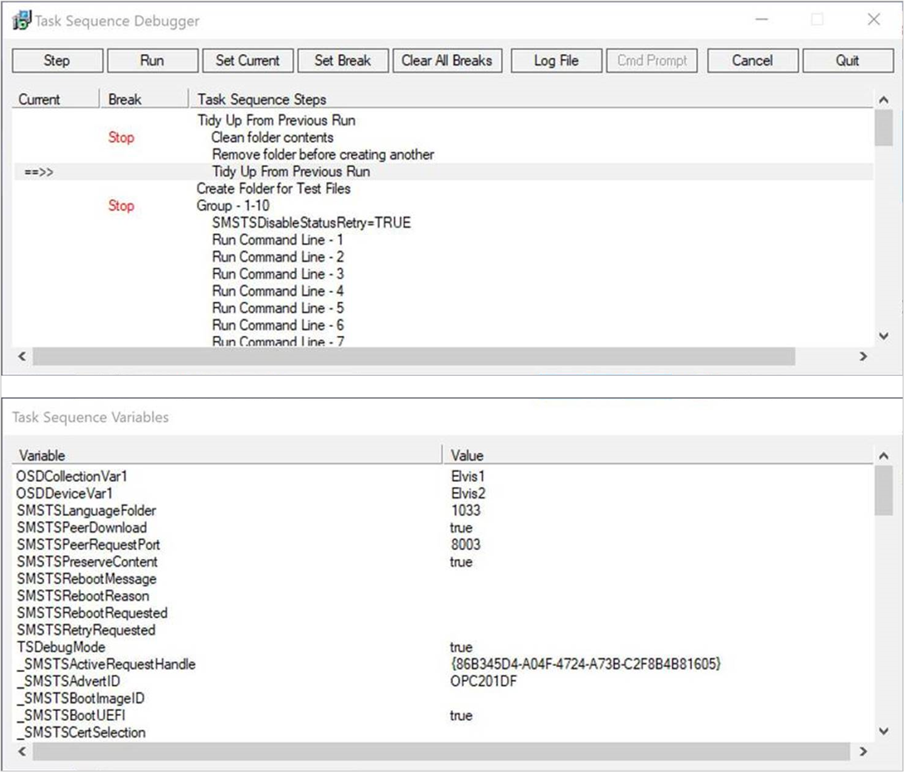

# Debug a task sequence

<!--3612274-->

Starting in version 1906, the task sequence debugger is a new troubleshooting tool. You deploy a task sequence in debug mode to a collection of one device. It lets you step through the task sequence in a controlled manner to aid troubleshooting and investigation.

## Prerequisites

- Update the Configuration Manager client on the target device

- Update the boot image associated with the task sequence to make sure it has the latest client version

## Start the tool

1. In the Configuration Manager console, go to the **Software Library** workspace, expand **Operating Systems**, and select **Task Sequences**.

1. Select a task sequence. In the Deployment group of the ribbon, select **Debug**.

    > [!Tip]  
    > Alternatively, set the variable **TSDebugMode** to `TRUE` on a collection to which the task sequence is deployed. This variable changes the behavior of any task sequence on any device in that collection.  

1. Create a debug deployment. The deployment settings are the same as a normal task sequence deployment. For more information, see [Deploy a task sequence](/sccm/osd/deploy-use/deploy-a-task-sequence#process).

## Use the tool

When the task sequence runs on the device, the Task Sequence Debugger window opens similar to the following screenshot:

The debugger includes the following controls:

- **Step**: From the *current* position, run only the next step in the task sequence.  

- **Run**: From the *current* position, run the task sequence normally to the end or the next *break* point.  

- **Set Current**: Select a step in the debugger and then select **Set Current**. This action moves the *current* pointer to that step. This action allows you to skip steps or move backwards.  

    > [!Warning]  
    > The debugger doesn't consider the type of step when you change the current position in the sequence. Some steps may fail or cause significant damage to a device if run out of order. Use this option at your own risk.  

- **Set Break**: Select a step in the debugger and then select **Set Break**. This action adds a *break* point in the debugger. When you **Run** the task sequence, it stops at a *break*.  

- **Clear All Breaks**: Remove all break points.

- **Log File**: Opens the current task sequence log file, **smsts.log**.

- **Cmd Prompt**: In Windows PE, opens a command prompt.

- **Quit**: Quit the debugger and stop the task sequence.  

The **Task Sequence Variables** pane shows the current values for all variables in the task sequence environment. For more information, see [Task sequence variables](/sccm/osd/understand/task-sequence-variables).

> [!Note]
> Some task sequence variables are for internal use only, and not listed in the reference documentation.

## Known issues

If you target both a normal deployment and debug deployment to the same device through multiple deployments, the task sequence debugger may not launch.

## See also

[Deploy a task sequence](/sccm/osd/deploy-use/deploy-a-task-sequence)
