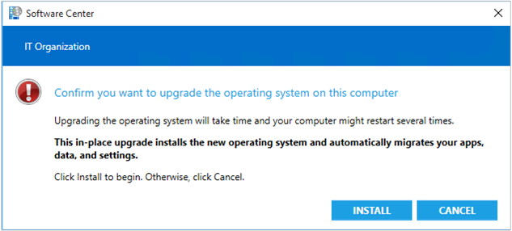

# Manage task sequences to automate tasks

*Applies to: Configuration Manager (current branch)*

Use task sequences to automate steps in your Configuration Manager environment. These steps can deploy an OS image to a destination computer, build and capture an OS image from a set of OS installation files, and capture and restore user state information. Task sequences are located in the Configuration Manager console. In the **Software Library** workspace, expand **Operating Systems**, and select **Task Sequences**. The **Task Sequences** node, including subfolders that you create, is replicated throughout the Configuration Manager hierarchy. For planning information, see [Planning considerations for automating tasks](/configmgr/osd/plan-design/planning-considerations-for-automating-tasks).  

##  Create

Create task sequences by using the Create Task Sequence Wizard. This wizard can create the following types of task sequences:  

- [Task sequence to install an OS](/configmgr/osd/deploy-use/create-a-task-sequence-to-install-an-operating-system): Create the steps to install an OS. It also includes options to migrate user data, include software updates, and install applications.

- [Task sequence to upgrade an OS](/configmgr/osd/deploy-use/create-a-task-sequence-to-upgrade-an-operating-system): Create the steps to upgrade an OS. It also includes options to include software updates and install applications.

- [Task sequence to capture an OS](/configmgr/osd/deploy-use/create-a-task-sequence-to-capture-an-operating-system): Create the steps to build and capture an OS from a reference computer. You can include software updates and install applications on the reference computer before capturing the image.

- [Task sequence to capture and restore user state](/configmgr/osd/deploy-use/create-a-task-sequence-to-capture-and-restore-user-state): Add steps to an existing task sequence to capture and restore user state data.

- [Custom task sequence](/configmgr/osd/deploy-use/create-a-custom-task-sequence): This type doesn't add any steps to the task sequence. After you create this task sequence, edit it, and add steps.

##  Edit  

Modify a task sequence by adding or removing steps, adding or removing groups, or by changing the order of the steps. For more information, see [Use the task sequence editor](/configmgr/osd/understand/task-sequence-editor).

##  Software Center properties

Use the following procedure to configure the details for the task sequence displayed in Software Center. These details are for information only.  

1. In the Configuration Manager console, go to the **Software Library** workspace, expand **Operating Systems**, and select **Task Sequences**.  

2. Select the task sequence to edit, and select **Properties**.  

3. On the **General** tab, the following settings for Software Center are available:  

    - **Restart required**: Lets the user know whether a restart is required during the installation.  

    - **Download size (MB)**: Specifies how many megabytes are displayed in Software Center for the task sequence.  

    - **Estimated run time (minutes)**: Specifies the estimated run time in minutes that's displayed in Software Center for the task sequence.  

##  Advanced settings

Use the following procedure to configure the behavior of the task sequence on the Configuration Manager client.  

1. In the Configuration Manager console, go to the **Software Library** workspace, expand **Operating Systems**, and select **Task Sequences**.  

2. Select the task sequence to edit, and select **Properties**.  

3. On the **Advanced** tab, the following settings are available:  

    - **Run another program first**: Select this option to run a program in another package before the task sequence runs. By default, this check box is cleared. You don't need to separately deploy the program that you specify to run first.  

        > [!IMPORTANT]
        > This setting applies only to task sequences that run in the full OS. If you start the task sequence by using PXE or boot media, Configuration Manager ignores this setting.  

        - **Package**: Browse for the package that contains the program to run before this task sequence.  

        - **Program**: Select the program to run before this task sequence.  

        > [!NOTE]  
        > If the selected program fails to run on a client, the task sequence doesn't run. If the selected program runs successfully, it doesn't run again, even if the task sequence is rerun on the same client.  

    - **Suppress task sequence notifications**: Select this option to hide the **New Software is available** toast notification. You still see the **New software** icon from Software Center in the notification area. By default, this option is disabled.  

    - **Disable this task sequence on computers where it is deployed**: If you select this option, Configuration Manager temporarily disables all deployments that contain this task sequence. It also removes the task sequence from the list of deployments available to run. The task sequence doesn't run until you enable it. By default, this option is disabled.  

    - **Maximum allowed run time**: Specifies the maximum time in minutes that you expect the task sequence to run on the destination computer. Use a whole number equal to or greater than zero. By default, this value is 120 minutes.  

        > [!IMPORTANT]  
        > If you're using maintenance windows for the collection to which you deploy this task sequence, a conflict might occur if the **Maximum allowed run time** is longer than the scheduled maintenance window. If you set the maximum run time to **0**, the task sequence starts during the maintenance window. It continues to run until it completes or fails after the maintenance window is closed. As a result, task sequences with a maximum run time set to **0** might run past the end of their maintenance windows. If you set the maximum run time to a specific period (non-zero) that exceeds the length of any available maintenance window, then that task sequence doesn't run. For more information, see [How to use maintenance windows](/configmgr/core/clients/manage/collections/use-maintenance-windows).  

        If you set the value as **0**, Configuration Manager evaluates the maximum allowed run time as **12** hours (720 minutes) for monitoring progress. However, the task sequence starts as long as the countdown duration doesn't exceed the maintenance window value.  

        > [!NOTE]  
        > When it reaches the maximum run time, if you set the option to **Run with administrative rights**, and don't set the option to **Allow users to interact with this program**, then Configuration Manager stops the task sequence. If the task sequence itself isn't stopped, Configuration Manager stops monitoring the task sequence after it reaches the maximum allowed run time.  

    - **Use a boot image**: Use the selected boot image when the task sequence is run. Select **Browse** to select a different boot image. Clear this option to disable the use of the selected boot image when the task sequence runs.  

    - **This task sequence can run on any platform**: If you select this option, Configuration Manager doesn't check the platform type of the destination computer when the task sequence runs. This option is selected by default.  

    - **This task sequence can only run on the specified client platforms**: This option specifies the processors, OS versions, and service packs on which this task sequence can run. When you select this option, select at least one platform from the list. By default, no platforms are selected. Configuration Manager uses this information when is evaluates which destination computers in a collection receive the deployed task sequence.  

        > [!NOTE]  
        > When you run a task sequence from boot media or PXE, Configuration Manager ignores this option. The task sequence runs as though the option **This program can run on any platform** is selected.  

## High-impact settings

Configure a task sequence as high-impact and customize the messages that users receive when they run the task sequence.

> [!WARNING]
> If you use PXE deployments, and configure device hardware with the network adapter as the first boot device, these devices can automatically start an OS deployment task sequence without user interaction. Deployment verification doesn't manage this configuration. While this configuration may simplify the process and reduce user interaction, it puts the device at greater risk for accidental reimage.

### Set a task sequence as a high-impact task sequence

Use the following procedure to set a task sequence as high-impact.

> [!NOTE]  
> Any task sequence that meets certain conditions is automatically defined as high-impact. For more information, see [Manage high-risk deployments](/configmgr/protect/understand/settings-to-manage-high-risk-deployments).

1. In the Configuration Manager console, go to the **Software Library** workspace, expand **Operating Systems**, and select **Task Sequences**.  

2. Select the task sequence to edit, and select **Properties**.  

3. On the **User Notification** tab, select **This is a high-impact task sequence**.  

### Create a custom notification for high-risk deployments

Use the following procedure to create a custom notification for high-impact deployments.

1. In the Configuration Manager console, go to the **Software Library** workspace, expand **Operating Systems**, and select **Task Sequences**.  

2. Select the task sequence to edit, and select **Properties**.  

3. On the **User Notification** tab, select **Use custom text**.  

    > [!NOTE]
    > You can only set user notification text when you select the option, **This is a high-impact task sequence**.  

4. Configure the following settings:  

    > [!Note]  
    > Each text box has a maximum limit of 255 characters.  

    - **User notification headline text**: Specifies the blue text that displays on the Software Center user notification. For example, in the default user notification, this section contains "Confirm you want to upgrade the operating system on this computer."  

    - **User notification message text**: There are three text boxes that provide the body of the custom notification. All text boxes require that you add text.  

        - First text box: Specifies the main body of text, typically containing instructions for the user. For example, in the default user notification, this section contains "Upgrading the operating system takes time and your computer might restart several times."  

        - Second text box: Specifies the bold text under the main body of text. For example, in the default user notification, this section contains "This in-place upgrade installs the new operating system and automatically migrates your apps, data, and settings."  

        - Third text box: Specifies the last line of text under the bold text. For example, in the default user notification, this section contains "Click Install to begin. Otherwise, click Cancel."  

#### Example

Let's say you configure the following custom notification in properties.

The following notification message displays when the end user opens the installation from Software Center.

##  Performance improvements for power plans

<!--3555926-->

Starting in version 1910, you can now run a task sequence with the high performance power plan. This option improves the overall speed of the task sequence. It configures Windows to use its built-in high performance power plan, which delivers maximum performance at the expense of higher power consumption. This option is on by default for new task sequences.

When the task sequence starts, in most scenarios it records the currently enabled power plan. It then switches the active power plan to the Windows default **High Performance** plan. If the task sequence restarts the computer, it repeats this process. At the end of the task sequence, it resets the power plan to the stored value. This functionality works in both Windows and Windows PE, but has no impact on virtual machines.

- If the task sequence starts in Windows PE, the task sequence doesn't record the currently enabled power plan for later reuse.

- An OS deployment task sequence that reimages the computer (wipe and load) doesn't preserve the power plan setting of the old OS. At the end of the task sequence, it restores the default **Balanced** power plan.

> [!Important]
> To take advantage of this new Configuration Manager feature, after you update the site, update clients to the latest version. Also update boot images to include the latest client components. While new functionality appears in the Configuration Manager console when you update the site and console, the complete scenario isn't functional until the client version is also the latest.

1. In the Configuration Manager console, go to the **Software Library** workspace. Expand **Operating Systems**, and select the **Task Sequences** node.

1. Create or choose an existing task sequence, and then select **Properties**.

1. Switch to the **Performance** tab.

1. Enable the option to **Run as high performance power plan**.

> [!Warning]
> Be cautious with this setting on low performance hardware. Running intense system operations for an extended period of time can strain low-end hardware. Check with your hardware manufacturer for specific guidance.

### Known issue

<!-- 5554928 -->

You need to create a new task sequence deployment to enable or disable this setting for high performance. The new setting appears on existing deployments, but it doesn't apply.<!-- SCCMDocs#2107 -->

##  Distribute referenced content  

Before clients run a task sequence that references content, distribute that content to distribution points. At any time, you can select the task sequence and distribute its content to build a new list of reference packages for distribution. If you make changes to the task sequence with updated content, redistribute the content before it's available to clients. Use the following procedure to distribute the content that is referenced by a task sequence.  

### Process to distribute referenced content to distribution points  

1. In the Configuration Manager console, go to the **Software Library** workspace, expand **Operating Systems**, and then select the **Task Sequences** node.  

2. In the **Task Sequence** list, select the task sequence that you want to distribute.  

3. On the **Home** tab of the ribbon, in the **Deployment** group, select **Distribute Content**. This action starts the Distribute Content Wizard.  

4. On the **General** page, verify that the correct task sequence is selected for distribution.  

5. On the **Content** page, verify the content to distribute, such as the boot image referenced by the task sequence.  

6. On the **Content Destination** page, specify the collections, distribution point, or distribution point group where you want to distribute the task sequence contents.  

    > [!IMPORTANT]  
    > If the task sequence that you selected references content that's already distributed to a specific distribution point, the wizard doesn't list that distribution point.  

7. Complete the wizard.  

You can also prestage the content referenced in the task sequence. Configuration Manager creates a compressed, prestaged content file that contains the files, associated dependencies, and associated metadata for the content that you select. Then you manually import the content at a site server, secondary site, or distribution point. For more information about how to prestage content files, see [Prestage content](/configmgr/core/servers/deploy/configure/deploy-and-manage-content#bkmk_prestage).  

##  Deploy  

For more information, see [Deploy a task sequence](/configmgr/osd/deploy-use/deploy-a-task-sequence).

##  Export and import  

Export and import task sequences with or without their related objects. This referenced content includes the following objects:  

- OS images  
- Boot images  
- Packages like the client install package  
- Driver packages  
- Applications with dependencies  

Consider the following points when you export and import task sequences:  

- Configuration Manager doesn't export passwords in the task sequence. If you export and import a task sequence that contains passwords, edit the imported task sequence to reenter any passwords. Review the following steps that may include a password:  

  - [Join Domain or Workgroup](/configmgr/osd/understand/task-sequence-steps#BKMK_JoinDomainorWorkgroup)  
  - [Connect To Network Folder](/configmgr/osd/understand/task-sequence-steps#BKMK_ConnectToNetworkFolder)  
  - [Run Command Line](/configmgr/osd/understand/task-sequence-steps#BKMK_RunCommandLine)  

- When you export a task sequence with the **Set Dynamic Variables** step, Configuration Manager doesn't export values for variables that you configure with the **Secret value** setting. Reenter the values for these variables after you import the task sequence.  

- When you have multiple primary sites, import task sequences at the central administration site.  

### Process to export task sequences  

1. In the Configuration Manager console, go to the **Software Library** workspace, expand **Operating Systems**, and then select the **Task Sequences** node.  

2. In the **Task Sequence** list, select the task sequences that you want to export. If you select more than one task sequence, they're all stored in one export file.  

3. On the **Home** tab of the ribbon, in the **Task Sequence** group, select **Export**. This action starts the Export Task Sequence Wizard.  

4. On the **General** page, specify the following settings:  

    - **File**: Specify the location and name of the export file. If you enter the file name directly, be sure to include the .zip extension to the file name. If you browse for the export file, the wizard automatically adds this file name extension.  

    - If you don't want to export task sequence dependencies, deselect the option to **Export all task sequence dependencies**. By default, the wizard scans for all the related objects and exports them with the task sequence. These dependencies include any for applications.  

    - If you don't want to copy the content from the package source to the export location, deselect the option to **Export all content for the selected task sequences and dependencies**. If you select this option, the Import Task Sequence Wizard uses the import path as the new package source location.  

    - **Administrator comments**: Add a description of the task sequences to export.  

5. Complete the wizard.  

The wizard creates the following output files:  

- If you don't export content: a .zip file.  

- If you export content: a .zip file and a folder named *export*_files, where *export* is the name of the .zip file that contains the exported content.  

If you include content when you export a task sequence, make sure that you copy the .zip file and the *export*_files folder, or the import fails.  

### Process to import task sequences  

1. In the Configuration Manager console, go to the **Software Library** workspace, expand **Operating Systems**, and then select the **Task Sequences** node.  

2. On the **Home** tab of the ribbon, in the **Create** group, select **Import Task Sequence**. This action starts the Import Task Sequence Wizard.  

3. On the **General** page of the ribbon, specify the exported .zip file.  

4. On the **File Content** page, select the action that you require for each object that you import. This page shows all the objects that Configuration Manager found to import.  

    - If the object has never been imported, select **Create New**.  

    - If the object has been previously imported, select one of the following actions:  

        - **Ignore Duplicate** (default): This action doesn't import the object. Instead, the wizard links the existing object to the task sequence.  

        - **Overwrite**: This action overwrites the existing object with the imported object. For applications, you can add a revision to update the existing application or create a new application.  

5. Complete the wizard.  

After you import the task sequence, edit the task sequence to specify any passwords that were in the original task sequence. For security reasons, passwords aren't exported.  

## Return to previous page on failure

When you run a task sequence, and there's a failure, you can return to a previous page of the task sequence wizard. In prior versions of Configuration Manager, you had to restart the task sequence when there was a failure. Use the **Previous** button in the following scenarios:

- When a computer starts in Windows PE, the task sequence bootstrap dialog might display before the task sequence is available. When you select Next in this scenario, the final page of the task sequence displays with a message that there are no task sequences available. Now, you can select **Previous** to search again for available task sequences. You can repeat this process until the task sequence is available.  

- When you run a task sequence, but dependent content packages aren't available yet on distribution points, the task sequence fails. If the missing content wasn’t distributed yet, distribute it now. Or wait for the content to be available on distribution points. Then select **Previous** to have the task sequence search again for the content.

##  Collection and device variables

You can define custom task sequence variables for computers and collections. Variables that you define for a computer are referred to as per-computer task sequence variables. Variables defined for a collection are referred to as per-collection task sequence variables. For more information, see [Collection and device variables](/configmgr/osd/understand/using-task-sequence-variables#bkmk_set-coll-var).

##  Additional actions  

You can manage task sequences by using additional actions when you select a task sequence.  

### Edit

For more information, see [Use the task sequence editor](/configmgr/osd/understand/task-sequence-editor#bkmk_edit).

### Enable

Enables the task sequence so that clients can run it. You don't need to redeploy a task sequence after it's enabled.  

### Disable

Disables the task sequence so that it can't run on computers. You can deploy a disabled task sequence, but computers don't run the task sequence until you enable it.  

### Export

For more information, see [Export and import task sequences](#BKMK_ExportImport).

### Copy

Makes a copy of the selected task sequence. This action is useful to create a new task sequence that's based on an existing task sequence.

When you make a copy of a task sequence in a folder, the copy is listed in that folder until you refresh the task sequence node. After the refresh, the copy appears in the root folder.  

### Refresh

Refreshes the details for the selected task sequence.

### Delete

Deletes the selected task sequence.

### Create Phased Deployment

For more information, see [Create phased deployments](/configmgr/osd/deploy-use/create-phased-deployment-for-task-sequence).

### Deploy

For more information, see [Deploy a task sequence](/configmgr/osd/deploy-use/deploy-a-task-sequence).

### Distribute Content

Starts the Distribute Content Wizard to send the referenced content to distribution points.

### Create Prestaged Content File

Starts the Create Prestaged Content File Wizard to prestage the task sequence content. For information about how to create a prestaged content file, see [Prestage content](/configmgr/core/servers/deploy/configure/deploy-and-manage-content#bkmk_prestage).

### Move

Moves the selected task sequence to another folder in the **Task Sequences** node.

### Set Security Scopes

Select the security scopes for the selected task sequence. For more information, see [Security scopes](/configmgr/core/understand/fundamentals-of-role-based-administration#bkmk_PlanScope).

### Properties

For more information, see [Configure Software Center properties](#bkmk_prop-general) and [Configure advanced task sequence settings](#bkmk_prop-advanced).

### View

<!--3633146-->
Starting in version 1902, the **View** action on task sequences is the default. This action lets you see the steps of the task sequence without locking it for editing. For more information, see [Use the task sequence editor](/configmgr/osd/understand/task-sequence-editor#bkmk_view).

## See also

- [Scenarios to deploy enterprise operating systems](/configmgr/osd/deploy-use/scenarios-to-deploy-enterprise-operating-systems)

- [Use the task sequence editor](/configmgr/osd/understand/task-sequence-editor)

- [Deploy a task sequence](/configmgr/osd/deploy-use/deploy-a-task-sequence)

- [Task sequence steps](/configmgr/osd/understand/task-sequence-steps)

- [Collection and device variables](/configmgr/osd/understand/using-task-sequence-variables#bkmk_set-coll-var)

- [Create phased deployments](/configmgr/osd/deploy-use/create-phased-deployment-for-task-sequence)
