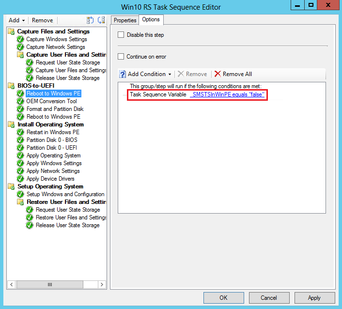

# Task sequence steps to manage BIOS to UEFI conversion
Windows 10 provides many new security features that require UEFI-enabled devices. You might have modern Windows PCs that support UEFI, but are using legacy BIOS. Converting a device to UEFI has required you to go to each PC, repartition the hard disk, and reconfigure the firmware. By using task sequences in Configuration Manager, you can prepare a hard drive for BIOS to UEFI conversion, convert from BIOS to UEFI as part of the in-place upgrade process, and collect UEFI information as part of hardware inventory.

## Hardware inventory collects UEFI information
Beginning in version 1702, a new hardware inventory class (**SMS_Firmware**) and property (**UEFI**) are available to help you determine whether a computer starts in UEFI mode. When a computer is started in UEFI mode, the **UEFI** property is set to **TRUE**. This is enabled in hardware inventory by default. For more information about hardware inventory, see [How to configure hardware inventory](/sccm/core/clients/manage/inventory/configure-hardware-inventory).

## Create a custom task sequence to prepare the hard drive for BIOS to UEFI conversion
Starting in Configuration Manager version 1610, you can now customize an operating system deployment task sequence with a new variable, TSUEFIDrive, so that the **Restart Computer** step will prepare a FAT32 partition on the hard drive for transition to UEFI. The following procedure provides an example of how you can create task sequence steps to prepare the hard drive for the BIOS to UEFI conversion.

### To prepare the FAT32 partition for the conversion to UEFI:
In an existing task sequence to install an operating system, you will add a new group with steps to do the BIOS to UEFI conversion.

1. Create a new task sequence group after the steps to capture files and settings, and before the steps to install the operating system. For example, create a group after the **Capture Files and Settings** group named **BIOS-to-UEFI**.
2. On the **Options** tab of the new group, add a new task sequence variable as a condition where **_SMSTSBootUEFI** is **not equal** to **true**. This prevents the steps in the group from running when a computer is already in UEFI mode.

  
3. Under the new group, add the **Restart Computer** task sequence step. In **Specify what to run after restart**, select **The boot image assigned to this task sequence is selected** to start the computer in Windows PE.  
4. On the **Options** tab, add a task sequence variable as a condition where **_SMSTSInWinPE equals false**. This prevents this step from running if the computer is already in Windows PE.

  
5. Add a step to start the OEM tool that will convert the firmware from BIOS to UEFI. This will typically be a **Run Command Line** task sequence step with a command line to start the OEM tool.
6. Add the Format and Partition Disk task sequence step that will partition and format the hard drive. In the step, do the following:
  1. Create the FAT32 partition that will be converted to UEFI before the operating system is installed. Choose **GPT** for **Disk type**.
    
  2. Go to the properties for the FAT32 partition. Enter **TSUEFIDrive** in the **Variable** field. When the task sequence detects this variable, it will prepare for the UEFI transition before restarting the computer.
    
  3. Create an NTFS partition that the task sequence engine uses to save its state and to store log files.
7. Add the **Restart Computer** task sequence step. In **Specify what to run after restart**, select **The boot image assigned to this task sequence is selected** to start the computer in Windows PE.  

## Convert from BIOS to UEFI during an in-place upgrade
Windows 10 Creators Update introduces a simple conversion tool that automates the process to repartition the hard disk for UEFI-enabled hardware and integrates the conversion tool into the Windows 7 to Windows 10 in-place upgrade process. When you combine this tool with your operating system upgrade task sequence and the OEM tool that converts the firmware from BIOS to UEFI, you can convert your computers from BIOS to UEFI during an in-place upgrade to the Windows 10 Creators Update.

**Requirements**:
- Windows 10 Creators Update
- Computers that support UEFI
- OEM tool that converts the computer’s firmware from BIOS to UEFI

### To convert from BIOS to UEFI during an in-place upgrade
1. Create an operating system upgrade task sequence that performs an in-place upgrade to Windows 10 Creators Update.
2. Edit the task sequence. In the **Post-Processing group**, add the following task sequence steps:
   1. From General, add a **Run Command Line** step. You will add the command line for the MBR2GPT tool that coverts a disk from MBR to GPT without modifying or deleting data from the disk. In Command line, type the following:  **MBR2GPT /convert /disk:0 /AllowFullOS**. You can also choose to run the MBR2GPT.EXE tool when in Windows PE instead of in the full operating system. You can do this by adding a step to restart the computer to WinPE before the step to run the MBR2GPT.EXE tool and removing the /AllowFullOS option from the command line. For details about the tool and available options, see [MBR2GPT.EXE](https://technet.microsoft.com/itpro/windows/deploy/mbr-to-gpt).
   2. Add a step to start the OEM tool that will convert the firmware from BIOS to UEFI. This will typically be a Run Command Line task sequence step with a command line to start the OEM tool.
   3. From General, add the **Restart Computer** step. For Specify what to run after restart, select **The currently installed default operating system**.
3. Deploy the task sequence.
