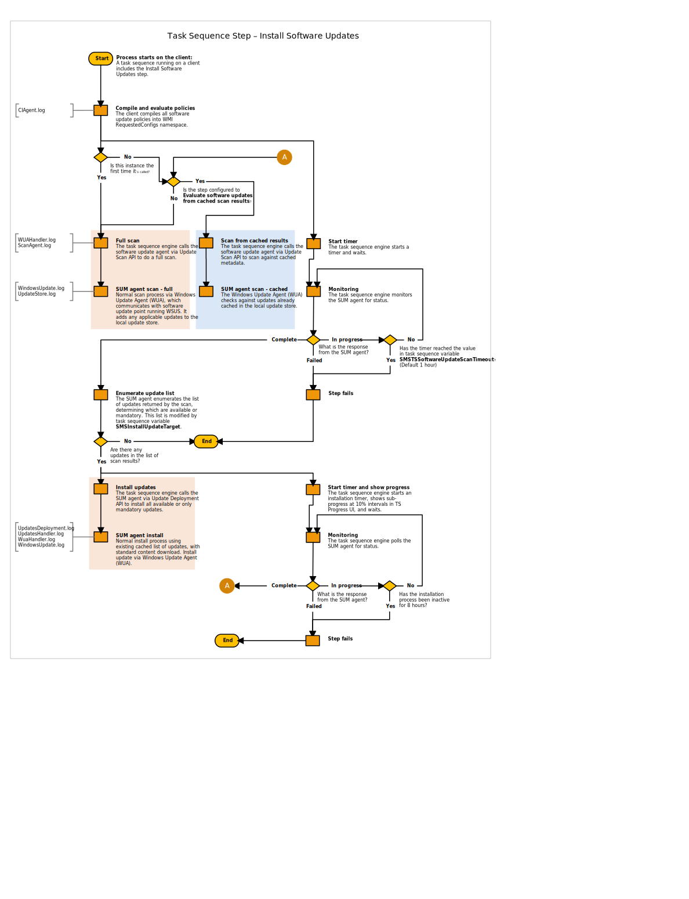

# Install Software Updates

*Applies to: System Center Configuration Manager (Current Branch)*

The **Install Software Updates** step is commonly used in Configuration Manager task sequences. When installing or updating the OS, it triggers the software updates component. This step can cause challenges for some customers, such as long timeout delays or missed updates. Use the information in this article to help mitigate common issues with this step, and better troubleshoot when things go wrong.

For more information on the step, see [Install Software Updates](/sccm/osd/understand/task-sequence-steps#BKMK_InstallSoftwareUpdates)


## Recommendations

To help this process be successful, use the following recommendations:

#### Use offline servicing
Use Configuration Manager to regularly install applicable software updates to your image files. This practice then reduces the number of updates that you need to install during the task sequence. 

For more information, see [Apply software updates to an image](/sccm/osd/get-started/manage-operating-system-images#BKMK_OSImagesApplyUpdates).


#### Single index
Many image files include multiple indexes, such as for different editions of Windows. Reduce the image file to a single index that you require. This practice reduces the amount of time to apply software updates to the image. It also enables the next recommendation to [Reduce the image size](#bkmk_resetbase). 


#### <a name="bkmk_resetbase"></a> Reduce image size
When you apply software updates to the image, optimize the output by removing any superseded updates. Use the DISM command-line tool, for example: 

```
dism /Mount-Image /ImageFile:C:\Data\install.wim /MountDir:C:\Mountdir
dism /Image:C:\Mountdir /Cleanup-Image /StartComponentCleanup /ResetBase 
dism /Unmount-Image /MountDir:C:\Mountdir /Commit  
```


## Image engineering decisions

When you design your imaging process, there are several options that can impact the installation of software updates:

- [Periodically recapture the image](#bkmk_goldimage)  
- [Use offline servicing](#bkmk_offline)  
- [Use default image only](#bkmk_installwim)


### <a name="bkmk_goldimage"></a> Periodically recapture the image

You have an automated process to capture a custom OS image on a regular schedule. This capture task sequence installs the latest software updates. These updates can include cumulative, non-cumulative, and other critical updates such as servicing stack updates (SSU). The deployment task sequence installs any additional updates since capture.

For more information on this process, see [Create a task sequence to capture an OS](/sccm/osd/deploy-use/create-a-task-sequence-to-capture-an-operating-system).


#### Advantages
- Fewer updates to apply at deployment time per client, which saves time and bandwidth during deployment
- Fewer updates to worry about causing restarts
- Customized image for the organization
- Fewer variables at deployment time

#### Disadvantages 
- Time to create and capture image, even though it's mostly automated
- Increased time to distribute the image to distribution points, which can be seen as outage for active deployments
- Time to test through pre-production environments may be longer than OS patch cycle, which can make the updated image irrelevant 


### <a name="bkmk_offline"></a> Use offline servicing

Schedule Configuration Manager to apply software updates to your images. 

For more information, see [Apply software updates to an image](/sccm/osd/get-started/manage-operating-system-images#BKMK_OSImagesApplyUpdates).


#### Advantages
- Fewer updates to apply at deployment time per client, which saves time and bandwidth during deployment
- Fewer updates to worry about causing restarts
- You can schedule the servicing process at the site

#### Disadvantages 
- Manual selection of updates 
- Increased time to distribute the image to distribution points
- Only supports CBS-based updates. It can't apply Office updates

> [!Tip]  
> You can automate the selection of software updates using PowerShell. Use the [Get-CMSoftwareUpdate](https://docs.microsoft.com/powershell/module/configurationmanager/get-cmsoftwareupdate?view=sccm-ps) cmdlet to get a list of updates. Then use the [New-CMOperatingSystemImageUpdateSchedule](https://docs.microsoft.com/powershell/module/configurationmanager/new-cmoperatingsystemimageupdateschedule?view=sccm-ps) cmdlet to create the offline servicing schedule.  


### <a name="bkmk_installwim"></a> Use default image only

Use the default Windows install.wim image file in your deployment task sequences.

#### Advantages
- A known good source, which reduces the risk of image corruption as a possible issue
- Eliminates modifications to image as a possible issue

#### Disadvantages 
- Potential for high volume of updates during the deployment
- Increased deployment time for every device
- May not have needed customizations, requires additional task sequence steps to customize


## Flowchart

This flowchart diagram shows the process when you include the Install Software Updates step in a task sequence.



[View the diagram at full size](media/ts-step-install-software-updates.svg)


### Timeouts

The diagram includes two of the timeout variables that apply to this step. There are other standard timers from other components that can impact this process. 

- Update scan timeout: 1 hour (smsts.log)  
- Location request timeout: 1 hour (LocationServices.log, CAS.log)  
- Content download timeout: 1 hour (DTS.log)  
- Inactive distribution point timeout: 1 hour (LocationServices.log, CAS.log)  
- Total install inactive timeout: 8 hours (smsts.log)  


## Troubleshooting

Use the following resources and additional information to help you troubleshoot issues with this step:

- Make sure to target your software update deployments to the same collection as the task sequence deployment.  

- Make sure to include software update points in boundary groups. For more information, see this [Microsoft Support article](https://support.microsoft.com/help/4041012/1702-clients-do-not-get-software-updates-from-configuration-manager).  

- To help you troubleshoot the software update management process, see [Software Update Management Troubleshooting](https://support.microsoft.com/help/10680/software-update-management-troubleshooting-in-configuration-manager).  

- To help improve overall performance, reduce the size of the software update catalog. For example:  

    - Remove unnecessary classifications, products, and languages. For more information, see [Configure classifications and products to synchronize](/sccm/sum/get-started/configure-classifications-and-products).  

    - Reindex the site database and rebuild statistics. For more information, see the [Configuration Manager Perf and Scale Guidance Whitepaper](https://gallery.technet.microsoft.com/Configuration-Manager-ba55428e).  

    - Decline unnecessary updates, for example:
        - Superseded (Starting in version 1810, Configuration Manager does this action for you. For more information, see [WSUS cleanup behavior starting in version 1810](/sccm/sum/deploy-use/software-updates-maintenance#wsus-cleanup-behavior-starting-in-version-1810).)
        - Itanium
        - Beta
        - Version Next
        - ARM
        - Version of Windows you aren't deploying

