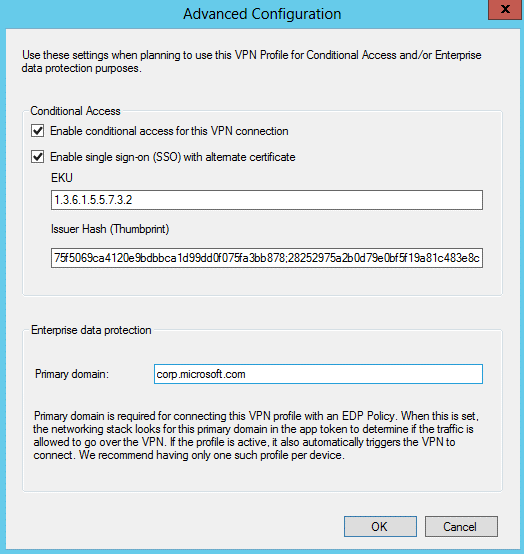

# How to Create VPN profiles in System Center Configuration Manager

*Applies to: System Center Configuration Manager (Current Branch)*

> [!NOTE]  
>
> - For information about what connection types are available for the different device platforms see [VPN profiles in System Center Configuration Manager](../../protect/deploy-use/vpn-profiles.md).  
> - For third-party VPN connections, distribute the VPN app before deploying the VPN profile. If you don't deploy the app, users will be prompted to do so when they try to connect to the VPN. To learn how to deploy apps, see [Deploy applications with System Center Configuration Manager](../../apps/deploy-use/deploy-applications).

### Start the Create VPN Profile Wizard  

1.  In the System Center Configuration Manager console, click **Assets and Compliance**.  

2.  In the **Assets and Compliance** workspace of the System Center Configuration Manager console, expand **Compliance Settings**, expand **Company Resource Access**, and then click **VPN Profiles**.  

3.  On the **Home** tab, in the **Create** group, click **Create VPN Profile**.  

### Provide General Information about the VPN Profile  

1.  On the **General** page of the **Create VPN Profile Wizard**, specify the following information:  

    -   **Name** - Enter a unique name for the VPN profile (up to 256 characters).  

        > [!IMPORTANT]  
        >  Do not use the characters \\/:*?<>&#124;, or the space character in the VPN profile name, because these characters are not supported by the Windows Server VPN profile.  

    -   **Description** - Enter a description to help you find the profile it in the System Center Configuration Manager console (up to 256 characters).  

    -   **Import an existing VPN profile item from a file** - Select this option to display the **Import VPN Profile** page. On this page, you can import VPN profile information that has previously been exported to an XML file (Windows 8.1 and Windows RT operating systems only).  

### Provide Connection Information for the VPN Profile  

1.  On the **Connection** page of the wizard, specify the following information:  

    -   **Connection type:** From the drop-down list, select the connection type for the VPN connection. You can choose from the connection types in the following table showing the supported platforms.  

        > [!IMPORTANT]  
        >  Before you can use VPN profiles deployed to a device, you should install third-party VPN apps that you need. You can use the information in the [How to create applications with System Center Configuration Manager](../../apps/deploy-use/create-applications.md) topic to help you deploy the app using System Center Configuration Manager.  

    -   **Server list:** Click **Add** to add a new server to use for the VPN connection. Depending on the connection type, you can add one or more VPN servers and also specify which server is to be the default server.  

        > [!NOTE]  
        >  Devices that run iOS do not support using multiple VPN servers. If you configure multiple VPN servers and then deploy the VPN profile to an iOS device, only the default server is used.  

     The further options in the following table might be displayed, which depends on the connection type that you selected. See your VPN server documentation for more information.  

    |Option|More information|Connection type|  
    |------------|----------------------|---------------------|  
    |**Realm**|Specify the name of the authentication realm that you want to use. An authentication realm is a grouping of authentication resources that is used by the Pulse Secure connection type.|Pulse Secure|  
    |**Role**|Specify the name of the user role that has access to this connection.|Pulse Secure|  
    |**Login group or domain**|Specify the name of the login group or domain that you want to connect to.|Dell SonicWALL Mobile Connect|  
    |**Fingerprint**|Specify a string, for example "Contoso Fingerprint Code" that will be used to verify the VPN server can be trusted.   A fingerprint can be:   - Sent to the client so it knows to trust any server presenting that same fingerprint when connecting.   - If the device doesn’t already have the fingerprint it will prompt the user to trust the VPN server they are connecting to while showing the fingerprint (the user manually verifies the fingerprint and clicks trust to connect).|Check Point Mobile VPN|  
    |**Send all network traffic through the VPN connection**|If this option is not selected, you can specify additional routes for the connection (for **Microsoft SSL (SSTP)**, **Microsoft Automatic**, **IKEv2**, **PPTP** and **L2TP** connection types), which is known as split or VPN tunneling.   Only connections to the company network are sent over a VPN tunnel. VPN tunneling is not used when you connect to resources on the Internet.|All|  
    |**Connection specific DNS suffix**|Optionally, specify the connection-specific Domain Name System (DNS) suffix for the connection.|-                              Microsoft SSL (SSTP)   - Microsoft Automatic   -                              IKEv2   -                              PPTP   -                              L2TP|  
    |**Bypass VPN when connected to company Wi-Fi network**|Specifies that the VPN connection will not be used when the device is connected to the company Wi-Fi network.|- Cisco AnyConnect   - Pulse Secure   - F5 Edge Client   - Dell SonicWALL Mobile Connect   - Check Point Mobile VPN   - Microsoft SSL (SSTP)   - Microsoft Automatic   - IKEv2   - L2TP|  
    |**Bypass VPN when connected to home Wi-Fi network**|Specifies that the VPN connection will not be used when the device is connected to a home Wi-Fi network.|All|  
    |**Per App VPN (iOS 7 and later, Mac OS X 10.9 and later )**|Select this option if you want to associate this VPN connection with an iOS app so that the connection will be opened when the app is run. You can associate the VPN profile with an app when you deploy it.|-                          Cisco AnyConnect   - Pulse Secure   - F5 Edge Client   - Dell SonicWALL Mobile Connect   - Check Point Mobile VPN|  
    |**Custom XML (optional)**|Allows you to specify custom XML commands that configure the VPN connection.   Examples:   For **Pulse Secure**:   **<pulse-schema><isSingleSignOnCredential\>true</isSingleSignOnCredential\></pulse-schema>**   For **CheckPoint Mobile VPN**:   **<CheckPointVPN port="443" name="CheckPointSelfhost" sso="true" debug="3" /\>**   For **Dell SonicWALL Mobile Connect**:   **<MobileConnect\><Compression\>false</Compression\><debugLogging\>True</debugLogging\><packetCapture\>False</packetCapture\></MobileConnect\>**   For **F5 Edge Client**:   **<f5-vpn-conf><single-sign-on-credential /></f5-vpn-conf>**   Refer to each manufacturers VPN documentation for more information about how to write custom XML commands.|- Cisco AnyConnect   - Pulse Secure   - F5 Edge Client   - Dell SonicWALL Mobile Connect   - Check Point Mobile VPN|  

####   Windows 10 VPN features, available when using Configuration Manager with Intune  

> [!NOTE]  
> The name of a VPN profile that uses Windows 10 VPN features cannot be in unicode or include special characters.

|Option|More information|Connection type|  
|------------|----------------------|---------------------|  
|**Bypass VPN when connected to company Wi-Fi network**|Specifies that the VPN connection will not be used when the device is connected to the company Wi-Fi network. Enter the trusted network name, which will be used to determine if the device is connected to the company network.|All|  
|**Network traffic rules**|Set which protocols, local and remote port and address ranges will be enabled for the VPN connection.   **Note:** If you do not create a network traffic rule, all protocols, ports and address ranges are enabled. Once you create a rule, only the protocols, ports and address ranges that you specify in that rule or in additional rules will be used by the VPN connection.|All|  
|**Routes**|Which routes will use the VPN connection. Note that creation of more than 60 routes may cause the policy to fail. |All|  
|**DNS servers**|Which DNS servers are used by the VPN connection once the connection has been established.|All|  
|**Apps that automatically connect to the VPN**|You can add apps, or import lists of apps, that will automatically use the VPN connection. The type of app will determine the app identifier. For a desktop app, provide the file path of the app. For a universal app, provide the package family name (PFN). To learn how to find the PFN for an app, see [Find a package family name for per-app VPN](../../protect/deploy-use/find-a-pfn-for-per-app-vpn.md). |All|

> [!IMPORTANT]
> We recommend that you secure all lists of associated apps that you compile for use in configuration of per-app VPN. If an unauthorized user modifies your list and you import it into the per-app VPN app list, you will potentially authorize VPN access to apps that should not have access. One way you can secure app lists is by using an access control list (ACL).

### Configure the Authentication Method for the VPN Profile  

1.  On the **Authentication Method** page of the wizard, specify the following information:  

    -   **Authentication method:** From the drop-down list, select the authentication method that the VPN connection will use. The items in the drop-down list might differ; they depend on the connection type that you previously selected. The available authentication methods and the supported connection types are listed in the following table.  

        |Authentication method|Supported connection types|  
        |---------------------------|--------------------------------|  
        |**Certificates**   **Note:** If the client certificate is used to authenticate to a RADIUS server, such as a Network Policy Server, the Subject Alternative Name in the certificate must be set to the User Principal Name.|-                              Cisco AnyConnect   - Pulse Secure   - F5 Edge Client   - Dell SonicWALL Mobile Connect   - Check Point Mobile VPN|  
        |**Username and Password**|-                              Pulse Secure   - F5 Edge Client   - Dell SonicWALL Mobile Connect   - Check Point Mobile VPN|  
        |**Microsoft EAP-TTLS**|- Microsoft SSL (SSTP)   - Microsoft Automatic   - PPTP   - IKEv2   - L2TP|  
        |**Microsoft protected EAP (PEAP)**|- Microsoft SSL (SSTP)   - Microsoft Automatic   - IKEv2   - PPTP   - L2TP|  
        |**Microsoft secured password (EAP-MSCHAP v2)**|- Microsoft SSL (SSTP)   - Microsoft Automatic   - IKEv2   - PPTP   - L2TP|  
        |**Smart Card or other certificate**|- Microsoft SSL (SSTP)   - Microsoft Automatic   - IKEv2   - PPTP   - L2TP|  
        |**MSCHAP v2**|-  Microsoft SSL (SSTP)   - Microsoft Automatic   - IKEv2   - PPTP   - L2TP|  
        |**RSA SecurID** (iOS only)|- Microsoft SSL (SSTP)   - Microsoft Automatic   - PPTP   - L2TP|  
        |**Use machine certificates**|IKEv2|  

         Depending on the options you select, you might be asked to specify further information, such as:  

        -   **Remember the user credentials at each logon**: Select this option to ensure that the user credentials are remembered so that the user does not have to enter credentials each time a connection is established.  

        -   **Select a client certificate for client authentication** - Select the client SCEP certificate that you previously created that will be used to authenticate the VPN connection. For more information about how to use certificate profiles in System Center Configuration Manager, see [Certificate profiles in System Center Configuration Manager](introduction-to-certificate-profiles.md).  

            > [!NOTE]  
            >  For iOS devices, the SCEP profile you select will be embedded in the VPN profile. For other platforms, an applicability rule is added to ensure that the VPN profile is not installed if the certificate is not present, or not compliant.  
            >   
            >  If the SCEP certificate you specify is not compliant, or has not been deployed, then the VPN profile
            >  will not be installed on the device.
            >  
            >  Devices that run iOS support only RSA SecurID and MSCHAP v2 for the authentication method when the connection type is PPTP. To avoid reporting errors, deploy a separate PPTP VPN profile to devices that run iOS.  

               - **Conditional access** and  **Enterprise Data Protection primary domain** settings, supported only when using Configuration Manager without Intune, which you can access by choosing **Advanced**. For information about Enterprise Data Protection, see [Create a Windows Information Protection (WIP) policy using Microsoft Intune](https://technet.microsoft.com/en-us/itpro/windows/keep-secure/create-wip-policy-using-intune).

        

		-   For some authentication methods, you can click **Configure** to open the Windows properties dialog box (if the version of Windows on which you are running the System Center Configuration Manager console supports this authentication method) where you can configure the properties of the authentication method.  

### Configure Proxy Settings for the VPN Profile  

1.  On the **Proxy Settings** page of the **Create VPN Profile Wizard**, select the **Configure proxy settings for this VPN profile** check box if your VPN connection uses a proxy server.  

2.  Specify details about your proxy server and its settings. For more information, see the Windows Server documentation.  

> [!NOTE]  
>  On Windows 8.1 computers, the VPN profile will not display the proxy information until you connect to the VPN with that computer.  

### Configure Further DNS Settings (if required)  
 On the **Configure Automatic VPN connection** page of the wizard, you can configure the following settings:  

-   **Enable VPN on-demand** Select this option if you want to configure further DNS settings on this page of the wizard for Windows Phone 8.1 devices.

> [!Note]  
> This setting applies only to Windows Phone 8.1 devices and should only enabled on VPN profiles that are going to be deployed to Windows Phone 8.1 devices.

-   DNS Suffix list (for Windows Phone 8.1 devices only) - Configures domains that will establish a VPN connection. For each domain you specify, add the DNS suffix, the DNS server address, and one of the following on-demand actions:  

    -   **Never establish** - Never open a VPN connection  

    -   **Establish if needed** - Only open a VPN connection if the device needs to connect to resources  

    -   **Always establish** - Always open the VPN connection  

-   **Merge** -  Copies any DNS suffices you configured into the **Trusted network list**.  

-   **Trusted network list** (for Windows Phone 8.1 devices only) - Specify one DNS suffix on each line. If the device is in a trusted network, the VPN connection will not be opened.  

-   **Suffix search list** (for Windows Phone 8.1 devices only) - Specify one DNS suffix on each line. Each DNS suffix you specify will be searched when connecting to a website using a short name.  

     For example, you specify the DNS suffices **domain1.contoso.com** and **domain2.contoso.com** and then visit the URL **http://mywebsite**. The following addresses will be searched:  

    -   **http://mywebsite.domain1.contoso.com**  

    -   **http://mywebsite.domain2.contoso.com**  

> [!NOTE]  
>  For Windows Phone 8.1 devices only  
>   
>  If the **Send all network traffic through the VPN connection** option is selected, and the VPN connection is using full tunneling, for the first profile provisioned on the device, the VPN connection will automatically open. If you want a different profile to automatically open a connection, you must make it the default profile on the device.  
>   
>  If the **Send all network traffic through the VPN connection** option is not selected, and the VPN connection is using split-tunneling, a VPN connection can automatically be opened if you configure routes, or a connection specific DNS suffix.  

### Configure Supported Platforms for the VPN Profile  
 Supported platforms are the operating systems on which the VPN profile will be installed.  

On the **Supported Platforms** page of the **Create VPN Profile Wizard**, select the operating systems on which the VPN profile will be installed, or click **Select all** to install the VPN profile on all available operating systems.  

### Complete the Wizard  
 On the **Summary** page of the wizard, review the actions to be taken, and then choose **Finish**. The new VPN profile is displayed in the **VPN Profiles** node in the **Assets and Compliance** workspace.  

### Next steps

- For third-party VPN connections, distribute the VPN app before deploying the VPN profile. If you don't deploy the app, users will be prompted to do so when they try to connect to the VPN. To learn how to deploy apps, see [Deploy applications with System Center Configuration Manager](../../apps/deploy-use/deploy-applications).

- Deploy the VPN profile as described in [How to deploy profiles in System Center Configuration Manager](deploy-wifi-vpn-email-cert-profiles.md).  
