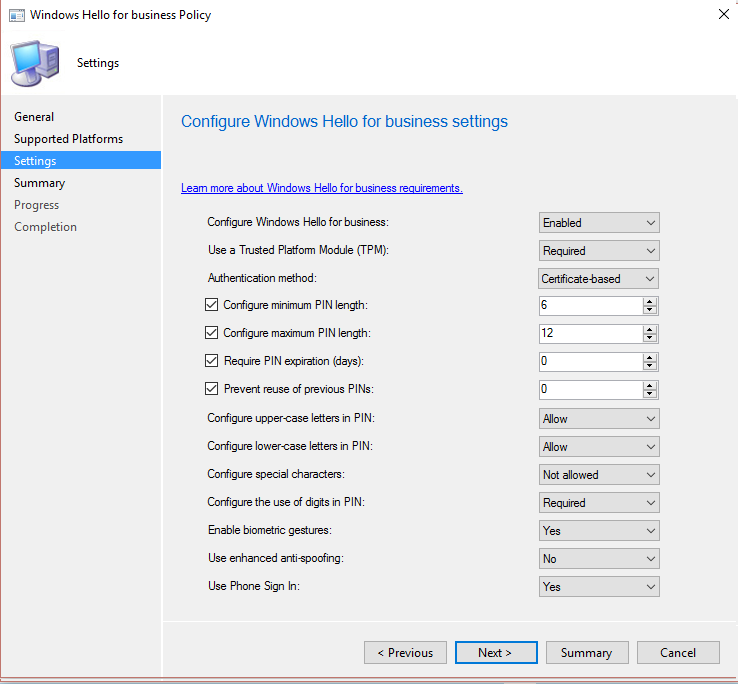

# Windows Hello for Business settings in Configuration Manager

*Applies to: System Center Configuration Manager (Current Branch)*

<!--1245704-->
Configuration Manager lets you integrate with Windows Hello for Business (formerly Microsoft Passport for Windows), which is an alternative sign-in method for Windows 10 devices. Hello for Business uses Active Directory, or an Azure Active Directory account to replace a password, smart card, or virtual smart card. Hello for Business lets you use a **user gesture** to log in, instead of a password. A user gesture might be a simple PIN, biometric authentication, or an external device such as a fingerprint reader.

> [!Important]  
> As of December 2017, Windows Hello for Business settings in Configuration Manager is a [deprecated feature](/sccm/core/plan-design/changes/deprecated/removed-and-deprecated-cmfeatures). Windows Server 2016 Active Directory Federation Services Registration Authority (ADFS RA) deployment is simpler, provides a better user experience, and has a more deterministic certificate enrollment experience.  

For more information, see [Windows Hello for Business](https://docs.microsoft.com/windows/access-protection/hello-for-business/hello-identity-verification).

> [!Note]  
> Configuration Manager doesn't enable this optional feature by default. You must enable this feature before using it. For more information, see [Enable optional features from updates](/sccm/core/servers/manage/install-in-console-updates#bkmk_options).<!--505213-->  

Configuration Manager integrates with Windows Hello for Business in two ways:  

- You can use Configuration Manager to control which gestures users can and cannot use to sign in.  

- You can store authentication certificates in the Windows Hello for Business key storage provider (KSP). For more information, see [Certificate profiles](introduction-to-certificate-profiles.md).  

- You can deploy Windows Hello for Business policies to domain-joined Windows 10 devices that run the Configuration Manager client. This configuration is described in the [Configure Windows Hello for Business on domain-joined Windows 10 devices](#configure-windows-hello-for-business-on-domain-joined-windows-10-devices) section. When you use Configuration Manager with Microsoft Intune (hybrid), you can configure these settings on Windows 10, and Windows 10 Mobile devices. For more information, see [Configure Windows Hello for Business settings (hybrid)](/sccm/mdm/deploy-use/windows-hello-for-business-settings).

## Configure Windows Hello for Business on domain-joined Windows 10 devices

You can control Windows Hello for Business settings on domain-joined Windows 10 devices by creating and deploying a Windows Hello for Business Profile. This approach is recommended.

If you are using certificate-based authentication, you must also deploy a certificate profile, as described in [Configure a certificate profile](#configure-a-certificate-profile). If you are using key-based authentication, you do not need to deploy a certificate profile.

## Configure a Windows Hello for Business profile  

In the Configuration Manager console, under **Company Resource Access**, right-click **Windows Hello for Business Profiles** and choose **New** to start the profile wizard. Provide the settings requested by the wizard, review and confirm the settings on the last page, and click **Close**. Here's an example of what your settings might look like:  

## Configure a certificate profile to enroll the Windows Hello for Business enrollment certificate in Configuration Manager  

If you want to use Windows Hello for Business certificate-based logon, configure the following components:  

-   A Configuration Manager certificate profile.  

-   In the certificate profile, select a template that uses Smart Card logon EKU.  

-	If you intend to store certificate profiles in the Windows Hello for Business key container, and the certificate profile uses the **Smart Card Logon** EKU, you must configure the following permissions for key registration to ensure the certificate is validated correctly.
You must first have created the **Key Admins** group and added all Configuration Manager management point computers as members to this group.

Some configurations might not need you to configure permissions, or might require further configurations. Refer to the following table for more help:

|Windows client version|Configuration Manager 1602 or 1606|Configuration Manager 1610|Configuration Manager 1702 or later|
|-|-|-|-|
|Windows 10 Anniversary Update|No hotfix required  No permissions required  No Windows schema update required|No hotfix required (see **Warning**)  No permissions required  No Windows schema update required|Configure permissions  Apply Windows Server 2016 schema to Active Directory|
|Windows 10 Creators Update or later|Not supported|Install [this hotfix](https://support.microsoft.com/help/4010155/update-rollup-for-system-center-configuration-manager-current-branch-v)  Configure permissions  Apply Windows Server 2016 schema to Active Directory|Configure permissions  Apply Windows Server 2016 schema to Active Directory|

> [!WARNING]
> While [the hotfix](https://support.microsoft.com/help/4010155/update-rollup-for-system-center-configuration-manager-current-branch-v) is not required for Configuration Manager 1610 and Windows 10 Anniversary Update, it may be installed.  If the hotfix is installed, you need to configure permissions and apply Windows Server 2016 schema to Active Directory.

## To configure permissions

1.	Sign in to a domain controller or management workstations with Domain Admin, or equivalent credentials.
2.	Open **Active Directory Users and Computers**.
3.	From the navigation pane, right-click your domain name, and then click **Properties**.
4.	On the **Security** tab of the *<domain name>* **Properties** dialog box, click **Advanced**. 
If the **Security** tab is not displayed, turn on **Advanced Features** from the **View** menu of **Active Directory Users and Computers**.
5.	Click **Add**.
6.	In the **Permission Entry for** *<domain name>* dialog box, click **Select a principal**.
7.	In the **Select User, Computer, Service Account, or Group** dialog box, type **Key Admins** in the **Enter the object name to select** text box. Click **OK**.
8.	From the **Applies to** list, select **Descendant User objects**.
9.	Scroll to the bottom of the page and click **Clear all**.
10.	In the **Properties** section, select **Read msDS-KeyCredentialLink**.
11.	Click **OK** three times to complete the task.

## Next steps

For more information, see [Certificate profiles](introduction-to-certificate-profiles.md).  

