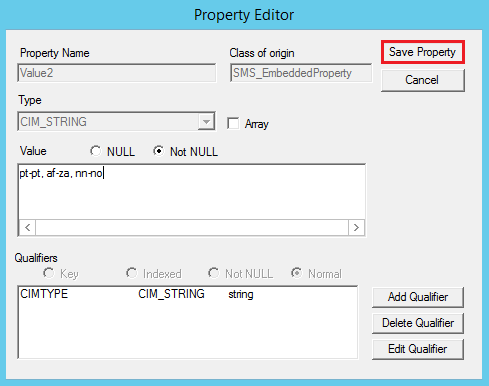
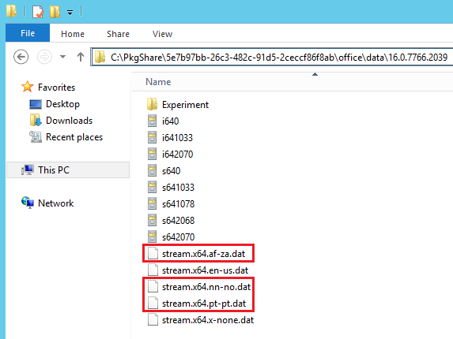

# Manage Office 365 ProPlus with Configuration Manager

*Applies to: System Center Configuration Manager (Current Branch)*

Configuration Manager lets you manage Office 365 ProPlus apps in the following ways:

- [Office 365 Client Management dashboard](#office-365-client-management-dashboard): You can review Office 365 client information from the Office 365 Client Management dashboard. Beginning in Configuration Manager version 1802, the Office 365 client management dashboard displays a list of relevant devices when graph sections are selected. <!--1357281 -->

- [Deploy Office 365 apps](#deploy-office-365-apps): You can start the Office 365 Installer from the Office 365 Client Management dashboard to make the initial Office 365 App installation experience easier. The wizard lets you configure Office 365 installation settings, download files from Office Content Delivery Networks (CDNs), and create and deploy a script application with the content.    

- [Deploy Office 365 updates](#deploy-office-365-updates): You can manage Office 365 client updates by using the software update management workflow. When Microsoft publishes a new Office 365 client update to the Office Content Delivery Network (CDN), Microsoft also publishes an update package to Windows Server Update Services (WSUS). After Configuration Manager synchronizes the Office 365 client update from the WSUS catalog to the site server, the update is available to deploy to clients.    

- [Add languages for Office 365 update downloads](#add-languages-for-office-365-update-downloads): You can add support for Configuration Manager to download updates for any languages supported by Office 365. Meaning Configuration Manager doesn't have to support the language as long as Office 365 does. Prior to Configuration Manager version 1610 you must download and deploy updates in the same languages configured on Office 365 clients. 

- [Change the update channel](#change-the-update-channel-after-you-enable-office-365-clients-to-receive-updates-from-configuration-manager): You can use group policy to distribute a registry key value change to Office 365 clients to change the update channel.

## Office 365 Client Management dashboard  
The Office 365 Client Management dashboard provides charts for the following information:

- Number of Office 365 clients
- Office 365 client versions
- Office 365 client languages
- Office 365 client channels     
  For more information, see [Overview of update channels for Office 365 ProPlus](/DeployOffice/overview-of-update-channels-for-office-365-proplus).

To view the Office 365 Client Management dashboard in the Configuration Manager console, go to **Software Library** > **Overview** > **Office 365 Client Management**. At the top of the dashboard, use the **Collection** drop-down setting to filter the dashboard data by members of a specific collection. Beginning in Configuration Manager version 1802, the Office 365 client management dashboard displays a list of relevant devices when graph sections are selected.

### Display data in the Office 365 Client Management dashboard
The data that is displayed in the Office 365 Client Management dashboard comes from hardware inventory. Enable hardware inventory and select the **Office 365 ProPlus Configurations** hardware inventory class for data to display in the dashboard. 
#### To display data in the Office 365 Client Management dashboard
1. Enable hardware inventory, if it isn't yet enabled. For details, see [Configure hardware inventory](/sccm/core/clients/manage/inventory/configure-hardware-inventory).
2. In the Configuration Manager console, navigate to **Administration** > **Client Settings** > **Default Client Settings**.  
3. On the **Home** tab, in the **Properties** group, click **Properties**.  
4. In the **Default Client Settings** dialog box, click **Hardware Inventory**.  
5. In the **Device Settings** list, click **Set Classes**.  
6. In the **Hardware Inventory Classes** dialog box, select **Office 365 ProPlus Configurations**.  
7.  Click **OK** to save your changes and close the **Hardware Inventory Classes** dialog box.  The Office 365 Client Management dashboard starts displaying data as hardware inventory is reported.

## Deploy Office 365 apps  
Start the Office 365 Installer from the Office 365 Client Management dashboard for the initial Office 365 App installation. The wizard lets you configure Office 365 installation settings, download files from Office Content Delivery Networks (CDNs), and create and deploy a script application for the files. Until Office 365 is installed on clients and the [Office automatic updates task](https://docs.microsoft.com/deployoffice/overview-of-the-update-process-for-office-365-proplus) runs, Office 365 updates aren't applicable. For testing purposes, you can run the update task manually.

For previous Configuration Manager versions, you must take the following steps to install Office 365 apps for the first time on clients:
- Download Office 365 Deployment Tool (ODT)
- Download the Office 365 installation source files, including all of the language packs that you need.
- Generate the Configuration.xml that specifies the correct Office version and channel.
- Create and deploy either a legacy package or a script application for clients to install the Office 365 apps.

### Requirements
- The computer that runs the Office 365 Installer must have Internet access.  
- The user that runs the Office 365 Installer must have **Read** and **Write** access to the content location share provided in the wizard.
- If you receive a 404 download error, copy the following files to the user %temp% folder:
  - [releasehistory.xml](http://officecdn.microsoft.com/pr/wsus/releasehistory.cab)
  - [o365client_32bit.xml](http://officecdn.microsoft.com/pr/wsus/ofl.cab)  

### Deploy Office 365 apps using Configuration Manager version 1806 or higher: 
Starting in Configuration Manager 1806, the Office Customization Tool is integrated with the Office 365 Installer in the Configuration Manager console. When creating a deployment for Office 365, you can dynamically configure the latest Office manageability settings. <!--1358149-->

1. In the Configuration Manager console, navigate to **Software Library** > **Overview** > **Office 365 Client Management**.
2. Click **Office 365 Installer** in the upper-right pane. The Office 365 Client Installation Wizard opens.
3. On the **Application Settings** page, provide a name and description for the app, enter the download location for the files, and then click **Next**. The location must be specified as &#92;&#92;*server*&#92;*share*.
4. On the **Office Settings** page, click on **Go to the Office Customization Tool**. This will open the [Office Customization Tool for Click-to-Run](https://config.office.com).
5. Configure the desired settings for your Office 365 installation. Click the **Submit** in the upper right of the page when you complete the configuration. 
6. On the **Deployment** page, determine if you would like to deploy now or at a later time. If you choose to deploy later, you can find the application in **Software Library** < **Application Management** < **Applications**.  
7. Confirm the settings on the **Summary** page. 
8. Click **Next** then click **Close** once the Office 365 Client Installation Wizard completes. 

### Deploy Office 365 apps using Configuration Manager version 1802 and prior:

1. In the Configuration Manager console, navigate to **Software Library** > **Overview** > **Office 365 Client Management**.
2. Click **Office 365 Installer** in the upper-right pane. The Office 365 Client Installation Wizard opens.
3. On the **Application Settings** page, provide a name and description for the app, enter the download location for the files, and then click **Next**. The location must be specified as &#92;&#92;*server*&#92;*share*.
4. On the **Import Client Settings** page, choose whether to import the Office 365 client settings from an existing XML configuration file or to manually specify the settings. Click **Next** when you're done.  

    When you have an existing configuration file, enter the location for the file and skip to step 7. You must specify the location in the form &#92;&#92;*server*&#92;*share*&#92;*filename*.XML.
    > [!IMPORTANT]    
    > The XML configuration file must contain only [languages supported by the Office 365 ProPlus client](https://docs.microsoft.com/deployoffice/office2016/language-identifiers-and-optionstate-id-values-in-office-2016).

5. On the **Client Products** page, select the Office 365 suite that you use. Select the applications that you want to include. Select any additional Office products that should be included, and then click **Next**.
6. On the **Client Settings** page, choose the settings to include, and then click **Next**.
7. On the **Deployment** page, choose whether to deploy the application, and then click **Next**.  If you choose not to deploy the package in the wizard, skip to step 9.
8. Configure the remainder of the wizard pages as you would for a typical application deployment. For details, see [Create and deploy an application](/sccm/apps/get-started/create-and-deploy-an-application).
9. Complete the wizard.
10. You can deploy or edit the application from **Software Library** > **Overview** > **Application Management** > **Applications**.    

After you create and deploy Office 365 applications using the Office 365 Installer, Configuration Manager won't manage the Office updates by default. To enable Office 365 clients to receive updates from Configuration Manager, see [Deploy Office 365 updates with Configuration Manager](#deploy-office-365-updates-with-configuration-manager).

After you deploy Office 365 apps, you can create automatic deployment rules to maintain the apps. To create an automatic deployment rule for Office 365 apps, click **Create an ADR** from the Office 365 Client Management dashboard. Select **Office 365 Client** when you choose the product. For more information, see [Automatically deploy software updates](/sccm/sum/deploy-use/automatically-deploy-software-updates).

## Deploy Office 365 updates
There is a scheduled [Automatic Updates task in Office 365](https://docs.microsoft.com/deployoffice/overview-of-the-update-process-for-office-365-proplus) that runs several times a week. If you recently installed Office 365, it's possible that the update channel has not been set yet and an update scan will not find applicable updates for it. For testing purposes, you can start the update task manually. 

Use the following steps to deploy Office 365 updates with Configuration Manager:

1.  [Verify the requirements](/DeployOffice/manage-updates-to-office-365-proplus-with-system-center-configuration-manager#requirements-for-using-configuration-manager-to-manage-office-365-client-updates) for using Configuration Manager to manage Office 365 client updates in the **Requirements for using Configuration Manager to manage Office 365 client updates** section of the article.  

2.  [Configure software update points](../get-started/configure-classifications-and-products.md) to synchronize the Office 365 client updates. Set **Updates** for the classification and select **Office 365 Client** for the product. Synchronize software updates after you configure the software update points to use the **Updates** classification.
3.  Enable Office 365 clients to receive updates from Configuration Manager. Use Configuration Manager client settings or group policy to enable the client.   

    **Method 1**: Beginning in Configuration Manager version 1606, you can use the Configuration Manager client setting to manage the Office 365 client agent. After you configure this setting and deploy Office 365 updates, the Configuration Manager client agent communicates with the Office 365 client agent to download the updates from a distribution point and install them. Configuration Manager takes inventory of Office 365 ProPlus Client settings.    

      1.  In the Configuration Manager console, click **Administration** > **Overview** > **Client Settings**.  

      2.  Open the appropriate device settings to enable the client agent. For more information about default and custom client settings, see [How to configure client settings in System Center Configuration Manager](../../core/clients/deploy/configure-client-settings.md).  

      3.  Click **Software Updates** and select **Yes** for the **Enable management of the Office 365 Client Agent** setting.  

    **Method 2**:
    [Enable Office 365 clients to receive updates](/DeployOffice/manage-updates-to-office-365-proplus-with-system-center-configuration-manager#BKMK_EnableClient) from Configuration Manager by using the Office Deployment Tool or Group Policy.  

4. [Deploy the Office 365 updates](deploy-software-updates.md) to clients.   

> [!Important]
> - Starting in Configuration Manager version 1706 Office 365 client updates have moved to the **Office 365 Client Management** >**Office 365 Updates** node. This move won't impact your current ADR configuration. 
> - Prior to Configuration Manager version 1610 you must download and deploy updates in the same languages configured on Office 365 clients. For example, let's say you have an Office 365 client configured with the en-us and de-de languages. On the site server, you download and deploy only en-us content for an applicable Office 365 update. When the user starts the installation from Software Center for this update, the update hangs while downloading the content for de-de.   

## Restart behavior and client notifications for Office 365 updates
When you deploy an update to an Office 365 client, the restart behavior and client notifications are different depending on the version of Configuration Manager. The following table provides information about the end-user experience when the client receives an Office 365 update:

|Configuration Manager version |End-user experience|  
|----------------|---------------------|
|1706, 1710|The client receives pop-up and in-app notifications, as well as a countdown dialog, prior to installing the update.|
|1802| The client receives pop-up and in-app notifications, as well as a countdown dialog, prior to installing the update.  If any Office 365 applications are running during an Office 365 client update enforcement, the Office applications will not be forced to close. Instead, the update install will return as requiring a system restart <!--510006-->|

> [!Important]
>
>In Configuration Manager version 1706, note the following details:
>
>- A notification icon displays in the notification area on the task bar for required apps where the deadline is within 48 hours in the future and the update content has been downloaded. 
>- A countdown dialog displays for required apps where the deadline is within 7.5 hours in the future and the update has been downloaded. The user can postpone the countdown dialog up to three times before the deadline. When postponed, the countdown displays again after two hours. If not postponed, there is a 30-minute countdown and update gets installed when the countdown expires.
>- A pop-up notification might not display until the user clicks the icon in the notification area. In addition, if the notification area has minimal space, the notification icon might not be visible unless the user opens or expands the notification area. 
>- The notification and countdown dialog could start while the user is not actively working on the device. For example, when the device is locked overnight it’s possible Office apps running on the device could be forced to close to install the update. Before closing the app, Office saves app data to prevent data loss. 
>- If the deadline is in the past or configured to start as soon as possible, running Office apps might be forced to close without notifications. 
>- If the user installs an Office update before the deadline, Configuration Manager verifies that the update is installed when the deadline is reached. If the update is not detected on the device, the update is installed. 
>- The in-app notification bar does not display on an Office app that is running before the update is downloaded. After the update is downloaded, the in-app notification displays only for newly opened apps.
>- For Office updates triggered by a service window or scheduled for non-business hours, it's possible that running Office apps might be forced to close to install the update without notifications. 
>- For more information, see [End-user update notifications for Office 365](https://docs.microsoft.com/deployoffice/end-user-update-notifications-for-office-365-proplus)

## Add languages for Office 365 update downloads
You can add support for Configuration Manager to download updates for any languages that are supported by Office 365, regardless of whether they're supported in Configuration Manager.    

> [!IMPORTANT]  
> Configuring additional Office 365 update languages is a site-wide setting. After you add the languages using the following procedure, all Office 365 updates are downloaded in those languages, as well as the languages that you select on the **Language Selection** page in the Download Software Updates or Deploy Software Updates wizards.

### To add support to download updates for additional languages
Use the following procedure on the software update point at the central administration site or stand-alone primary site.
1. From a command prompt, type *wbemtest* as an administrative user to open the Windows Management Instrumentation Tester.
2. Click **Connect**, and then type *root\sms\site_&lt;siteCode&gt;*.
3. Click **Query**, and then run the following query:
   *select &#42; from SMS_SCI_Component where componentname ="SMS_WSUS_CONFIGURATION_MANAGER"*  
   
4. In the results pane, double-click the object with the site code for the central administration site or stand-alone primary site.
5. Select the **Props** property, click **Edit Property**, and then click **View Embedded**.
   
6. Starting at the first query result, open each object until you find the one with **AdditionalUpdateLanguagesForO365** for the **PropertyName** property.
7. Select **Value2** and click **Edit Property**.  
   
8. Add additional languages to the **Value2** property and click **Save Property**.   
   For example, pt-pt (for Portuguese - Portugal), af-za (for Afrikaans - South Africa), nn-no (for Norwegian (Nynorsk) - Norway), etc. You would type `pt-pt,af-za,nn-no` for the example languages. Don't use spaces between the languages.
 
     
9. Click **Close**, click **Close**, click **Save Property**, and click **Save Object** (if you click **Close** here the values are discarded). Click **Close**, and then click **Exit** to exit the Windows Management Instrumentation Tester.
10. In the Configuration Manager console, go to **Software Library** > **Overview** > **Office 365 Client Management** > **Office 365 Updates**.
11. Now when you download Office 365 updates, the updates are downloaded in the languages that you select in the wizard and configured in this procedure. To verify that the updates download in the correct languages, go to the package source for the update and look for files with the language code in the filename.  
    

## Updating Office 365 during task sequences when Office 365 is installed in the base image
When you install an operating system where Office 365 is already installed in the image, it's possible that the update channel registry key value has the original install location. In this case, the update scan won't show any Office 365 client updates as applicable. There's a scheduled Office automatic updates task that runs several times a week. After that task runs, the update channel will point to the configured Office CDN URL and the scan will then show these updates as applicable. <!--510452-->

To ensure that the update channel is set so applicable updates will be found, do the following steps:
1. On a machine with the same version of Office 365 as the OS base image, open Task Scheduler (taskschd.msc) and identify the Office 365 automatic updates task. Typically, it's located under **Task Scheduler Library** >**Microsoft**>**Office**.
2. Right-click on the automatic updates task and select **Properties**.
3. Go to the **Actions** tab and click **Edit**. Copy the command and any arguments. 
4. In the Configuration Manager console, edit your task sequence.
5. Add a new **Run Command Line** step before the **Install Updates** step in the task sequence. 
6. Copy in the command and arguments that you gathered from the Office automatic updates scheduled task. 
7. Click **OK**. 

## Change the update channel after you enable Office 365 clients to receive updates from Configuration Manager
To change the update channel after you enable Office 365 clients to receive updates from Configuration Manager, use group policy to distribute a registry key value change to Office 365 clients. Change the **HKEY_LOCAL_MACHINE\SOFTWARE\Microsoft\Office\ClickToRun\Configuration\CDNBaseUrl** registry key to use one of the following values:

- Monthly Channel  
<i>(formerly Current Channel)</i>:  
  **CDNBaseUrl** = http&#58;//officecdn.microsoft.com/pr/492350f6-3a01-4f97-b9c0-c7c6ddf67d60

- Semi-Annual Channel  
<i>(formerly Deferred Channel)</i>:  
  **CDNBaseUrl** = http&#58;//officecdn.microsoft.com/pr/7ffbc6bf-bc32-4f92-8982-f9dd17fd3114

- Monthly Channel (Targeted) 
 <i>(formerly First Release for Current Channel)</i>:  
  **CDNBaseUrl** = http&#58;//officecdn.microsoft.com/pr/64256afe-f5d9-4f86-8936-8840a6a4f5be

- Semi-Annual Channel (Targeted)  
<i>(formerly First Release for Deferred Channel)</i>:  
  **CDNBaseUrl** = http&#58;//officecdn.microsoft.com/pr/b8f9b850-328d-4355-9145-c59439a0c4cf
<!--the channel names changed in Sept 2017- https://docs.microsoft.com/en-us/DeployOffice/overview-of-update-channels-for-office-365-proplus?ui=en-US&rs=en-US&ad=US-->

<!--- You can create an Office 365 app without using the Office 365 Installation Wizard. To do this, you use the Office 2016 Deployment Tool (ODT) to download Office installation source files to a network share, generate Configure.xml that specifies the correct Office version and channel, and so on. Then, create an app for the files using the normal app management process.
> [!Note]
> The Office 365 Installation Wizard was introduced in Configuration Manager version 1702 and provides an easy way to create Office 365 apps.

- [Download the Office 2016 Deployment Tool](http://aka.ms/ODT2016) from the Microsoft Download Center.  
- Review the [configuration options for the Office Deployment Tool](https://technet.microsoft.com/library/jj219426.aspx).

You can create an application just as you would with any other application in Configuration Manager from **Software Library** > **Overview** > **Application Management** > **Applications**. For details, see [Create and deploy an application](/sccm/apps/get-started/create-and-deploy-an-application).
--->

<!--- ## Next steps
Use the Office 365 Client Management dashboard in Configuration Manager to review Office 365 client information and deploy Office 365 apps. For details, see [Manage Office 365 apps](manage-office-365-apps.md). --->
