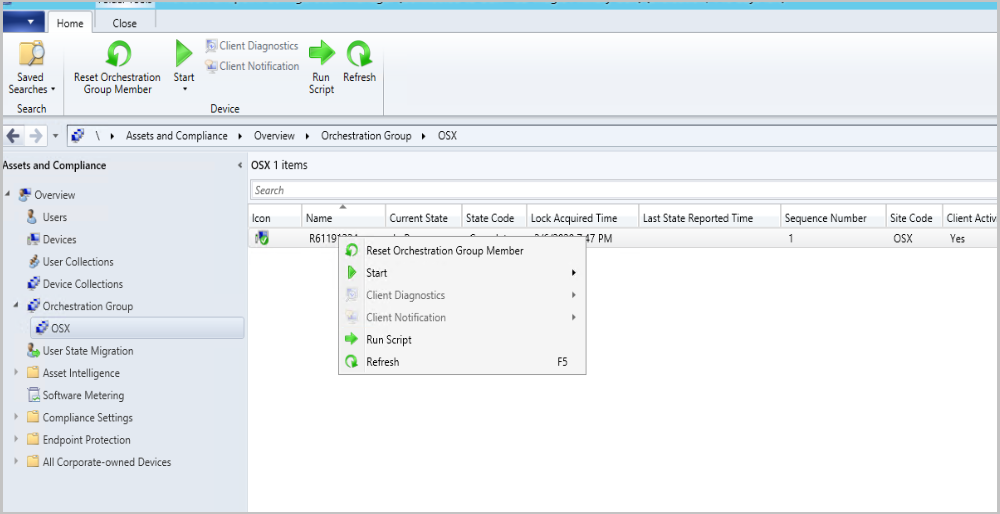

# Orchestration groups in Configuration Manager
<!--3098816-->
*Applies to: Configuration Manager (current branch)*

Starting in Configuration Manager version 2002, you can create orchestration groups. Create an orchestration group to better control the deployment of software updates to devices. Many server administrators need to carefully manage updates for specific workloads, and automate behaviors in between.

An orchestration group gives you the flexibility to update devices based on a percentage, a specific number, or an explicit order. You can also run a PowerShell script before and after the devices run the update deployment.

Members of an orchestration group can be any Configuration Manager client, not just servers. The orchestration group rules apply to the devices for all software update deployments to any collection that contains an orchestration group member. Other deployment behaviors still apply. For example, maintenance windows and deployment schedules.

> [!NOTE]
> In this version of Configuration Manager, orchestration groups is a pre-release feature. To enable it, see [Pre-release features](/sccm/core/servers/manage/pre-release-features).  
>
> The **Orchestration Groups** feature is the evolution of the [Server Groups](/sccm/sum/deploy-use/service-a-server-group) feature. An orchestration group is an object in Configuration Manager.

## Orchestration group usage example

- As the software updates administrator, you manage all updates for your organization.
- You have one large collection for all servers and one large collection for all clients. You deploy all updates to these collections.
- The SQL administrators want to control all the software installed on the SQL servers. They want to patch five servers in a specific order. Their current process is to manually stop specific services before installing updates, and then restart the services afterwards.
- You create an orchestration group and add all five SQL servers. You also add pre- and post-scripts, using the PowerShell scripts provided by the SQL administrators.
- During the next update cycle, you create and deploy the software updates as normal to the large collection of servers. The SQL administrators run the deployment, and the orchestration group automates the order and services.

## Prerequisites

### Site server and permission prerequisites
- To see all of the orchestration groups and updates for those groups, your account needs to be a **Full Administrator**.
   - Role-based administration for orchestration groups currently isn't available.
- Enable the **Orchestration Groups** feature. For more information, see [Enable optional features](/sccm/core/servers/manage/install-in-console-updates#bkmk_options).
   - When you enable **Orchestration Groups**, the site disables the **Server Groups** feature. This behavior avoids any conflicts between the two features.

### Client prerequisites

- Upgrade the target devices to the latest version of the Configuration Manager client.
- Members of an orchestration group should be assigned to the same site.
- Devices can't be in more than one orchestration group.
   - Devices already in an orchestration group won't' be available to select when adding new members.

## Limitations

- You can have up to 1000 orchestration group members.
- Orchestration groups don't work in interoperability mode. For more information, see [Interoperability between different versions of Configuration Manager](/configmgr/core/plan-design/hierarchy/interoperability-between-different-versions#bkmk_mixed). <!--6389000-->
- If updates are initiated by users from Software Center, orchestration will be bypassed. <!--6362887-->

## Server groups are automatically updated to orchestration groups

The **Orchestration Groups** feature is the evolution of the [Server Groups](/sccm/sum/deploy-use/service-a-server-group) feature. When you install Configuration Manager version 2002 or later and you have Server Groups enabled, your server groups are automatically moved to orchestration groups.

## Create an orchestration group

1. In the Configuration Manager console, go to the **Assets and Compliance** workspace, and select the **Orchestration Group** node.

1. In the ribbon, select **Create Orchestration Group** to open the **Create Orchestration Group Wizard**.

1. On the **General** page, give your orchestration group a **Name** and optionally a **Description**. Specify your values for the following items:
   - **Orchestration Group timeout (in minutes)**: Time limit for all group members to complete update installation.
   - **Orchestration Group member timeout (in minutes)**: Time limit for a single device in the group to complete the update installation.

1. On the **Member Selection** page, first specify the **Site code**. Then select **Add** to add device resources as members of this orchestration group. **Search** for devices by name, and then **Add** them. You can also filter your search to a single collection by using **Search in Collection**.  Select **OK** when you finish adding devices to the selected resources list.
   - When selecting resources for the group, only valid clients are shown. Checks are made for verifying the site code, that the client is installed, and that resources aren't duplicated.

1. On the **Rule Selection** page, select one of the following options:

   - **Allow a percentage of the machines to be updated at the same time**, then select or enter a number for this percentage. Use this setting to allow for future flexibility of the size of the orchestration group. For example, your orchestration group contains 50 devices, and you set this value to 10. During a software update deployment, Configuration Manager allows five devices to simultaneously run the deployment. If you later increase the size of the orchestration group to 100 devices, then 10 devices update at once.

   - **Allow a number of the machines to be updated at the same time**, then select or enter a number for this specific count. Use this setting to always limit to a specific number of devices, whatever the overall size of the orchestration group.

   - **Specify the maintenance sequence**, then sort the selected resources in the proper order. Use this setting to explicitly define the order in which devices run the software update deployment.

1. On the **Pre-Script** page, enter a PowerShell script to run on each device *before* the deployment runs. The script should return a value of `0` for success, or `3010` for success with restart.

1. On the **Post-Script** page, enter a PowerShell script to run on each device *after* the deployment runs. The behavior is otherwise the same as the PreScript.

1. Complete the wizard.

> [!WARNING]
> Ensure pre-scripts and post-scripts are tested before using them for orchestration groups. The pre-scripts and post-scripts don't timeout and will run until the orchestration group member timeout has been reached.

## View orchestration groups and members

From the **Assets and Compliance** workspace, select the **Orchestration Group** node. To view members, select an orchestration group and select **Show Members** in the ribbon. For more information about the available columns for the nodes, see [Monitor orchestration groups and members](#bkmk_orch_monitor).

## Edit or delete an orchestration group

To delete the orchestration group, select it then click **Delete** in the ribbon or from the right-click menu. To edit an orchestration group, select it then click **Properties** in the ribbon or from the right-click menu. Change the settings from the following tabs:

   - **General**: 
      - **Name**: The name of your orchestration group
      - **Description**: Orchestration group description (optional)
      - **Orchestration Group timeout (in minutes)**: Time limit for all group members to complete update installation.
      - **Orchestration Group member timeout (in minutes)**: Time limit for a single device in the group to complete the update installation.

  - **Member Selection**:
     - **Site Code**: Site code for the orchestration group.
     - **Members**: Click **Add** to select additional devices for the orchestration group. Click **Remove** to remove the selected device.

   - **Rules Selection**:
      - **Allow a percentage of the machines to be updated at the same time**, then select or enter a number for this percentage. Use this setting to allow for future flexibility of the size of the orchestration group. For example, your orchestration group contains 50 devices, and you set this value to 10. During a software update deployment, Configuration Manager allows five devices to simultaneously run the deployment. If you later increase the size of the orchestration group to 100 devices, then 10 devices update at once.
      - **Allow a number of the machines to be updated at the same time**, then select or enter a number for this specific count. Use this setting to always limit to a specific number of devices, whatever the overall size of the orchestration group.
      - **Specify the maintenance sequence**: Sort the selected resources to the proper order. Use this setting to explicitly define the order in which devices run the software update deployment.

   - **Pre-Script**: 
       - Enter a PowerShell script that runs on each device *before* the deployment runs. The script should return a value of `0` for success, or `3010` for success with restart.
       
   - **Post-Script**:
      - Enter a PowerShell script to run on each device *after* the deployment runs. The script should return a value of `0` for success, or `3010` for success with restart.
   > [!WARNING]
   > Ensure pre-scripts and post-scripts are tested before using them for orchestration groups. The pre-scripts and post-scripts don't timeout and will run until the orchestration group member timeout has been reached.

## Start orchestration

1. [Deploy software updates](/sccm/sum/deploy-use/deploy-software-updates) to a collection that contains the members of the orchestration group.

1. Orchestration starts when any client in the group tries to install any software update at deadline or during a maintenance window. It starts for the entire group, and makes sure that the devices update by following the orchestration group rules.
1. You can manually start orchestration by selecting it from the **Orchestration Group** node, then choosing **Start Orchestration** from the ribbon or right-click menu.
1. If an orchestration group is in a *Failed* state:
   1. Determine why the orchestration failed and resolve any issues.
   1. [Reset the orchestration state for group members](#bkmk_reset).
   1. From the **Orchestration Group** nose, click the **Start Orchestration** button to restart orchestration.
    reset that status it by using **Start Orchestration** button.  
   

> [!TIP]
> - Orchestration groups only apply to software update deployments. They don't apply to other deployments.
> - You can right-click on an Orchestration Group member and select **Reset Orchestration Group Member**. This allows you to rerun orchestration.

##  Monitor orchestration groups

From the **Assets and Compliance** workspace, select the **Orchestration Group** node. Add any of the following columns to get information about the groups:

- **Orchestration Name**: The name of your orchestration group.
- **Site Code**: Site code for the group.
- **Orchestration Type**: is one of the following types:
   - Number
   - Percentage
   - Sequence

- **Orchestration Value**: How many members or the percentage of members that can get a lock simultaneously. **Orchestration Value** is only populated when **Orchestration Type** is either *Number* or *Percentage*.  
- **Orchestration State**: In progress during orchestration. Idle when not in progress.
- **Orchestration Start Time**: Date and time that the orchestration started.
- **Current Sequence Number**: Indicates for which member of the group orchestration is active. This number corresponds with the **Sequence Number** for the member.  
- **Orchestration Timeout (in minutes)**: Value of **The Orchestration Group timeout (in minutes)** set on the **General** page when creating the group, or the **General** tab when editing the group.
- **Orchestration Group Member Timeout (in minutes)**: Value of **Orchestration Group member timeout (in minutes)** set on the **General** page when creating the group, or the **General** tab when editing the group.
- **Orchestration Group ID**: ID of the group, The ID is used in logs and the database.
- **Orchestration Group Unique ID**: Unique ID of the group, The Unique ID is used in logs and the database.

## Monitor orchestration group members

In the **Orchestration Group** node, select an orchestration group. In the ribbon, select **Show Members**. You can see the members of the group, and their orchestration status. Add any of the following columns to get information about the members:

- **Name**: Device name of the orchestration group member
- **Current State**: Gives you the state of the member device.
   - **In progress** during orchestration.
   - **Waiting**: Indicates the client is waiting on the lock for its turn to install updates.
   - **Idle** when orchestration is complete or not running.
- **State Code**: You can right-click on the Orchestration Group member and select **Reset Orchestration Group Member**. This reset allows you to rerun orchestration. States include: 
   - Idle
   - Waiting, the device is waiting its turn
   - In progress, installing an update
   - Failed
   - Reboot pending
- **Lock Acquired Time**: Locks are requested by the client based on its policy. Once the client acquires a lock, orchestration is triggered on it.  
-**Last State Reported Time**: Time the member last reported a state.
- **Sequence Number**: The client's location in the queue for installing updates.
- **Site Code**: The site code for the member.
- **Client Activity**: Tells you if the client is active or inactive.
- **Primary User(s)**: Which users are primary for the device.
- **Client Type**: What type of device the client is.
- **Currently Logged on User**: Which user is currently logged on to the device.
- **OG ID**: ID of the orchestration group the member belongs to.
- **OG Unique ID**: Unique ID of the orchestration group the member belongs to.
- **Resource ID**: Resource ID of the device.

##  Reset the orchestration state for a group member

If you want to rerun orchestration on a group member, you can clear its state such as *Complete* or *Failed*. To clear the state, right-click on the Orchestration Group member and select **Reset Orchestration Group Member**. You can also click **Reset Orchestration Group Member** from the ribbon. Before resetting the state, you should check the client to see why it failed and correct any issues found.
   

## Log files

Use the following log files on the site server to help monitor and troubleshoot:

### Site server

- **Policypv.log**: shows that the site targets the orchestration group to the clients.
- **SMS_OrchestrationGroup.log**: shows the behaviors of the orchestration group.

### Client

- **MaintenanceCoordinator.log**: Shows the lock acquisition, update installation, pre and post-scripts, and lock release process.
- **UpdateDeployment.log**: Shows the update installation process.
- **PolicyAgent.log**: Checks if the client is in an orchestration group.

## Next steps

[Deploy software updates](/configmgr/sum/deploy-use/deploy-software-updates)