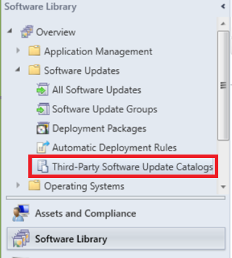
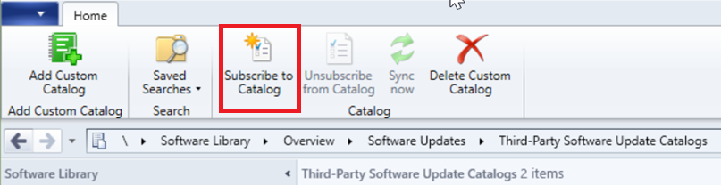

# Enable third-party updates 

*Applies to: System Center Configuration Manager version 1806*

Beginning with version 1806, the **Third-Party Software Update Catalogs** node in the Configuration Manager console allows you to subscribe to third-party catalogs, publish their updates to your software update point (SUP), and then deploy them to clients.  <!--1357605, 1352101, 1358714-->

## Prerequisites 
- Sufficient disk space on the top-level software update point's WSUSContent folder to store the source binary content for third-party software updates.
    - The amount of required storage varies based on the vendor, types of updates, and specific updates that you publish for deployment.
    - If you need to move the WSUSContent folder to another drive with more free space, see the [How to change the location where WSUS stores updates locally](https://blogs.technet.microsoft.com/sus/2008/05/19/wsus-how-to-change-the-location-where-wsus-stores-updates-locally/) blog post.
- The third-party software update synchronization service requires internet access.
    - For the partner catalogs list, download.microsoft.com over HTTPS port 443 is needed. 
    -  Internet access to any third-party catalogs and update content files. Additional ports other than 443 may be needed.
    - Third-party updates use the same proxy settings as the SUP.

## Additional requirements when the SUP is remote from the top-level site server 

1. SSL must be enabled on the SUP when it's remote. 
    - [Configure SSL on WSUS](https://docs.microsoft.com/windows-server/administration/windows-server-update-services/deploy/2-configure-wsus#bkmk_2.5.ConfigSSL)
        - When you configure SSL on WSUS, note some of the web services and the virtual directories are always HTTP and not HTTPS. 
        - Configuration Manager downloads third-party content for software update packages from your WSUS content directory over HTTP.   
    - [Configure SSL on the SUP](../get-started/install-a-software-update-point.md#configure-ssl-communications-to-wsus)

2. To allow the creation of the self-signed WSUS certificate: 
   - Remote registry should be enabled on the SUP server.
   -  The **WSUS server connection account** should have remote registry permissions on the SUP/WSUS server. 

3. Create the following registry key on the Configuration Manager site server: 
    - `HKLM\Software\Microsoft\Update Services\Server\Setup`, create a new DWORD named **EnableSelfSignedCertificates** with a value of `1`. 

4. To enable installing the certificate to the Trusted Publishers and Trusted Root stores on the remote SUP server:
   - The **WSUS server connection account** should have remote administration permissions on the SUP server.

    If this item isn't possible, export the certificate from the local computer's WSUS store into the Trusted Publisher and Trusted Root stores. 

> [!NOTE] 
>The **WSUS server connection account** can be identified by viewing the **Proxy and Account Settings** tab on the Site System role properties of the SUP. If an account is not specified, the site server's computer account is used.

## Enable third-party updates on the SUP
If you enable this option, you can subscribe to third-party update catalogs in the Configuration Manager console. You can then publish those updates to WSUS and deploy them to clients. The following steps should be run once per hierarchy to enable and set up the feature for use. The steps may need to be rerun if you ever replace the top-level SUP's WSUS server. 

1. In the Configuration Manager console, go to the **Administration** workspace. Expand **Site Configuration**, and select the **Sites** node.
2. Select the top-level site in the hierarchy. In the ribbon, click **Configure Site Components**, and select **Software Update Point**.
3. Switch to the **Third-Party Updates** tab. Select the option **Enable third-party software updates**.

    

## Configure the WSUS signing certificate
You'll need to decide if you want Configuration Manager to automatically manage the third-party WSUS signing certificate, or if you need to manually configure the certificate. 

### Automatically manage the WSUS signing certificate
If you don't have a requirement to use PKI certificates, you can choose to automatically manage the signing certificates for third-party updates. The WSUS certificate management is done as part of the sync cycle and gets logged in the `wsyncmgr.log`. 

1. In the Configuration Manager console, go to the **Administration** workspace. Expand **Site Configuration**, and select the **Sites** node.
2. Select the top-level site in the hierarchy. In the ribbon, click **Configure Site Components**, and select **Software Update Point**.
3. Switch to the **Third-Party Updates** tab. Select the option **Configuration Manager manages the certificate**. 
4. A new certificate of type **Third-party WSUS Signing** is created in the **Certificates** node under **Security** in the **Administration** workspace.  

### Manually manage the WSUS signing certificate
If you need to manually configure the certificate, such as needing to use a PKI certificate, you'll need to use either [System Center Updates Publisher](../tools/updates-publisher-options.md#update-server) or another tool to do so.  

1. Configure the signing certificate using [System Center Updates Publisher](../tools/updates-publisher-options.md#update-server).
2. In the Configuration Manager console, go to the **Administration** workspace. Expand **Site Configuration**, and select the **Sites** node.
3. Select the top-level site in the hierarchy. In the ribbon, click **Configure Site Components**, and select **Software Update Point**.
4. Switch to the **Third-Party Updates** tab. Select the option for **Manually manage the certificate**.

## Enable third-party updates on the clients
Enable third-party updates on the clients in the client settings. The setting sets the Windows Update agent policy for [Allow signed updates for an intranet Microsoft update service location](https://docs.microsoft.com/windows-server/administration/windows-server-update-services/deploy/4-configure-group-policy-settings-for-automatic-updates#BKMK_comp3). This client setting also installs the WSUS signing certificate to the Trusted Publisher store on the client. The certificate management logging is seen in `updatesdeployment.log` on the clients.  Run these steps for each custom client setting you want to use for third-party updates. For more information, see the [About client settings](/sccm/core/clients/deploy/about-client-settings#Enable-third-party-software-updates) article.

1. In the Configuration Manager console, go to the **Administration** workspace and select the **Client Settings** node.
2. Select an existing custom client setting or create a new one. 
3. Select the **Software Updates** tab on the left-hand side. If you don't have this tab, make sure that the **Software Updates** box is enabled.
4. Set **Enable third-party software updates** to **Yes**. 

## Add a custom catalog
*Partner catalogs* are software vendor catalogs that have their information already registered with Microsoft. With partner catalogs, you can subscribe to them without having to specify any additional information. Catalogs that you add are called *custom catalogs*. You can add a custom catalog from a third-party update vendor to Configuration Manager. Custom catalogs must use https and the updates must be digitally signed. 

1. Go to the **Software Updates Library** workspace, expand **Software updates**, and select the **Third-Party Software Update Catalogs** node. 
   
     
2. Click **Add Custom Catalog** in the ribbon. 

     
1. On the **General** page, specify the following items: 
    - **Download URL**: A valid HTTPS address of the custom catalog.
    - **Publisher**: The name of the organization that publishes the catalog. 
    - **Name**: The name of the catalog to display in the Configuration Manager Console. 
    - **Description**: A description of the catalog. 
    - **Support URL** (optional): A valid HTTPS address of a website to get help with the catalog. 
    - **Support Contact** (optional): Contact information to get help with the catalog. 
2. Click **Next** to review the catalog summary and to continue with completing the **Third-party Software Updates Custom Catalog Wizard**.

## Subscribe to a third-party catalog and sync updates
When you subscribe to a third-party catalog in the Configuration Manager console, the metadata for every update in the catalog are synced into the WSUS servers for your SUPs. The sync of the metadata allows the clients to determine if any of the updates are applicable. Perform the following steps for each third-party catalog to which you want to subscribe:  

1. In the Configuration Manager console, go to the **Software Library** workspace. Expand **Software Updates** and select the **Third-Party Software Update Catalogs** node.  
2. Select the catalog to subscribe and click **Subscribe to Catalog** in the ribbon. 
    
1. Review and approve the catalog certificate.
    >[!NOTE]
    > When you subscribe to a third-party software update catalog, the certificate that you review and approve in the wizard is added to the site. This certificate is of type **Third-party Software Updates Catalog**. You can manage it from the **Certificates** node under **Security** in the **Administration** workspace.  
2. Complete the wizard. After initial subscription, the catalog should start to download in a few minutes. 
    - The catalog synchronizes automatically every 7 days.
    - Click **Sync now** in the ribbon to force a sync.
3. After the catalog is downloaded, the product metadata needs to be synchronized from the WSUS database into the Configuration Manager database. [Manually start the software updates synchronization](../get-started/synchronize-software-updates.md#manually-start-software-updates-synchronization) to synchronize the product information.
4. Once the product information is synchronized, [Configure the SUP to synchronize the desired product](../get-started/configure-classifications-and-products.md#to-configure-classifications-and-products-to-synchronize) into Configuration Manager.  
5. [Manually start the software updates synchronization](../get-started/synchronize-software-updates.md#manually-start-software-updates-synchronization) to synchronize the new product's updates into Configuration Manager.  
6. When the synchronization completes, you can see the third-party updates in the **All Updates** node. These updates are published as **metadata-only** updates until you choose to publish them. 
     - The icon with the blue arrow represents a metadata-only software update. 

## Publish and deploy third-party software updates 
Once the third-party updates are in the **All Updates** node, you can choose which updates should be published for deployment. When you publish an update, the binary files are downloaded from the vendor and placed into the WSUSContent directory on the top-level SUP. 

1. In the Configuration Manager console, go to the **Software Library** workspace. Expand **Software Updates** and select the **All Software Updates** node.
2. Click **Add Criteria** to filter the list of updates. For example, add **Vendor** for **HP**. to view all updates from HP.  
3. Select the updates that are required by your organization. Click **Publish Third-Party Software Update Content**.
    - This action downloads the update binaries from the vendor then stores them in the WSUSContent folder on the top-level software update point. 
4. [Manually start the software updates synchronization](../get-started/synchronize-software-updates.md#manually-start-software-updates-synchronization) to change the state of the published updates from metadata-only to deployable updates with content. 
    >[!NOTE]
    >When you publish third-party software update content, any certificates used to sign the content are added to the site. These certificates are of type **Third-party Software Updates Content**. You can manage them from the **Certificates** node under **Security** in the **Administration** workspace.  

5. Review the progress in the SMS_ISVUPDATES_SYNCAGENT.log. The log is located on the  top-level software update point in the site system Logs folder.
6. Deploy the updates using the [Deploy software updates](../deploy-use/deploy-software-updates.md) process. 
7. On the **Download Locations** page of the **Deploy Software Updates Wizard**, select the default option to **Download software updates from the internet**. In this scenario, the content is already published to the software update point, which is used to download the content for the deployment package.
8. Clients will need to run a scan and evaluate updates before you can see compliance results.  You can manually trigger this cycle from the Configuration Manager control panel on a client by running the **Software Updates Scan Cycle** action.

## Monitoring progress of third-party software updates 

Synchronization of third-party software updates is handled by the SMS_ISVUPDATES_SYNCAGENT component on the top-level default software update point. You can view status messages from this component, or see more detailed status in the SMS_ISVUPDATES_SYNCAGENT.log. This log is on the  top-level software update point in the site system Logs folder. By default this path is C:\Program Files\Microsoft Configuration Manager\Logs. For more information on monitoring the general software update management process, see [Monitor software updates](../deploy-use/monitor-software-updates.md) 

## Known issues

- The machine where the console is running is used to download the updates from WSUS and add it to the updates package. The WSUS signing certificate must be trusted on the console machine. If it isn't, you may see issues with the signature check during the download of third-party updates. 
- The third-party software update synchronization service can't publish content to metadata-only updates that were added to WSUS by another application, tool, or script, such as SCUP. The **Publish third-party software update content** action fails on these updates. If you need to deploy third-party updates that this feature doesn't yet support, use your existing process in full for deploying those updates.  
-  Configuration Manager has a new version for the catalog cab file format. The new version includes the certificates for the vendor's binary files. These certificates are added to the **Certificates** node under **Security** in the **Administration** workspace once you approve and trust the catalog.  
     - You can still use the older catalog cab file version as long as the download URL is https and the updates are signed. The content will fail to publish because the certificates for the binaries aren't in the cab file and already approved. You can work around this issue by finding the certificate in the **Certificates** node, unblocking it, then publish the update again. If you're publishing multiple updates signed with different certificates, you'll need to unblock each certificate that is used.
     - For more information, see status messages 11523 and 11524 in the below status message table.

## Status messages

| MessageID       | Severity           | Description | Possible cause| Possible solution
| ------------- |-------------| -----|----|----|
| 11516     | Error |Failed to publish content for update "Update ID" because the content is unsigned.  Only content with valid signatures can be published.  |Configuration Manager doesn't allow unsigned updates to be published.| Publish the update in an alternate way.   See if a signed update is available from the vendor.|
| 11523  | Warning |  Catalog "X" does not include content signing certificates, attempts to publish update content for updates from this catalog may be unsuccessful until content signing certificates are added and approved. | This message can occur when you import a catalog that is using an older version of the cab file format.|Contact the catalog provider to obtain an updated catalog that includes the content signing certificates.     The certificates for the binaries aren't included in the cab file so the content will fail to publish. You can work around this issue by finding the certificate in the **Certificates** node, unblocking it, then publish the update again. If you're publishing multiple updates signed with different certificates, you'll need to unblock each certificate that is used.|
| 11524| Error  | Failed to publish update "ID" due to missing update metadata. | The update may have been synchronized to WSUS outside of Configuration Manager.| Synchronize the update with Configuration Manager before attempting to publish it's content.     If an external tool was used to publish the update as **Metadata only**, then use the same tool to publish the update content.|

## Working with third-party updates video
<iframe width="560" height="315" src="https://www.youtube.com/embed/bvAQeDSJIbs?ecver=1" frameborder="0" allowfullscreen></iframe>

## Next step
> [!div class="nextstepaction"]
> [Deploy software updates](./deploy-software-updates.md)