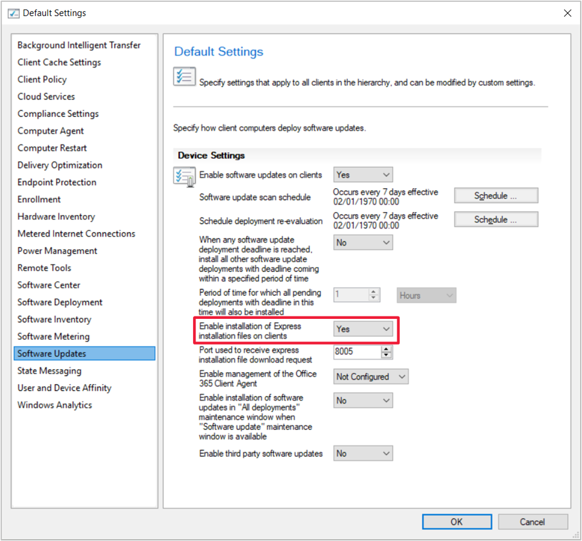

# UUP private preview instructions

> [!Note]  
> This information relates to a preview feature which may be substantially modified before it's commercially released. Microsoft makes no warranties, express or implied, with respect to the information provided here.  

## Benefits

### Feature updates

Feature updates with UUP are designed to alleviate multiple problems that customers have with servicing today. Try UUP feature updates, including:

- Upgrade straight to the latest security compliance level, you no longer need to install security updates immediately after upgrading to be compliant. Each month a new feature update will be published to include the latest cumulative security update. You won't need to redownload or distribute majority of the feature update content each month, only the security update component, which is also shared with the cumulative update.

- All FODs and language packs should be preserved and not lost during the upgrade process.

- Feature updates with UUP support express installation files, enabling clients to reduce the amount of content each client must download.

### Cumulative updates

Cumulative updates with UUP allow content for FODs and Language Packs to be distributed offline to enable end users to acquire them on demand without needing to go to the internet or tedious staging efforts by administrators.


## Set up instructions

### 1. Send your WSUS ID to your UUP preview contact at Microsoft

In order to participate in the UUP private preview, you must share your WSUS ID with Microsoft so that we can whitelist your environment into the preview. Without this ID, you'll be unable to see any UUP updates until the preview goes public.

To retrieve your WSUS ID:

```PowerShell
$server = Get-WsusServer
$config = $server.GetConfiguration()
$config.ServerId
```

### 2. Upgrade ConfigMgr to a supported version

If you're syncing express installation files in your environment, then ConfigMgr 1810 (TAP, fast ring, or GA builds all acceptable) is required for production environments, or 1812 Technical Preview for Technical Preview environments.

If you aren't syncing express installation files in your environment, then ConfigMgr 1810 UUP Hotfix on top of 1810 GA is required for production environments, or 1812 Technical Preview for Technical Preview environments.


#### ConfigMgr 1810 UUP HOTFIX (KB4482615) from 1810 GA (Slow Ring)
If you're currently on ConfigMgr 1810 GA (Slow Ring), then you'll need to upgrade ConfigMgr to the UUP rollup.

1. Apply “Configuration Manager 1810 Hotfix (KB4482615)” package GUI 86450B7D-3574-4CF7-8B11-486A2C1F62A6) – this hotfix will enable UUP for non-express scenarios.  

    1. Download the hotfix from Microsoft Download Center (link will be provided once published)  

    2. After you download this hotfix, see the following Microsoft Docs webpage for installation instructions: [Use the Update Registration Tool to import hotfixes](/sccm/core/servers/manage/use-the-update-registration-tool-to-import-hotfixes)  

    3. For information about how to download Microsoft support files, click the following article number to view the article in the Microsoft Knowledge Base: [119591 How to obtain Microsoft support files from online services](https://support.microsoft.com/help/119591/how-to-obtain-microsoft-support-files-from-online-services)  

2. Once upgraded to the UUP hotfix, upgrade your ConfigMgr clients to match. All clients you target UUP updates to must be upgraded to prevent **unnecessarily downloading around 6 GB** of unused content to the client.

#### ConfigMgr 1810 UUP HOTFIX (KB4482615) from 1810 Fast Ring
If you're currently on a ConfigMgr 1810 fast ring, then you'll need to upgrade ConfigMgr with two servicing updates but hold off on deploying client upgrades until you've done both so that you only need to upgrade clients once.

1. A hotfix to roll up to 1810 GA will be available to you soon (anticipate early January), hold off until you see the update appear in Updates and Servicing.  

2. Upgrade (site servers only, not clients) to “Configuration Manager 1810 Hotfix (KB4479288)” (package GUID 930FA45E-530F-4B08-B1BF-DE3F5267B03C)  

3. Upgrade again to “Configuration Manager 1810 Hotfix (KB4482615)” (package GUID 86450B7D-3574-4CF7-8B11-486A2C1F62A6) – this hotfix will enable UUP for non-express.  

    1. Download the hotfix from Microsoft Download Center (link will be provided once published)  

    2. After you download this hotfix, see the following Microsoft Docs webpage for installation instructions: [Use the Update Registration Tool to import hotfixes](/sccm/core/servers/manage/use-the-update-registration-tool-to-import-hotfixes)  

    3. For information about how to download Microsoft support files, click the following article number to view the article in the Microsoft Knowledge Base: [119591 How to obtain Microsoft support files from online services](https://support.microsoft.com/help/119591/how-to-obtain-microsoft-support-files-from-online-services)  

4. Once upgraded to the UUP hotfix, upgrade your ConfigMgr clients to match. All clients you target UUP updates to must be upgraded to prevent **unnecessarily downloading around 6 GB** of unused content to the client.

#### 1812 Technical Preview
The 1812 Technical Preview is equivalent in supported UUP scenarios to the ConfigMgr 1810 UUP Hotfix (KB4482615).

The only note is that client upgrade of 1812 Technical Preview is broken from 1810.1 TP or 1811 TP. To work around this issue, you'll need to uninstall 1810.1 TP and 1811 TP clients, then install the 1812 TP client cleanly. All clients you target UUP updates to must be on 1812 Technical Preview (or later) to prevent **unnecessarily downloading around 6 GB** of unused content to the client.


### 3. Update Windows clients to supported versions

#### For express installation file sync
For express content, supported Windows versions include:

- **Windows 10 version 1709** with [KB4338825](https://support.microsoft.com/help/4338825) (July 2017 cumulative security update) or later  

- **Windows 10 version 1803** with [KB4284835](https://support.microsoft.com/help/4284835) (June 2017 cumulative security update) or later  

- **Windows 10 version 1809** with yet to be released January cumulative non-security update (or the following February cumulative security update) or later

#### For non-express installation file sync
For non-express content, an additional patch must be applied. This path became available in a non-cumulative format on the catalog 12/20 and will be available in the normal cumulative format in late January.

**Windows 10 version 1709** and **Windows 10 version 1803** with either:
- December-January: Clients must have a base cumulative update level plus the non-cumulative update  
    - Cumulative update  
        - 1709: [KB4338825](https://support.microsoft.com/help/4338825) (July 2017 cumulative security update) through January 2019 security cumulative update, inclusive  
        - 1803: [KB4284835](https://support.microsoft.com/help/4284835) (June 2017 cumulative security update) through January 2019 cumulative security update, inclusive  
    - Non-cumulative update: This update is only available in the catalog and doesn't directly sync to WSUS. To import the update into your environment in order to deploy it, see [Import updates from the Microsoft Update Catalog](/sccm/sum/get-started/synchronize-software-updates#import-updates-from-the-microsoft-update-catalog).  
        - 1709: [KB4483530](https://support.microsoft.com/help/4483530)  
        - 1803: [KB4483541](https://support.microsoft.com/help/4483541)  
- February and beyond: For cumulative update only the yet to be released January cumulative non-security update (or the following February cumulative security update) or later   

**Windows 10 version 1809** with yet to be released January cumulative non-security update (or the following February cumulative security update) or later


### 4. Enable express installation on clients in client settings

The client setting to enable express installation must be set for UUP updates, regardless of whether express content is synced or not. This setting enables ConfigMgr to let WUA determine the necessary content to download to clients, rather than having ConfigMgr download all content associated with the UUP update. This setting is required even for non-express scenarios as there's optional FOD and Language Pack content, resulting in a non-significant amount extra data that is not required by all clients associated with the update.

Enabling this setting won't affect server content downloads, only client download behaviors. It's important that you have the ConfigMgr and Windows client versions articulated above before enabling this setting if you didn't already have it enabled, as those versions fix some compatibility issues with approval of updates directly in WSUS and enable ConfigMgr to use this channel for UUP updates even if express content isn't synced.

To enable express installation on clients:

1. In the Configuration Manager Console, browse to **Administration** \ **Client Settings**  

2. Open the Properties of the Client Settings you wish to use or create a new one to deploy as appropriate.  

3. Under **Software Updates** group, set **Enable installation of express installation files on clients** to **Yes**




### 5. Make sure your ADRs are set as desired 

Before enabling sync of UUP updates, consider your ADRs and any other update infrastructure you have in place. If you don’t want these updates to automatically deploy as part of your existing ADRs and Servicing Plans, be sure to update your ADRs to filter them out, see [How to find synced UUP updates](#how-to-find-synced-uup-updates). Existing Servicing Plans will deploy non-UUP only by default, but you can update them to change this behavior.

Also consider if these updates will affect any of your compliance reports or other infrastructure just by syncing them and make any desired modifications in advance. For example, if you measure compliance across all products, you’ll now see both the UUP and non-UUP cumulative Windows 10 update as non-compliant or compliant therefore skewing your numbers.


## Enable UUP and start testing

### Select products and classifications to sync

Once you're ready to start syncing UUP updates and trying them out, and you have received word from Microsoft that we've enabled your WSUS to see the pilot, enable the new products.

1. [Synchronize Software Updates](/sccm/sum/get-started/synchronize-software-updates) to allow the new products to populate  

2. In the Configuration Manager console, browse to **Administration** \ **Site Configuration** \ **Sites**  

3. Select your top-level site (CAS or standalone primary)  

4. Open **Configure Site Components** \ **Software Update Point**  

5. On the **Products** tab, once your WSUS server is added to the preview, two new products should appear. These products contain the preview UUP content.  

    - **Windows 10 UUP Pilot**: Windows workstation UUP updates  
    - **Windows Server 2016 UUP**: Windows Server UUP updates  

6. On the **Classifications** tab, make sure to select:  

    - **Security Updates**: To see the UUP Cumulative Updates  
    - **Upgrades**: To see the UUP Feature Updates  

7. Synchronize software updates to see the new UUP updates


### How to find synced UUP updates

After you have synced UUP updates into your environment, you’ll want to find them in order to test. There are two easy ways to find the preview updates within the Configuration Manager console.

- Because these preview updates are in separate products, you can always use the product to filter or find these updates. Product filter has been added to Servicing Plans to enable you to select whether you want to deploy the UUP or non-UUP feature updates.  

- There's a new optional column, **Tag**, in the **All Software Updates** and **All Windows 10 Updates** nodes of Software Library, as well as a filter in ADRs. This field is set to **UUP** for UUP updates and blank for non-UUP updates.  


### Updates available during preview

- Windows 10 1709 Cumulative Updates
    - December security update (12/11)
    - January security update (1/8)
    - January non-security update (1/15)
    - February security update (2/12)  

- Windows 10 1803 Cumulative Updates
    - December security update (12/11)
    - January security update (1/8)
    - January non-security update (1/15)
    - February security update (2/12)  

- Windows 10 1809 Cumulative Updates
    - February security update (2/12)  

- Windows 10 1803 Feature Updates (from 1709 or 1803)	
    - December security update compliance (12/11)
    - January security update compliance (1/8)
    - February security update compliance (2/12)  

- Windows 10 1809 Feature Updates (from 1709 or 1803)
    - December (12/11) security update compliance
    - January (1/8) security update compliance
    - February security update compliance (2/12)  

If necessary, March and future security updates will continue to be published in all these areas for as long as UUP is still in preview (private or public). Once we complete preview, only Windows 10 Version 1809 Cumulative Updates and Feature Updates (from Windows 10 Version 1803) will be supported in production.


### Scenarios to try

#### Feature updates
- Upgrade straight to the security compliance level of your choosing  

- Upgrade with FODs and language packs installed before the upgrade, they're preserved through the upgrade  

- Optionally, enable syncing express installation files for feature updates to reduce the amount of content each client must download.  

    > [!Note]  
    > This client benefit comes at the cost of larger server download and distribution, as is the case for express installation files for cumulative updates.  

#### Cumulative updates
During the preview, keep clients compliant using the UUP type update for multiple consecutive updates to get the feel for ongoing expectations.

#### Content
The first update for each major version (1709, 1803, 1809), architecture, and language combination will appear to be large, in both number of files and disk space, compared to what you would have seen in non-UUP updates before. This extra content is primarily for all the FOD and language packs for cumulative updates. For feature updates, especially if express is enabled there's additional content that is large for that first update. 

However, the subsequent updates (both the cumulative updates and the monthly feature updates at higher compliance levels) the amount of new content that needs to be downloaded and distributed will be much smaller as all of the FOD and language pack content is intelligently shared across updates rather than redownloaded or redistributed. During the preview, in 1709 and 1803, this monthly download will be approximately equivalent to the size of the cumulative updates you see in non-UUP scenarios. However, in 1809, the story gets much better as the incremental download of the cumulative update is much smaller month to month. 

When you look at the total content downloaded and distributed over a 12-month period for non-express, 1803 without UUP should be approximately equivalent to 1809 with UUP, and after that tipping point the total content downloaded and distributed over the entire lifespan of the release is smaller in 1809 with UUP. For express, the tipping point is sooner as with 1809, express is only for feature updates not cumulative update, and therefore the large server content cost of express is only once per release rather than monthly.

#### Supported content channels
For the preview, test with what you use in your real enterprise environments. UUP will support all content channels, including:
- Windows Delivery Optimization
- Configuration Manager peer cache
- Windows BranchCache
- Deploy without downloading to server (no deployment package) to download straight from MU, which if you're using, we recommended using DO in conjunction
- Third-party alternate content providers

For more information, see [Optimize Windows 10 update delivery](/sccm/sum/deploy-use/optimize-windows-10-update-delivery).
