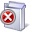

# Icons used for software updates in System Center Configuration Manager

*Applies to: System Center Configuration Manager (Current Branch)*
Synchronized software updates are displayed in the Configuration Manager console, and the first column for each software update contains an icon that indicates a specific state. Software update groups are also represented with an icon that provides information about the state of the software updates contained in the group. This section provides information about the software update icons and what each icon represents.  

## Icons for Software Updates  
 Synchronized software updates are represented by one of the following icons.  

### Normal Icon  
  The icon with the green arrow represents a normal software update.  

 **Description:**  

 Normal software updates have been synchronized and are available for software deployment.  

 **Operational Concerns:**  

 There are no operational concerns.  

### Expired Icon  
  The icon with the black X represents an expired software update. You can also identify expired software updates by viewing the **Expired** column for the software update when it displays in the Configuration Manager console.  

 **Description:**  

 Expired software updates were previously deployable to client computers, but once a software update is expired, new deployments can no longer be created for the software updates. Expired software updates are removed from active deployments and will no longer be made available to clients.  

 **Operational Concerns:**  

 There are no operational concerns.

### Superseded Icon  
  The icon with the yellow star represents a superseded software update. You can also identify superseded software updates by viewing the **Superseded** column for the software update when it displays in the Configuration Manager console.  

 **Description:**  

 Superseded software updates have been replaced with newer versions of the software update. Typically, a software update that supersedes another software update does one or more of the following:  

-   Enhances, improves, or adds to the fix provided by one or more previously released software updates.  

-   Improves the efficiency of its software update file package, which clients install if the software update is approved for installation. For example, the superseded software update might contain files that are no longer relevant to the fix or to the operating systems now supported by the new software update, so those files are not included in the superseding software update's file package.  

-   Updates newer versions of a product, or in other words, is no longer applicable to older versions or configurations of a product. Software updates can also supersede other software updates if modifications have been made to expand language support. For example, a later revision of a product update for Microsoft Office might remove support for an older operating system, but add additional support for new languages in the initial software update release.  

 On the Supersedence Rules tab in the Software Update Point Component properties, you can specify how to manage superseded software updates. For more information, see [Supersedence rules](../plan-design/plan-for-software-updates.md#BKMK_SupersedenceRules).  

 **Operational Concerns:**  

 When possible, deploy the superseding software update to client computers instead of the superseded software update. You can display a list of the software updates that supersede the software update on the **Supersedence Information** tab in the software update properties.  

### Invalid Icon  
  The icon with the red X represents an invalid software update.  

 **Description:**  

 Invalid software updates are in an active deployment, but for some reason the content (software update files) is not available. The following are scenarios in which this state can occur:  

-   You successfully deploy the software update, but the software update file is removed from the deployment package and is no longer available.  

-   You create a software update deployment at a site and the deployment object is successfully replicated to a child site, but the deployment package has not successfully replicated to the child site.  

 **Operational Concerns:**  

 When the content is missing for a software update, clients are unable to install the software update until the content becomes available on a distribution point. You can redistribute the content to distribution points by using the **Redistribute** action. When content is missing for a software update in a deployment created at a parent site, the software update must be replicated or redistributed to the child site. For more information about content redistribution, see [Manage the content you have distributed](../../core/servers/deploy/configure/deploy-and-manage-content.md#bkmk_manage).  

### Metadata-Only Icon
  The icon with the blue arrow represents a metadata-only software update.

 **Description:**  

 Metadata-only software updates are available in the Configuration Manager console for reporting. You cannot deploy or download metadata-only software updates because a software update file is not associated with the software updates metadata.  

 **Operational Concerns:**  

 Metadata-only software updates are available for reporting purposes and are not intended for software update deployment.  

## Icons for Software Update Groups  
 Software update groups are represented by one of the following icons.  

### Normal Icon  
  The icon with the green arrow represents a software update group that contains only normal software updates.  

 **Operational Concerns:**  

 There are no operational concerns.  

### Expired Icon  
  The icon with the black X represents a software update group that contains one or more expired software updates.  

 **Operational Concerns:**  

 Remove or replace expired software updates in the software update group when possible.  

### Superseded Icon  
  The icon with the yellow star represents a software update group that contains one or more superseded software updates.  

 **Operational Concerns:**  

 Replace the superseded software update in the software update group with the superseding software update when possible.  

### Invalid Icon  
  The icon with the red X represents a software update group that contains one or more invalid software updates.  

 **Operational Concerns:**  

 When the content is missing for a software update, clients are unable to install the software update until the content becomes available on a distribution point. You can redistribute the content to distribution points by using the **Redistribute** action. When content is missing for a software update in a deployment created at a parent site, the software update needs to replicated or redistributed to the child site. For more information about content redistribution, see [Manage the content you have distributed](../../core/servers/deploy/configure/deploy-and-manage-content.md#bkmk_manage).  
