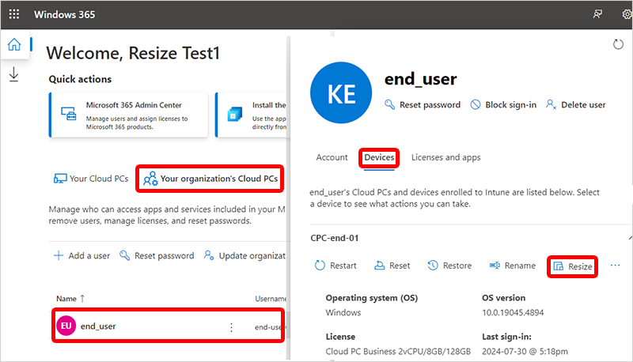
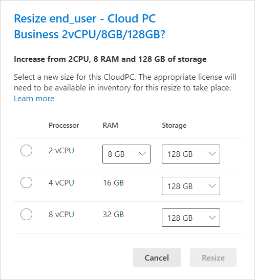

---
# required metadata
title: Resize a Windows 365 Business Cloud PC
titleSuffix:
description: Learn how to resize a Windows 365 Business Cloud PC.
keywords:
author: ErikjeMS  
ms.author: erikje
manager: dougeby
ms.date: 10/01/2024
ms.topic: how-to
ms.service: windows-365
ms.subservice: 
ms.localizationpriority: high
ms.assetid: 

# optional metadata

#ROBOTS:
#audience:

ms.reviewer: lrayasam
ms.suite: ems
search.appverid: MET150
#ms.tgt_pltfrm:
ms.custom: intune-azure; get-started
ms.collection:
- M365-identity-device-management
- tier2
---

# Resize a Windows 365 Business Cloud PC

[!INCLUDE [Resize a Cloud PC intro](../includes/resize-introduction.md)]

## Requirements

### Role requirements

To resize a Cloud PC, the admin must have certain built-in Microsoft Entra roles.

For a Cloud PC provisioned with a direct assigned license, at least one of the following roles:

- Windows 365 Administrator

Alternatively, you can assign a custom role that includes the permissions of this built-in role.

[!INCLUDE [Resize a Cloud PC IP requirements](../includes/resize-ip-address-requirements.md)]

[!INCLUDE [Resize a Cloud PC other requirements](../includes/resize-other-requirements.md)]

## Resize a Windows 365 Cloud PC

When resizing Windows 365 Cloud PCs, the Windows 365 service automatically takes care of: 

- Unassigning the original license.
- Assigning the new license on behalf of the admin.

1. Sign in to the windows365.microsoft.com, select **Your organization's Cloud PCs** > choose a device > **Devcies** > **Resize**.

2. Under **Resize**, there's a list of the sizes that you can upgrade or downsize to based on the licenses available in your inventory. You can upgrade a Cloud PC’s **Processor** and **RAM**. **Storage** can only be upgraded. Select one of the available options.

3. Select **Resize**.

If there available licenses, the resizing starts.

If there are no licenses available, then you can purchase a new license at the Windows 365 Market place. The newly purchased license will be available for upgrade soon.  

## Resizing details

[!INCLUDE [Resize a Cloud PC details](../includes/resize-details.md)]

## Next steps

[Remotely manage Windows 365 Business Cloud PCs](remotely-manage-business-cloud-pcs.md).
