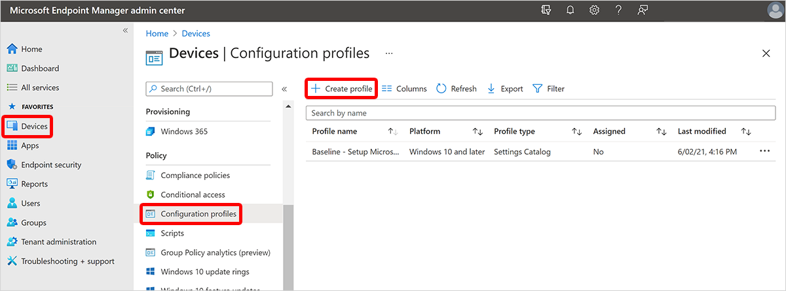

---
# required metadata
title: Create device configuration profile for Windows 365 - Azure | Microsoft Docs
titleSuffix:
description: Learn how to create device configuration profile for Windows 365.
keywords:
author: ErikjeMS  
ms.author: erikje
manager: dougeby
ms.date: 03/08/2021
ms.topic: how-to
ms.service: cloudpc
ms.subservice:
ms.localizationpriority: high
ms.technology:
ms.assetid: 

# optional metadata

#ROBOTS:
#audience:

ms.reviewer: chrimo
ms.suite: ems
search.appverid: MET150
#ms.tgt_pltfrm:
ms.custom: intune-azure; get-started
ms.collection: M365-identity-device-management
---

# Create device configuration profile

In this example, we’ll apply a **Device restrictions** [device configuration profile](/mem/intune/configuration/device-profile-create) and apply it to **All Cloud PCs**.

> [!NOTE]
> If you haven’t created a dynamic device group for all Cloud PCs, follow the steps in [Create a dynamic device group containing all Cloud PCs](create-dynamic-device-group-all-cloudpcs.md), then return here to create the device configuration profile.

Now that you’ve created a dynamic device group for all Cloud PCs, you can target policies to apply to all Cloud PCs in the tenant. To do so, follow these steps:

1. Sign in to the [Microsoft Endpoint Manager admin center](https://endpoint.microsoft.com/) > **Devices** > **Configuration profiles** > **Create profile**.

2. On the **Create profile** page, select **Windows 10 and later** for the **Platform** and **Device restrictions** for **Profile**.
3. Select **Create**.
4. Enter a **Name** for the policy, like "All Cloud PCs – Device restrictions" and a useful **Description**.
5. Select **Next**.
6. On the **Configuration settings** page, select that settings and restrictions that you want applied with this profile.
7. Select **Next**.
8. On the **Assignments** page, choose **Add groups** > search for and select **All Cloud PCs** > **Select**.
9. Choose **Select** > **Next**.
10. On the **Applicability Rules** page, select **Next**.
11. On the **Review + create** page, review the settings. You’ll see all the settings you selected along with the assignment to “All Cloud PCs”.
12. Select **Create** to deploy the profile.

<!-- ########################## -->
## Next steps

[Assign a user as a local admin](assign-users-as-local-admin.md).
