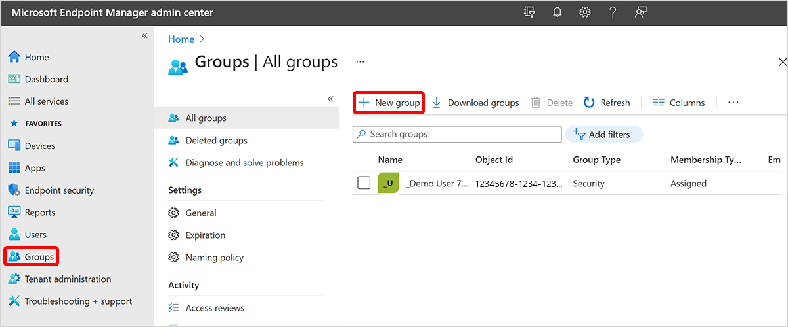

---
# required metadata
title: Create a dynamic device group for all Cloud PCs
titleSuffix:
description: Learn how to create dynamic device groups for all Cloud PCs.
keywords:
author: ErikjeMS  
ms.author: erikje
manager: dougeby
ms.date: 08/02/2021
ms.topic: how-to
ms.service: cloudpc
ms.subservice:
ms.localizationpriority: high
ms.technology:
ms.assetid: 

# optional metadata

#ROBOTS:
#audience:

ms.reviewer: chrimo
ms.suite: ems
search.appverid: MET150
#ms.tgt_pltfrm:
ms.custom: intune-azure; get-started
ms.collection: M365-identity-device-management
---

# Create a dynamic device group containing all Cloud PCs

You can create a dynamic device group that contains all Cloud PCs in your environment. Policies targeting this device group will apply to Cloud PCs.

In these steps, you’ll use the Device Model device property to create a dynamic device group.

1. Sign in to the [Microsoft Endpoint Manager admin center](https://go.microsoft.com/fwlink/?linkid=2109431) > **Groups** > **New Group**.

2. Select the **New Group** page, choose **Security** for **Group type**.
3. Enter the following:
    1. **Group name** = "All Cloud PCs" (or some other name indicating it will contain all Cloud PCs).
    2. **Group description** = "A dynamic device group containing all Cloud PC devices"
4. For **Membership type**, choose **Dynamic Device**.
5. Select **Add dynamic query**.
6. On the **Dynamic membership rules** page, enter the following:
    1. **Property** = "deviceModel"
    2. **Operator** = "Contains"
    3. **Value** = "Cloud PC"
7. To validate that it works, select **Validate Rules (Preview)** > **+Add devices** > select some Cloud PCs and non-Cloud PC devices.
8. After the validation completes, select **Save** > **Create**.

<!-- ########################## -->
## Next steps

[Create a dynamic device group containing all Cloud PCs from a specific provisioning policy](create-dynamic-device-group-from-specific-policy.md).
