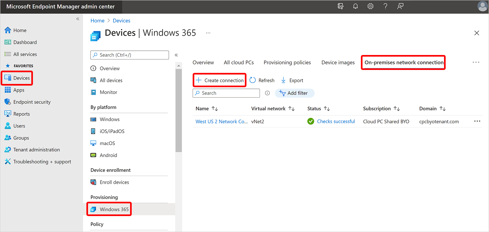
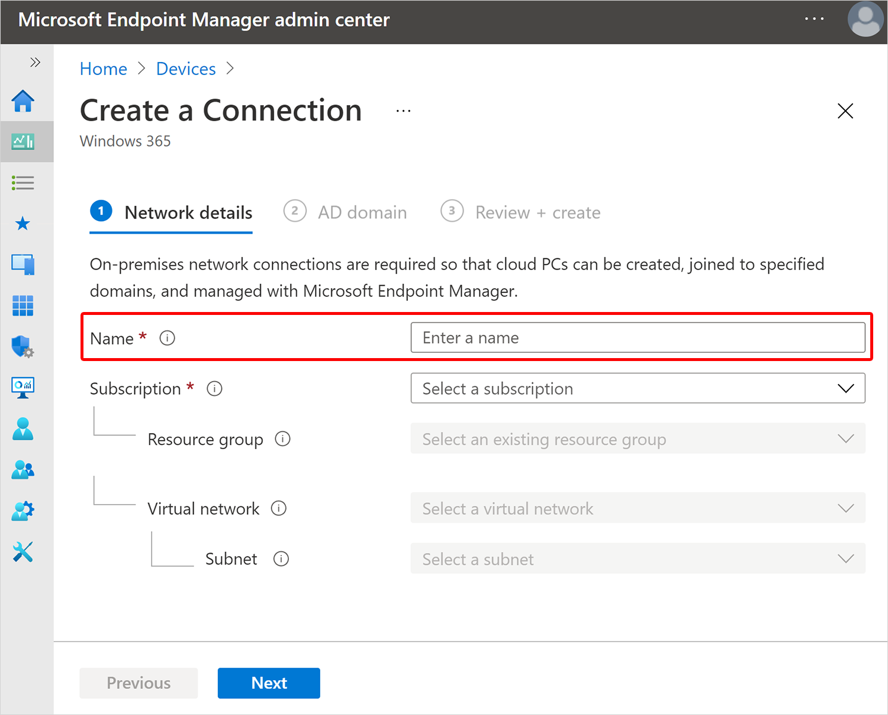

---
# required metadata
title: Create on-premises network connections for Windows 365
titleSuffix:
description: Learn how to create on-premises network connections for Windows 365.
keywords:
author: ErikjeMS  
ms.author: erikje
manager: dougeby
ms.date: 07/23/2021
ms.topic: how-to
ms.service: cloudpc
ms.subservice:
ms.localizationpriority: high
ms.technology:
ms.assetid: 

# optional metadata

#ROBOTS:
#audience:

ms.reviewer: mattsha
ms.suite: ems
search.appverid: MET150
#ms.tgt_pltfrm:
ms.custom: intune-azure; get-started
ms.collection: M365-identity-device-management
---

# Create on-premises network connection

[On-premises network connections](on-premises-network-connections.md) (OPNC) are required so that Cloud PCs can:

- Be provisioned.
- Be joined to your company’s domain.
- Have connectivity to your organization’s on-premises resources.

You can have up to 10 connections per tenant.

As part of the connection process, the Windows 365 service is granted the following permissions:

- Reader permission on the Azure subscription.
- Owner permission on the specified resource group.
- Network contributor permission on the virtual network.

## Requirements

To create a connection, you must:

- Be an [Intune Administrator in Azure AD](/azure/active-directory/roles/permissions-reference).
- Have [Owner permissions on the Azure subscription](/azure/cost-management-billing/manage/add-change-subscription-administrator) that contains the virtual network with connectivity to your on-premises domain controller and network.

## To create an on-premises network connection

1. Sign in to the [Microsoft Endpoint Manager admin center](https://go.microsoft.com/fwlink/?linkid=2109431), select **Devices** > **Windows 365** (under **Provisioning**) > **On-premises network connection** > **Create connection**.

2. On the **Network details** page, enter a **Name** for the new connection. The connection name must be unique within the customer tenant.

3. Select a **Subscription** and **Resource group** for the new connection. Create a new resource group to contain your Cloud PC resources. Optionally, you can instead select an existing resource group in the list (which grant Windows 365 permissions to the existing resource group). If you don’t have a [healthy OPNC](health-checks.md), you won't be able to proceed.
4. Select a **Virtual network** and **Subnet**.
5. Select **Next**.
6. On the **AD domain** page, provide the following information:
    - **AD domain name**: The DNS name of the Active Directory domain that you want to use for connecting and provisioning Cloud PCs. For example, corp.contoso.com.
    - **Organizational unit**: This is optional. An organizational unit (OU) is a container within an Active Directory domain, which can hold users, groups, and computers.
    - **AD domain username**: The username, in user principal name (UPN) format, that you want to use for connecting the Cloud PCs to your Active Directory domain. For example, svcDomainJoin@corp.contoso.com. This service account must have permission to join computers to the domain and, if set, the target OU. This user will also be a local administrator for the Cloud PCs that you provision.
    - AD domain password: The password for the user specified above.
    - Confirm AD domain password: The password for the user specified above.

7. Select **Next**.
8. On the **Review + Create** page, select **Create**.

<!-- ########################## -->
## Next steps

[Edit on-premises network connection](edit-on-premises-network-connection.md).
