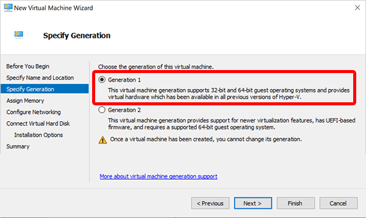

---
# required metadata
title: Convert custom device images to generation 2 virtual machines in Windows 365
titleSuffix:
description: Learn how to convert custom device images to generation 2 virtual machines in Windows 365.
keywords:
author: ErikjeMS 
ms.author: erikje
manager: dougeby
ms.date: 09/15/2021
ms.topic: how-to
ms.service: cloudpc
ms.subservice:
ms.localizationpriority: high
ms.technology:
ms.assetid: 

# optional metadata

#ROBOTS:
#audience:

ms.reviewer: chbrinkh
ms.suite: ems
search.appverid: MET150
#ms.tgt_pltfrm:
ms.custom: intune-azure; get-started
ms.collection: M365-identity-device-management
---

# Convert an existing custom device image to a generation 2 virtual machine

To support Windows 11, your custom device images must be based on generation 2 (Gen2) virtual machines (VMs). If you already have custom device images based on generation 1 (Gen1) virtual machines, you can convert those custom device images by following the steps below. After you've completed these steps, all future Cloud PCs provisioned from the converted device image will be based on Gen2 virtual machines.

Windows 365 won't prevent you from provisioning new Cloud PCs from existing custom images based on Gen1 VMs. However, when you want to add new custom images, Windows 365 will only accept Gen2-based images. Gen 2 VMs are required to support Windows 11.

1. Make sure that Hyper-V is installed on your management PC. For information on how to install Hyper-V, see [Install Hyper-V on Windows 10](/virtualization/hyper-v-on-windows/quick-start/enable-hyper-v).
2. Download your existing custom image VHD file from the storage blob URL to your PC where you have Hyper-V available.
    The VHD file is the exact size of the OS disk, which can be a very large file size. Make sure to use a fast, stable internet connection to download the VHD file and prepare for long download times.
    For information on how to download a managed disk, see [Download a VHD from Azure](/azure/virtual-machines/windows/download-vhd#generate-download-url).
    You can also download the VHD by using [Azure Storage Explorer](https://azure.microsoft.com/features/storage-explorer/) directly, both as managed disk or storage blob VHDs.
3. Switch to your local PC and open Hyper-V Manager.
4. Under **Actions**, select **New** > **Virtual Machine**.
    
5. On the **Before You Begin** page, select **Next**.
6. On the **Specify Name and Location** page, type friendly name, like CustomFinanceImageg2, and then select **Next**.
7. On the **Specify Generation** page, select **Generation 1** (not **Generation 2**). Gen2 is needed here to mount the disk and change the partition model to GUID Partition Table (GPT). Select **Next**.
    
8. On the **Assign Memory** page, set **Startup memory** to at least 1024000 MB, preferably 4096000 MB. Select **Next**.
9. On the **Configure Networking** page, select **Default Switch** > **Next**.
10. On the **Connect Virtual Hard Disk** page, select **Use an existing virtual hard disk**.
11. For **Location**, select **Browse** and select the virtual hard disk that you downloaded earlier.
12. Select **Next** and on the **Summary** page select **Finish**.
13. Download the WinPE media from [NEED LOCATION - WE CAN'T USE A PERSONAL SHAREPOINT]().
14. In Hyper-V Manager, under **Virtual Machines**, select the new VM, and then under **Actions** select **Settings**.
15. Mount the ISO to your new VM in Hyper-V Manager NEED INSTRUCTIONS ON HOW TO DO THIS.
16. Under **Actions**, select **Start**.
    - Make sure to boot from the mounted ISO. NEED INSTRUCTIONS ON HOW TO DO THIS.
    - Make sure the wpeinit command prompt is open. NEED INSTRUCTIONS ON HOW TO DO THIS.
17. To convert the Master Boot Record (MBR) to the GUID Partition Table (GPT) partition, run the following two commands. The GPT is the new standard for gen2 based VMs. WHERE ARE THESE COMMANDS RUN? the wpeinit command prompt?
    1. To determine the correct disk for conversion and validate it, run ````mbr2gpt /validate /disk:0````.
    2. To convert the disk to the GUID Partition Table (GPT), run ````mbr2gpt /convert /disk:0````
18. After the commands run successfully, dismount the WinPE ISO. NEED INSTRUCTIONS ON HOW TO DO THIS.
19. Upload the converted VHD back to Azure. You can use Azure Storage Explorer. For other upload options, see [Upload a generalized Windows VHD and use it to create new VMs in Azure](/azure/virtual-machines/windows/upload-generalized-managed).
20. Create a new VM template based on gen2 and click browse to mount the VHD to the template. NEED INSTRUCTIONS ON HOW TO DO THIS.
    - Make sure that the VHD remains **VHD in fixed size**. **VHDX as format** isn’t supported on Azure. WHERE ARE THESE SETTINGS?
21. You can now upload the converted Gen2 custom device image to Windows 365. For information on how to upload custom images, see [](device-images.md#custom-images).

## Creating new Gen2 custom images

For information on how to create a new custom image using a Gen2 gallery image from the Azure marketplace, see [NEED LOCATION](). 


<!-- ########################## -->
## Next steps

[Learn about device configuration](device-configuration.md).
