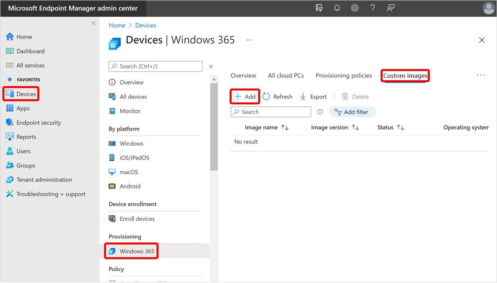

---
# required metadata
title: Add or delete custom device images for Windows 365
titleSuffix:
description: Learn how to add or delete custom device images for Windows 365.
keywords:
author: ErikjeMS  
ms.author: erikje
manager: dougeby
ms.date: 04/05/2022
ms.topic: how-to
ms.service: cloudpc
ms.subservice:
ms.localizationpriority: high
ms.technology:
ms.assetid: 

# optional metadata

#ROBOTS:
#audience:

ms.reviewer: naramkri
ms.suite: ems
search.appverid: MET150
#ms.tgt_pltfrm:
ms.custom: intune-azure; get-started
ms.collection: M365-identity-device-management
---

# Add or delete custom device images

If you want to use a custom device image, you can add it into your Azure subscription and then use it for provisioning Cloud PCs. You can use standard Azure Marketplace gallery images or [create your own custom managed image](/azure/virtual-machines/windows/capture-image-resource). If you currently use a Shared Image Gallery in Microsoft Azure, you can convert one of those images into a managed image. To convert, use the steps to [export an image version to a managed disk](/azure/virtual-machines/managed-disk-from-image-version) and then [create an image from a managed disk](/azure/virtual-machines/windows/capture-image-resource#create-an-image-from-a-snapshot-using-powershell).

> [!NOTE]
>
> - Windows 10 images should not contain Azure Virtual Desktop client components. Additionally, you can't import Windows 10 Multisession images into Windows 365.
> - For information about support for Windows 11 custom device images, see [What's New for Windows 365 Enterprise](whats-new.md#support-for-windows-11).

## Add a custom device image

You can upload the custom image to the Windows 365 service by following these steps:

1. Sign in to the [Microsoft Endpoint Manager admin center](https://go.microsoft.com/fwlink/?linkid=2109431).

2. Select **Devices** > **Windows 365** (under **Provisioning**) > **Custom images** > **Add**.

3. In the **Add image** pane, provide the following information:
    - **Image name**: The name of the image you want to add.
    - **Image version**: A version number of the image with this format: Major(int).Minor(int).Patch(int) format. For example: 0.0.1, 1.5.13.
    - **Subscription**: Choose the Azure subscription where the image came from.
    - **Source Image**: Choose an image to add. The list will populate with all custom images from your chosen subscription that meet the pre-requisites.

4. Select **Add** to add the image to your device image list.

After successfully uploading the image, you'll see the uploaded image when selecting an image to create a provisioning policy.  

## Delete a custom device image

You can delete a custom image from Windows 365 by following these steps:

1. Sign in to the [Microsoft Endpoint Manager admin center](https://go.microsoft.com/fwlink/?linkid=2109431), select **Devices** > **Windows 365** (under **Provisioning**) > **Custom images**.
2. On the **Device images** page, select the check box next to the image > **Delete**.
3. Select **Yes** on the confirmation pop up to permanently delete the image.

Device images being used in a provisioning policy can't be deleted. Delete the provisioning policy first and then the associated device image.

<!-- ########################## -->
## Next steps

[Create a provisioning policy](create-provisioning-policy.md).

For more information on virtual machines and creating custom images in Azure, see [Virtual machines in Azure](/azure/virtual-machines/).
