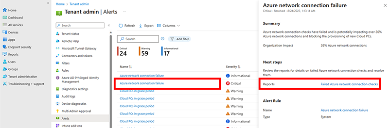

---
# required metadata
title: Alerts in Windows 365
titleSuffix:
description: Learn how view, create, and customize alerts in Windows 365.
keywords:
author: ErikjeMS  
ms.author: erikje
manager: dougeby
ms.date: 02/14/2024
ms.topic: how-to
ms.service: windows-365
ms.subservice: windows-365-enterprise
ms.localizationpriority: high
ms.assetid: 

# optional metadata

#ROBOTS:
#audience:

ms.reviewer: feadebay
ms.suite: ems
search.appverid: MET150
#ms.tgt_pltfrm:
ms.custom: intune-azure; get-started
ms.collection:
- M365-identity-device-management
- tier2
---

# Alerts in Windows 365

The Windows 365 Alerts system notifies you when specific events occur in your Cloud PC environment, like connection, provisioning, or image upload failures. By default, these alerts appear in the Microsoft Intune admin center as pop-up notifications (you can also turn on email notifications). You can customize the built-in alert rules:

- Set conditions and thresholds for triggering alerts.
- Define the severity of alerts.
- Turn each alert rule on or off.
- Configure each alert to notify you in the console and/or by email.

## Requirements

To see alerts, your account must meet the following requirements:

- Windows 365 Enterprise
- One of the following roles:
  - Intune Administrator
  - Windows 365 Administrator

## View alerts

To view the list of recent alerts, sign in to the [Microsoft Intune admin center](https://go.microsoft.com/fwlink/?linkid=2109431) > **Tenant administration** > **Alerts**.

### Filters

By default, only active alerts are shown. You can use the **Add filter** option to filter by:

- Severity
  - Informational
  - Warning
  - Critical
- State
  - Active
  - Resolved
  
### Alert summary

You can select an alert from the list to see a summary of that alert.

Select the link next to **Reports** to see more details.

## Customize alert rule

1. Sign in to the [Microsoft Intune admin center](https://go.microsoft.com/fwlink/?linkid=2109431) > **Tenant administration** > **Alerts** > **Alert rules**.

   

2. Select a rule from the list.
3. On the **System rule** page, make any changes that you want in the **Conditions**, **Settings**, and **Notifications** sections.

   

4. Select **Apply** to save the changes to the rule.

<!-- ########################## -->
## Next steps

For more troubleshooting information, see [Troubleshooting](troubleshooting.md).
