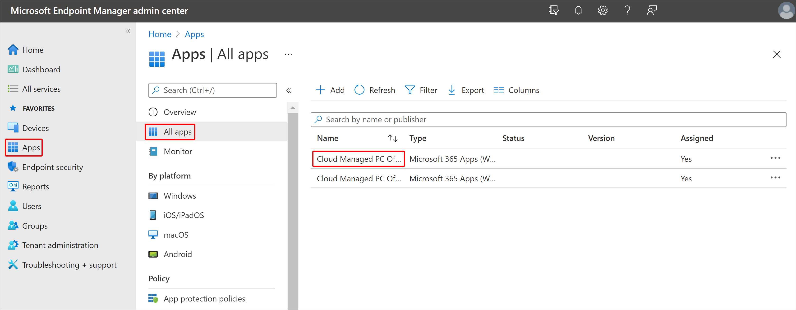

---
# required metadata
title: Assign apps with Windows 365
titleSuffix:
description: Learn how to assign apps with Windows 365
keywords:
author: ErikjeMS  
ms.author: erikje
manager: dougeby
ms.date: 08/02/2021
ms.topic: how-to
ms.service: cloudpc
ms.subservice:
ms.localizationpriority: high
ms.technology:
ms.assetid: 

# optional metadata

#ROBOTS:
#audience:

ms.reviewer: chbrinkh
ms.suite: ems
search.appverid: MET150
#ms.tgt_pltfrm:
ms.custom: intune-azure; get-started
ms.collection: M365-identity-device-management
---

# Assign apps to Cloud PCs

Follow these steps to deploy Intune Windows client apps to your Cloud PCs.

1. Sign in to the [Microsoft Endpoint Manager admin center](https://go.microsoft.com/fwlink/?linkid=2109431) > **Apps** > **All apps** > select an app.

2. On the app page, select **Properties** > **Edit** (next to **Assignments**).
3. On the **Assignments** page, select **Add group** (under **Group**).
4. In the **Select groups** to include, select the groups to which you want to assign this app > **Select** > **Review + Save**.
5. On the **Review + Save** page, select **Save**.

<!-- ########################## -->
## Next steps

[Learn about device management for Cloud PCs](device-management-overview.md).
