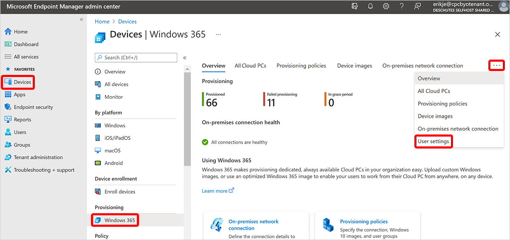

---
# required metadata
title: Assign user as a local admin for Windows 365
titleSuffix:
description: Learn how to assign a user as a local admin for Windows 365.
keywords:
author: ErikjeMS  
ms.author: erikje
manager: dougeby
ms.date: 08/02/2021
ms.topic: how-to
ms.service: cloudpc
ms.subservice: 
ms.localizationpriority: high
ms.technology:
ms.assetid: 

# optional metadata

#ROBOTS:
#audience:

ms.reviewer: 
ms.suite: ems
search.appverid: MET150
#ms.tgt_pltfrm:
ms.custom: intune-azure; get-started
ms.collection: M365-identity-device-management
---

# Make a user a local admin

The **User settings** page lets IT administrators manage various settings for the user. Currently, the only setting is the option of making the user a local admin in their Cloud PC.  

When managing settings, keep the following points in mind:

- The privileges can be applied before or after a Cloud PC is assigned.
- Local administrator permissions apply at the user level.
- The user will have local administrator permissions on all Cloud PCs assigned to them.  
- Changes to the settings take effect when the user logs on. If the user is currently logged on, they must sign out and then sign in again to see the change.

## Add a new setting

1. Sign in to the [Microsoft Endpoint Manager admin center](https://go.microsoft.com/fwlink/?linkid=2109431), select **Devices** > **Windows 365** (under **Provisioning**) > **...** > **User Settings** > **Add**.

2. Under **Settings**, enter a **Name** for the setting and set **Enable Local admin** to **On**.
3. Select **Next**.  
4. Under **Assignments**, choose **Select Groups**.
5. Under **Select groups to include**, choose a group of users to get the settings > **Select**.  
6. Select **Next**.
7. On the **Review + save** page, select **Create**.  

## Edit a user setting

1. Sign in to the [Microsoft Endpoint Manager admin center](https://go.microsoft.com/fwlink/?linkid=2109431), select **Devices** > **Windows 365** (under **Provisioning**) > **...**  > **User Settings**.
2. The **User Settings** page shows the current settings.  
3. Select the name of the user setting that you want to edit.
4. The policy setting for **Enable Local Admin** and assigned groups appears.  
5. To change the name of the policy or to turn **Enable Local admin** on or off, select **Edit** next to **Settings**.
6. Select **Next**.  
7. On the **Review + Save** page, select **Update**.  
8. To edit assignments, select **Edit** next to **Assignments** > **Select Groups** to add another group. To remove existing groups, select the ellipses (**…**) > **Delete**.  
9. Select **Next**.  
10. On the **Review + Save** page, select **Update**.  

## Delete a user setting

1. Sign in to the [Microsoft Endpoint Manager admin center](https://go.microsoft.com/fwlink/?linkid=2109431), select **Devices** > **Windows 365** (under **Provisioning**) > **...**  > **User Settings**.
2. On the **User settings** page, you can view the created settings.  
3. Select the ellipses (**…**) > **Delete**.
4. Select **Yes** on the confirmation pop up to delete the setting permanently.

## Conflict Resolution for Local Admin

Because user setting policies are assigned to user groups, there’s a possibility of overlap for groups/users. If a user is assigned to more than one user setting policy, user settings will honor the most-recently created policy and ignore all others. The last time a policy was updated doesn't affect this priority. To make sure user settings are consistent and clear, avoid any policy targeting overlaps.

<!-- ########################## -->
## Next steps

[Learn about security in Windows 365](security-guidelines.md).
