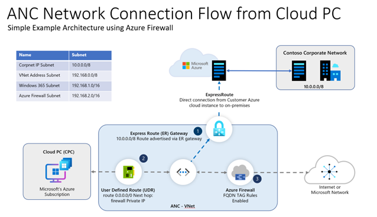

---
# required metadata
title: Use Azure Firewall to manage and secure Windows 365 environments
titleSuffix:
description: Learn how to use Azure Firewall to manage and secure Windows 365 environments.
keywords:
author: ErikjeMS  
ms.author: erikje
manager: dougeby
ms.date: 08/28/2024
ms.topic: how-to
ms.service: windows-365
ms.subservice: windows-365-enterprise
ms.localizationpriority: high
ms.assetid: 

# optional metadata

#ROBOTS:
#audience:

ms.reviewer: ericor
ms.suite: ems
search.appverid: MET150
#ms.tgt_pltfrm:
ms.custom: intune-azure; get-started
ms.collection:
- M365-identity-device-management
- tier2
---

# Use Azure Firewall to manage and secure Windows 365 environments

This article explains how to simplify and protect your Windows 365 environment using Azure Firewall. The example architecture explained here provides low maintenance and automated access to the required endpoints through a direct and optimized connection path. You can use Azure Firewall network rules and fully qualified domain name (FQDN) tags to replicate this architecture example in your environment.

> [!NOTE]  
> This article applies to customers who deploy Windows 365 with Azure network connections (ANC). This article doesn’t apply to environments that use Microsoft hosted networks. For more information about each, see [Windows 365 networking deployment options](deployment-options.md).

The Windows 365 service requires optimized, non-proxied connectivity to critical service endpoints, many of which reside within Microsoft’s infrastructure. Connecting to these resources using on-premises networks through the internet is inefficient and isn't recommended. Such connections can also be complex to configure and manage.

For example, some Windows 365 customers using the ANC deployment model might have a direct connection back to an on-premises environment that uses ExpressRoute or Site-To-Site VPN. Outbound traffic might be routed using an existing proxy server in the same way as on-premises traffic. This connection strategy isn’t optimized for Windows 365 environments and likely to introduce significant performance impact.

Instead, you can use Azure Firewall with your ANC Windows 365 environments to provide optimized, secure, low maintenance, and automated access.

## Required endpoints for Windows 365

Windows 365 requires access to the following endpoints:

1. [Windows 365](/windows-365/enterprise/requirements-network?tabs=enterprise%2Cent#allow-network-connectivity)  
2. [Azure Virtual Desktop](/azure/virtual-desktop/safe-url-list?tabs=azure)
3. [Intune](/mem/intune-service/fundamentals/intune-endpoints)

You might also consider access to other Microsoft services (like Office 365) when configuring optimized connectivity from the environment.

FQDN tags for certain services are available for Azure Firewall to help configure and maintain these rules in a simple way and are discussed later in this document.  

## Example architecture using Azure Firewall and FQDN tags

There are many ways to configure networking within Azure. Here, we use:

- A single VNet with Azure Firewall managing outbound access.
- An ExpressRoute circuit to connect the VNet back to the on-premises environment.

The traffic flow in this diagram:

1. Contoso Corporate Network: This on-premises IP subnet is advertised into the VNet through the ExpressRoute gateway. All traffic to this range (10.0.0.0/8) is sent through the ExpressRoute circuit.
2. All other traffic from the Windows 365 subnet is sent to the Azure firewall through a User Defined Route (UDR) route of 0.0.0.0/0. The next hop IP is set to the Azure Firewall's private IP.
3. The Firewall has application rules (and FQDN tags) and network rules configured for the Windows 365 required endpoints. Traffic that complies with the rules is allowed out. Any other traffic not explicitly permitted is blocked.

## Azure Firewall application rules

The environment in the diagram was set up using the following Azure Firewall application rules (applied in callout 3). All traffic not destined for the Contoso on-premises subnet is directed to the firewall. These rules allow the defined traffic to egress to its destination. For more information about deploying Azure Firewall, see [Deploy and configure Azure Firewall using the Azure portal](/azure/firewall/tutorial-firewall-deploy-portal).

| Rule Description | Destination type | FQDN tag name | Protocol | TLS inspection | Required/Optional |
| --- | --- | --- | --- | --- | --- |
| Windows 365 FQDNs | FQDN Tag | Windows365 | HTTP: 80, HTTPS: 443 | [Not recommended](/en-us/azure/virtual-desktop/proxy-server-support#dont-use-ssl-termination-on-the-proxy-server) | Required |
| Intune FQDNs | FQDN Tag | MicrosoftIntune | HTTP: 80, HTTPS: 443 | [Not recommended](/en-us/azure/virtual-desktop/proxy-server-support#dont-use-ssl-termination-on-the-proxy-server) | Required |
| Office 365 FQDNs | FQDN Tag | Office365 | HTTP: 80, HTTPS: 443 | [Not recommend for optimize & allow categories](/microsoft-365/enterprise/microsoft-365-network-connectivity-principles?view=o365-worldwide&preserve-view=true)  | Optional, but recommended|
| Windows Update | FQDN Tag | WindowsUpdate| HTTP: 80, HTTPS: 443 | [Not recommended](/windows/deployment/update/windows-update-security#securing-metadata-connections) | Optional|
| Citrix HDX Plus | FQDN Tag | CitrixHDXPlusForWindows365 | HTTP: 80, HTTPS: 443 | [Not recommended](/windows/deployment/update/windows-update-security#securing-metadata-connections) | Optional (only required when using Citrix HDX Plus) |

Azure Firewall can be associated with public IP addresses to provide outbound connectivity to the internet. The first Public IP is selected at random to provide [outbound SNAT](/azure/firewall/features#outbound-snat-support). The next available public IP will be used after all SNAT ports from the first IP are exhausted. In scenarios that require high throughput, it is recomended to leverage an [Azure NAT Gateway](/azure/nat-gateway/nat-overview). NAT Gateway dynamically scales outbound connectivity and can be [integrated with an Azure Firewall](/azure/firewall/integrate-with-nat-gateway). See the [integrate NAT Gateway with Azure Firewall tutorial](/azure/nat-gateway/tutorial-hub-spoke-nat-firewall) for guidance.

### Windows365 tag

The Windows365 tag includes the required Azure Virtual Desktop (AVD) endpoints, except those endpoints with nonstandard ports that need to be entered manually (see the Network rules section).

The Windows365 tag doesn't include Intune. The MicrosoftIntune tag can be used separately.

The Windows365 FQDN tag includes all required endpoints except those endpoints listed as *Required* in separate rows of this document, which must be configured separately. FQDN tags are different from a service tag. For example, the WindowsVirtualDesktop service tag only includes the IP addresses that *.wvd.microsoft.com resolves to.

## Network rules

Azure Firewall doesn’t currently handle nonstandard ports in an FQDN tag. Windows 365 has a few nonstandard port requirements, so the following rules must be added manually as Network Rules in addition to the FQDN tags.

| Rule Description | Destination type | FQDN/IP| Protocol | Port/s | TLS inspection | Required/Optional |
| --- | --- | --- | --- | --- | --- | --- |
| Windows Activation| FQDN | azkms.core.windows.net | TCP | 1688 | [Not recommended](/azure/virtual-desktop/proxy-server-support#dont-use-ssl-termination-on-the-proxy-server) | Required |
| Registration | FQDN | global.azure-devices-provisioning.net | TCP | 443, 5671 | [Not recommended](/azure/virtual-desktop/proxy-server-support#dont-use-ssl-termination-on-the-proxy-server) | Required |
| Registration | FQDN | hm-iot-in-prod-preu01.azure-devices.net | TCP | 443,5671 | [Not recommended](/azure/virtual-desktop/proxy-server-support#dont-use-ssl-termination-on-the-proxy-server) | Required |
| Registration | FQDN | hm-iot-in-prod-prap01.azure-devices.net | TCP | 443,5671 | [Not recommended](/azure/virtual-desktop/proxy-server-support#dont-use-ssl-termination-on-the-proxy-server) | Required |
| Registration | FQDN | hm-iot-in-prod-prna01.azure-devices.net | TCP | 443,5671 | [Not recommended](/azure/virtual-desktop/proxy-server-support#dont-use-ssl-termination-on-the-proxy-server) | Required |
| Registration | FQDN | hm-iot-in-prod-prau01.azure-devices.net | TCP | 443,5671 | [Not recommended](/azure/virtual-desktop/proxy-server-support#dont-use-ssl-termination-on-the-proxy-server) | Required |
| Registration | FQDN | hm-iot-in-prod-prna02.azure-devices.net | TCP | 443,5671 | [Not recommended](/azure/virtual-desktop/proxy-server-support#dont-use-ssl-termination-on-the-proxy-server) | Required |
| Registration | FQDN | hm-iot-in-2-prod-prna01.azure-devices.net | TCP | 443,5671 | [Not recommended](/azure/virtual-desktop/proxy-server-support#dont-use-ssl-termination-on-the-proxy-server) | Required |
| Registration | FQDN | hm-iot-in-3-prod-prna01.azure-devices.net | TCP | 443,5671 | [Not recommended](/azure/virtual-desktop/proxy-server-support#dont-use-ssl-termination-on-the-proxy-server) | Required |
| Registration | FQDN | hm-iot-in-2-prod-preu01.azure-devices.net  | TCP | 443,5671 | [Not recommended](/azure/virtual-desktop/proxy-server-support#dont-use-ssl-termination-on-the-proxy-server) | Required |
| Registration | FQDN | hm-iot-in-3-prod-preu01.azure-devices.net | TCP | 443,5671 | [Not recommended](/azure/virtual-desktop/proxy-server-support#dont-use-ssl-termination-on-the-proxy-server) | Required |
| UDP connectivity via TURN | IP | 20.202.0.0/16 | UDP | 3478 | Not recommended | Required |
| TURN connectivity | IP | 20.202.0.0/16 | TCP | 443 | Not recommended | Required |
| Registration | FQDN | hm-iot-in-4-prod-prna01.azure-devices.net | TCP | 443, 5671 | [Not recommended](/azure/virtual-desktop/proxy-server-support#dont-use-ssl-termination-on-the-proxy-server) | Required |

## Partner security solution options

Other ways to help protect your Windows 365 environment are partner security solution options that provide automated rulesets to access required endpoints for the Windows 365 service. Such options include:

- Check Point Software Technologies [Updatable Objects](https://support.checkpoint.com/results/sk/sk131852)

<!-- ########################## -->
## Next steps

[Learn more about Windows 365 architecture](architecture.md).

To learn more about FQDNS, see [FQDN tags overview](/azure/firewall/fqdn-tags).

To learn more about service tags, see [Virtual network service tags](/azure/virtual-network/service-tags-overview).
