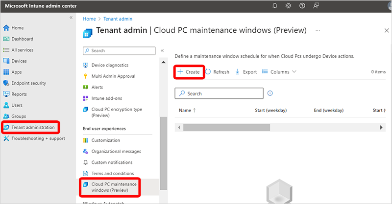
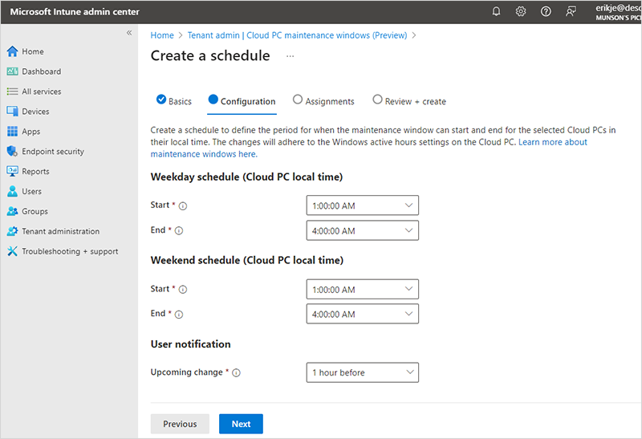

---
# required metadata
title: Cloud PC maintenance windows (preview)
titleSuffix:
description: Learn how to create a Cloud PC maintenance window in Windows 365.
keywords:
author: ErikjeMS  
ms.author: erikje
manager: dougeby
ms.date: 03/27/2024
ms.topic: how-to
ms.service: windows-365
ms.subservice: windows-365-enterprise
ms.localizationpriority: high
ms.assetid: 

# optional metadata

#ROBOTS:
#audience:

ms.reviewer: anushareddy
ms.suite: ems
search.appverid: MET150
#ms.tgt_pltfrm:
ms.custom: intune-azure; get-started
ms.collection:
- M365-identity-device-management
- tier1
---

# Cloud PC Maintenance windows (preview)

Admins can use Cloud PC maintenance windows to schedule specific times to run actions on Cloud PCs. For maximum flexibility, these windows can be scheduled:

- Daily.
- Weekly.
- Weekends.
- Specific hours within the day (Cloud PC local time).
- With two or more hours per window.
- For specific Microsoft Entra groups.
- With notifications to users of the upcoming window.
- For bulk resize actions.

These windows help you efficiently plan and manage Cloud PC maintenance activities, reduce disruption to user productivity, and comply with organizational policies.

## Create a maintenance window

To create a maintenance window, follow these steps:

1. Sign in to the [Microsoft Intune admin center](https://go.microsoft.com/fwlink/?linkid=2109431). 
2. Select **Tenant administration** > **Cloud PC maintenance windows (preview)** > **Create**.

    

3. On the **Basics** page, type a **Name** and **Description**.
4. On the **Configuration** page, under **Weekday schedule** and/or **Weekend schedule**, select the Cloud PC local time **Start** and **End** times. Each window must be at least two hours in duration.

    

5. Under **User notification**, for **Upcoming change**, select the lead time you’d like to use for notifying the user of the impending disruption. The user is notified in-session and can’t override or postpone the maintenance window.
6. Select **Next**.
7. On the **Assignments** page, select **Add groups**.
8. In the **Select groups to include** pane, select the groups that you want included in this maintenance window > **Select**.
9. Select **Next**.
10. On the **Review + create** page, select **Create**.
11. Follow the steps to [Bulk resize Cloud PCs](resize-cloud-pc.md#bulk-resizing-cloud-pcs) and make sure to select the **Use Cloud PC maintenance windows** box on the **Basics** page.

## Urgent or critical changes for Cloud PCs

When you must resolve an issue immediately and not wait for the maintenance window, don’t select the **Use Cloud PC maintenance windows** option. When you don’t select this option, the remote action runs immediately.

## Limitations

Maintenance windows aren’t responsible for the success or failure of the remote actions. They don’t cover service maintenance, Windows updates, Intune payload, OS updates, or other activities.

<!-- ########################## -->
## Next steps

[Remotely manage a Cloud PC](remotely-manage-cloud-pc.md).
