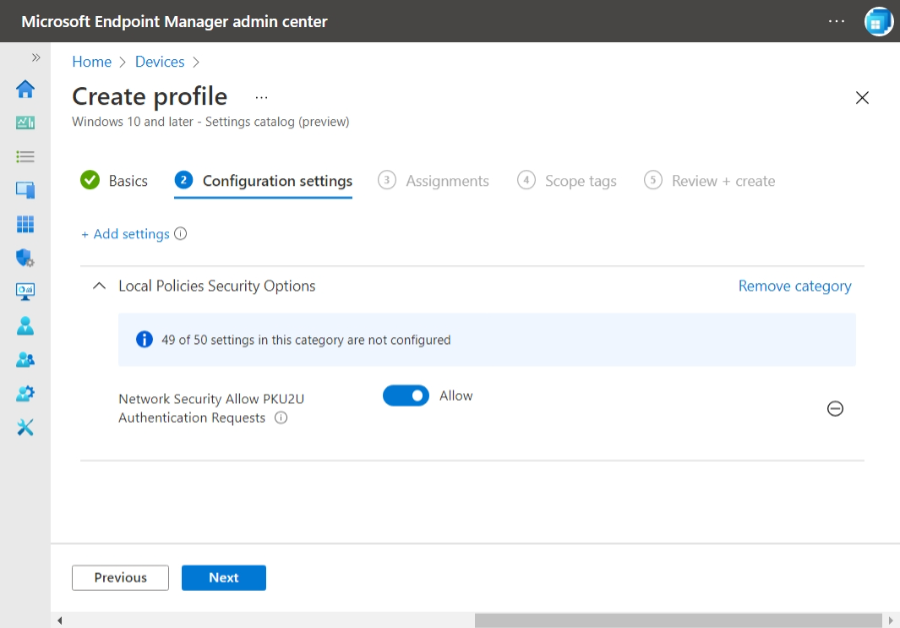

---
# required metadata
title: Troubleshoot connection errors
titleSuffix:
description: Troubleshoot connection errors in Windows 365.
keywords:
author: ErikjeMS  
ms.author: erikje
manager: dougeby
ms.date: 02/10/2022
ms.topic: reference
ms.service: cloudpc
ms.subservice:
ms.localizationpriority: high
ms.technology:
ms.assetid: 

# optional metadata

#ROBOTS:
#audience:

ms.reviewer: traceyadams
ms.suite: ems
search.appverid: MET150
#ms.tgt_pltfrm:
ms.custom: intune-azure; get-started
ms.collection: M365-identity-device-management
---

# Troubleshoot Cloud PC connection errors

The following errors can occur when connecting to a Cloud PC.

## Errors when connecting to an Azure Active Directory (Azure AD) joined Cloud PC

### The logon attempt failed
**Potential cause #1**: Either the Cloud PC or the user's physical device denied PKU2U protocol requests. The PKU2U protocol is only triggered in the following cases:

- The Cloud PC is Azure AD joined.
- The user is connecting from the Windows desktop client.
- The user's physical device is Azure AD registered, Azure AD joined, or hybrid Azure AD joined to the same organization as the Cloud PC.

**Possible solution**: Turn on PKU2U protocol requests on both the Cloud PC and the user's physical device:

1. [Create a filter for all Cloud PCs](create-filter.md#create-a-filter-for-all-cloud-pcs).
2. Create a device configuration policy [using the settings catalog](/mem/intune/configuration/settings-catalog).
3. On the **Configuration settings** page, search for and select **Network Security Allow PKU2U Authentication Requests** > **Allow**.

5. On the **Assignments** page, select **Add all devices** > **Edit filter** > **Include filtered devices in assignment** > select the filter you created for all Cloud PCs.
6. Complete the creation of the device configuration policy.

If the user's physical device is managed, assign the user or the user's physical device to the same device configuration policy. If the user's physical device is unmanaged or you manage through Group Policy, create a Group Policy Object (GPO) to [allow PKU2U authentication requests to this computer to use online identities](/windows/security/threat-protection/security-policy-settings/network-security-allow-pku2u-authentication-requests-to-this-computer-to-use-online-identities).

**Potential cause #2**: [Per-user multi-factor authentication](/azure/active-directory/authentication/howto-mfa-userstates) is turned on for the user account. Because it blocks sign-in, per-user multi-factor authentication isn't supported for users connecting to Azure AD joined Cloud PCs.

**Possible solution**: [Remove per-user multi-factor authentication](/azure/active-directory/devices/howto-vm-sign-in-azure-ad-windows#mfa-sign-in-method-required) for all users connecting to Cloud PCs. Then, [set an Azure AD conditional access policy](set-conditional-access-policies.md) and assign it to the appropriate users.

## Specific connection errors

### We couldn't connect because there are currently no available resources

**Potential cause**: There may be a resource issue on your Cloud PC.

**Possible solution**: Sign in to [windows365.microsoft.com](https://windows365.microsoft.com) > select the cog icon next to the Cloud PC > **Restart**.

### We couldn't connect to the gateway because of an error. If this keeps happening, ask your admin or tech support for help.

**Potential cause**: This error can be caused by network configuration settings, like:

- Custom DNS Settings
- Network Virtual Appliance blocking
- Network Security group configuration
- Resource Locks
- Blocks on required endpoints

**Possible solution**: Review the settings and confirm that they aren’t interfering with connections.

### The remote PC ended your session. If this keeps happening, contact your network administrator for assistance. Error code: 0x3

**Potential cause**: This error can occur when the Cloud PC’s processor is over-utilized.

**Possible solution**: If the issue persists, sign in to [windows365.microsoft.com](https://windows365.microsoft.com) > select the cog icon next to the Cloud PC > **Restart**.

## Other connection error causes

Some other possible causes for Cloud PC connection failures include:

### Out-of-date third-party VPN client versions

**Possible solution**: Update VPN clients to the most up-to-date versions.

### Signing in to the Cloud PC with Azure Active Directory-only user accounts

**Possible solution**: Windows 365 is currently a Hybrid Azure Active Directory (Azure AD) Join device, requiring users to sign in with their on-premises Active Directory account.

### Using a client PC with Remote Credential Guard enabled

**Possible solution**: Remote Credential Guard requires connectivity to the on-premises Active Directory Domain Controller on the client PC used to access the Cloud PC. This connection is only possible using a VPN solution. Using a KDC proxy isn't currently available for Windows 365.

## Other troubleshooting steps

### Move the Cloud PC to a new organizational unit (OU) with no group policies

Connection problems may be caused by settings delivered by group policies. To test this possible cause, you can move the Cloud PC to a separate OU that’s blocked from receiving group policies.

### On-premises Group Policy Objects (GPO) may affect a Cloud PC's provisioning or behavior

Settings delivered by group policies may cause connection problems. To test this, you can move the Cloud PC to a separate OU that's blocked from receiving group policies.

## Next steps

[Review other troubleshooting steps](troubleshooting.md)
