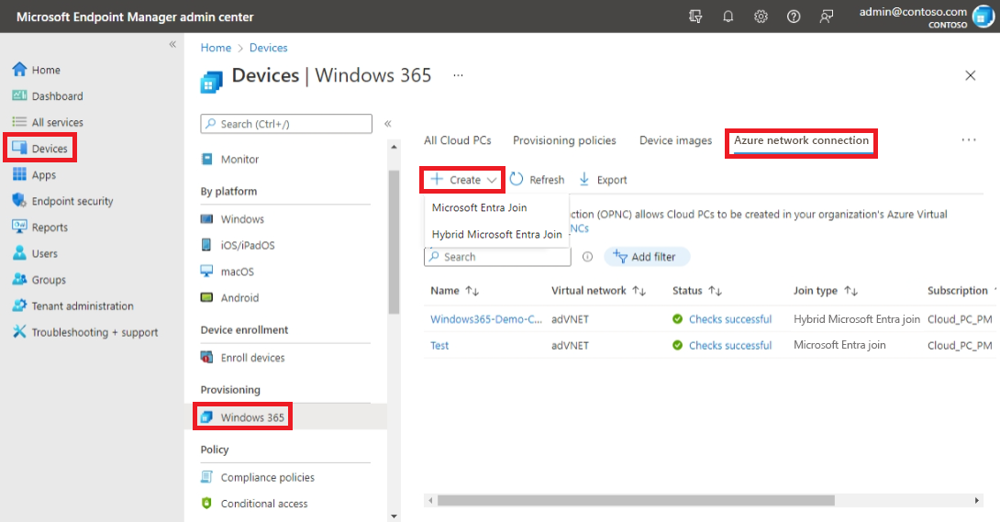
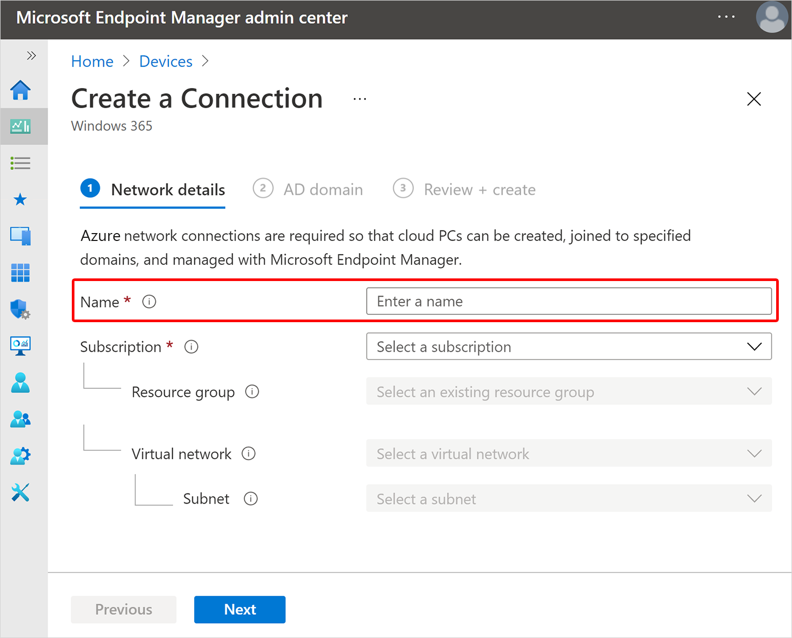

---
# required metadata
title: Create Azure network connections for Windows 365
titleSuffix:
description: Learn how to create Azure network connections for Windows 365.
keywords:
author: ErikjeMS  
ms.author: erikje
manager: dougeby
ms.date: 02/08/2022
ms.topic: how-to
ms.service: cloudpc
ms.subservice:
ms.localizationpriority: high
ms.technology:
ms.assetid: 

# optional metadata

#ROBOTS:
#audience:

ms.reviewer: mattsha
ms.suite: ems
search.appverid: MET150
#ms.tgt_pltfrm:
ms.custom: intune-azure; get-started
ms.collection: M365-identity-device-management
---

# Create Azure network connection

[Azure network connections](azure-network-connections.md) (ANC) let you provision Cloud PCs that are attached to a virtual network that you manage.

You can have up to 10 ANCs per tenant.

As part of the connection process, the Windows 365 service is granted the following permissions:

- Reader permission on the Azure subscription.
- Network contributor permission on the specified resource group.
- Network contributor permission on the virtual network.

## Requirements

To create an ANC, you must:

- Be an [Intune Administrator in Azure AD](/azure/active-directory/roles/permissions-reference).
- Have [Owner permissions on the Azure subscription](/azure/cost-management-billing/manage/add-change-subscription-administrator) that contains the virtual network with connectivity to your on-premises domain controller and network.
- Make sure that your PowerShell execution policy is configured to allow Unrestricted scripts. If you use Group Policy to set execution policy, make sure that the Group Policy Object (GPO) targeted at the Organizational Unit (OU) defined in the ANC is configured to allow Unrestricted scripts. For more information, see [Set-ExecutionPolicy](/powershell/module/microsoft.powershell.security/set-executionpolicy).
- For Disaster Recovery (DR) purposes, make sure that there are at least 50% of the IP addresses available in your subnet. If reprovisioning for DR is required, sufficient new IP addresses are required for each Cloud PC provisioned on the subnet. 

## Create an ANC

1. Sign in to the [Microsoft Endpoint Manager admin center](https://go.microsoft.com/fwlink/?linkid=2109431), select **Devices** > **Windows 365** (under **Provisioning**) > **Azure network connection** > **Create**.
2. Depending on the type of ANC you want to create, choose **Azure AD Join (preview)** or **Hybrid Azure AD Join**.

3. On the **Network details** page, enter a **Name** for the new connection. The connection name must be unique within the customer tenant.

4. Select a **Subscription** and **Resource group** for the new connection. Create a new resource group to contain your Cloud PC resources. Optionally, you can instead select an existing resource group in the list (which grant Windows 365 permissions to the existing resource group). If you don’t have a [healthy ANC](health-checks.md), you won't be able to proceed.
5. Select a **Virtual network** and **Subnet**.
6. Select **Next**.
7. For hybrid Azure AD join ANCs, on the **AD domain** page, provide the following information:
    - **AD domain name**: The DNS name of the Active Directory domain that you want to use for connecting and provisioning Cloud PCs. For example, corp.contoso.com.
    - **Organizational unit**: (Optional.) An organizational unit (OU) is a container within an Active Directory domain, which can hold users, groups, and computers. Make sure that this OU is enabled to sync with Azure AD Connect. Provisioning will fail if this OU isn't syncing.
    - **AD domain username**: The username, in user principal name (UPN) format, that you want to use for connecting the Cloud PCs to your Active Directory domain. For example, svcDomainJoin@corp.contoso.com. This service account must have permission to join computers to the domain and, if set, the target OU. 

    - AD domain password: The password for the user specified above.
    - Confirm AD domain password: The password for the user specified above.

8. Select **Next**.
9. On the **Review + Create** page, select **Create**.

<!-- ########################## -->
## Next steps

[Edit Azure network connection](edit-azure-network-connection.md).
