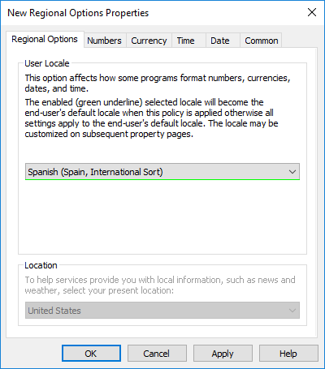

---
# required metadata
title: Create a custom image with languages already installed
titleSuffix:
description: Learn how to provide a localized Windows experience for your Cloud PC users by using custom images.
keywords:
author: ErikjeMS  
ms.author: erikje
manager: dougeby
ms.date: 08/28/2024
ms.topic: how-to
ms.service: windows-365
ms.subservice: windows-365-enterprise
ms.localizationpriority: high
ms.assetid: 

# optional metadata

#ROBOTS:
#audience:

ms.reviewer: chrimo
ms.suite: ems
search.appverid: MET150
#ms.tgt_pltfrm:
ms.custom: intune-azure; get-started
ms.collection:
- M365-identity-device-management
- tier2
---

# Create a custom device image with languages already installed

To create a custom device image that gives users a localized Windows experience, follow these steps:

1. [Create a custom device image](#create-a-custom-image).
2. [Configure the default language using Group Policy](#configure-the-default-language-using-group-policy).

Cloud PCs provisioned from this image will be fully configured to work in any of the installed languages, without any user action. When the user signs in to the Cloud PC, Group Policy will evaluate the device and set the appropriate pre-installed language as the user's preferred language for Windows.

## Create a custom image

Creating a custom image with the languages installed is the best way to make sure that the desired languages are available on the Cloud PC when the user signs in.

Before starting the custom image process, check if your language is supported by the [Windows 365 Language Installer](https://www.powershellgallery.com/packages/Windows365LanguagesInstaller) script. If:

- The language you want to provide for your users is supported by the PowerShell script, follow the steps to [Add languages to Windows using a script and capture the image](#add-languages-to-windows-using-a-script-and-capture-the-image). Windows 10 custom images only.
- The language you want to provide for your users isn't supported by the PowerShell script, follow the steps to [Add languages to Windows manually and capture the image](#add-languages-to-windows-manually-and-capture-the-image).

### Add languages to Windows using a script and capture the image

To add a language using the [Windows 365 Language Installer](https://www.powershellgallery.com/packages/Windows365LanguagesInstaller/1.0.0.0) script:

1. Sign in to the virtual machine you're customizing for use as the custom image.
2. Complete one of the **Installation Options** described for the [Windows 365 Language Installer](https://www.powershellgallery.com/packages/Windows365LanguagesInstaller/1.0.0.0) script.
3. Run the script and enter the number corresponding to the language you'd like to install on the custom image.

> [!NOTE]
> You can use the script to install as many languages as you'd like on the custom image. To do so, run the script one time for each language.

After you're done adding the desired languages and are ready to capture the image, follow the steps to [finish customizing your image](/azure/virtual-desktop/language-packs#finish-customizing-your-image).

### Add languages to Windows manually and capture the image

To manually install the desired languages to your Windows 10/11 Enterprise custom image, follow the steps in [Add language packs to a Windows 10/11 multi-session image](/azure/virtual-desktop/language-packs) up to and including [finish customizing your image](/azure/virtual-desktop/language-packs#finish-customizing-your-image).

> [!NOTE]
> Though these instructions are written specifically for Windows 10/11 Enterprise multi-session, these same steps apply to Windows 10/11 Enterprise.

### Upload the custom image

To upload the custom image to the Windows 365 service, after you've captured the image as an Azure managed image, follow the steps in [Add or delete device images](add-device-images.md).

## Configure the default language using Group Policy

Now that the languages are installed on the image that users will receive, you must create a Group Policy to apply the correct pre-installed language as the default for your users.

The following steps configure [Group Policy Preferences](/previous-versions/windows/it-pro/windows-server-2012-r2-and-2012/dn581922(v=ws.11)) to set the PreferredUILanguages Registry value and the Windows Regional Options. These options are then [targeted by security group](/previous-versions/windows/it-pro/windows-server-2012-r2-and-2012/dn581922(v=ws.11)#item-level-targeting) to sets of users. Each security group and Group Policy object configures a single language as the default for those users. To cater for users with different language default requirements, you can use a single image with multiple languages and different Group Policy objects targeted to different groups of users.

1. Create a security group in your Active Directory domain that will map a specific language to a specific set of users in that group.
2. Add all Cloud PC users who should receive that language to this new security group.
3. In Server Manager, open **Group Policy Management** and create a new Group Policy object linked to the Organization Unit (OU) or domain that will contain the Cloud PCs for those users.
4. Right-click the new Group Policy object, and select **Edit...**
5. Navigate to **User Configuration** > **Preferences** > **Windows Settings**, right-click **Registry**, and select **New** > **Registry Item**.
6. Enter the following details in the **General** tab. Here's an example that shows Spanish (Spain) with language code es-ES:
    - Action: Replace
    - Hive: HKEY_CURRENT_USER
    - Key Path: Control Panel\Desktop
    - Value name: PreferredUILanguages
    - Value type: REG_SZ
    - Value data: [Language/region tag]. For example, **ar-SA** for Arabic (Saudi Arabia).
    > [!Note]
    > To find the language code for your desired language and region combination, see the [language pack list](/windows-hardware/manufacture/desktop/available-language-packs-for-windows#language-packs).
7. Switch to the **Common** tab and check the following three options:
    - **Run in logged-on user's security context (user policy option)**
    - **Apply once and do not reapply**
    > [!Note]
    > This setting makes sure that users can change language options themselves later.
    - **Item-level targeting**
8. Select **Targeting...**, **New Item**, and **Security Group**.
9. Select **...** next to the Group, search for the new security group, select the new security group, and hit **OK**.
10. Select **User in group**, then select **OK** and **OK** to complete the new registry process.
11. In the "Group Policy Management Editor", navigate to **User Configuration** > **Preferences** > **Control Panel Settings**, right-click **Regional Options**, and select **New** > **Regional Options**.
12. Under **User Locale**, select the language and region combination that matches the registry key you created in a previous step.
13. After you select your desired language and region combination from the dropdown, the dropdown menu may be underlined in red. This underline indicates that the selection isn't confirmed. Press the **F5** function key on your keyboard to confirm the selection, resulting in a green underlined dropdown menu.

    Before hitting **F5**:

    

    After hitting **F5**

    

14. Switch to the **Common** tab and check the following three options:
    - **Run in logged-on user's security context (user policy option).**
    - **Apply once and do not reapply.**
    > [!Note]
    > This setting makes sure that users can change language options themselves later.
    - **Item-level targeting.**
15. Select **Targeting..**, **New Item**, and **Security Group**.
16. Select **...** next to the Group, search for the new security group, select the new security group, and select **OK**.
17. Select **User in group**, then select **OK** and **OK** to complete the new registry process.

You can perform these steps for each language you need to provide as the default language for users. If your users have both Cloud PCs and physical devices, you may want to apply [Group Policy loopback](/troubleshoot/windows-server/group-policy/loopback-processing-of-group-policy) so these settings only affect users when they sign in to their Cloud PC.

> [!NOTE]
> Step 6 above uses the "Replace" command, setting the user's preferred language to just the one language defined in the registry item. If you create multiple Group Policy objects to assign different languages to users, make sure each user is only a member of a single security group that is being targeted.

## Next steps

[Required URLs for language packs](provide-localized-windows-experience.md)
