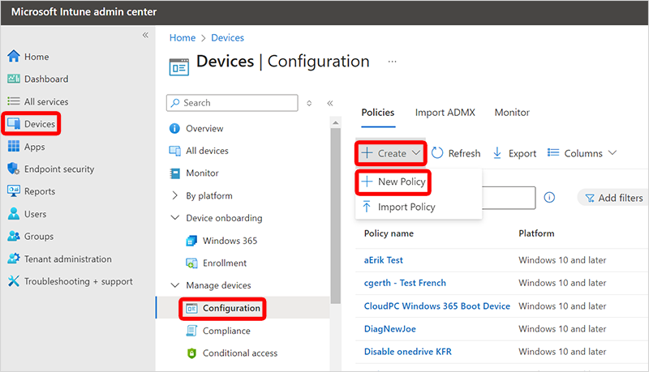

---
# required metadata
title: Create device configuration profile for Windows 365
titleSuffix:
description: Learn how to create device configuration profile for Windows 365.
keywords:
author: ErikjeMS  
ms.author: erikje
manager: dougeby
ms.date: 07/25/2024
ms.topic: how-to
ms.service: windows-365
ms.subservice: windows-365-enterprise
ms.localizationpriority: high
ms.assetid: 

# optional metadata

#ROBOTS:
#audience:

ms.reviewer: chrimo
ms.suite: ems
search.appverid: MET150
#ms.tgt_pltfrm:
ms.custom: intune-azure; get-started
ms.collection:
- M365-identity-device-management
- tier2
---

# Create device configuration profile

In this example, we’ll apply a **Device restrictions** [device configuration profile](/mem/intune-service/configuration/device-profile-create) and apply it to **All Cloud PCs**. You'll need either a dynamic device group or a filter to accomplish this task.

> [!NOTE]
> If you haven’t already, follow the steps to either [create a dynamic device group containing all Cloud PCs](create-dynamic-device-group-all-cloudpcs.md#create-a-dynamic-device-group-for-all-cloud-pcs) or [create a filter for all Cloud PCs](create-filter.md#create-a-filter-for-all-cloud-pcs), then return here to create the device configuration profile.

Now that you’ve created a dynamic device group or a filter for all Cloud PCs, you can target policies to apply to all Cloud PCs in the tenant. To do so, follow these steps:

1. Sign in to the [Microsoft Intune admin center](https://go.microsoft.com/fwlink/?linkid=2109431) > **Devices** > **Configuration** (under **Manage devices**) > **Create** > **New Policy**.

2. Under **Create a profile**, select **Windows 10 and later** for the **Platform**, **Templates** for the **Profile Type**, then **Device restrictions**.
3. Select **Create**.
4. Enter a **Name** for the policy, like "All Cloud PCs – Device restrictions" and a useful **Description**.
5. Select **Next**.
6. On the **Configuration settings** page, select that settings and restrictions that you want applied with this profile.
7. Select **Next**.
8. On the **Scope tags** page, select any desired scope tags to apply, then select **Next**.
9. On the **Assignments** page, choose the following selections, based on if you're using a dynamic device group or a filter:
   
   a. **Dynamic device group**: Select **Add groups** > search for and select the dynamic device group for all Cloud PCs > **Select**.
   
   b. **Filter**: Select an existing user group, **Edit filter** > **Include filtered devices in assignment** > search for and select the filter for all Cloud PCs.
   
   c. **Filter**: Select **Add all devices** or **Add all users**, **Edit filter** > **Include filtered devices in assignment** > search for and select the filter for all Cloud PCs.
   
10. Choose **Select** > **Next**.
11. On the **Applicability Rules** page, select **Next**.
12. On the **Review + create** page, review the settings. You’ll see all the settings you selected along with the assignment to “All Cloud PCs”.
13. Select **Create** to deploy the profile.

<!-- ########################## -->
## Next steps

[Assign a user as a local admin](assign-users-as-local-admin.md).
