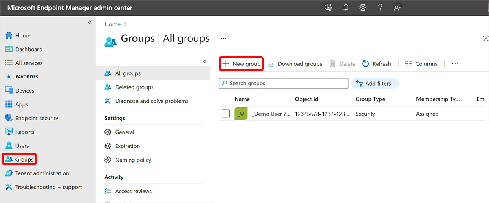

---
# required metadata
title: Create a dynamic device group containing all Cloud PCs with a specific size - Azure | Microsoft Docs
titleSuffix:
description: Learn how to create dynamic device groups containing all Cloud PC with a specific size.
keywords:
author: ErikjeMS  
ms.author: erikje
manager: dougeby
ms.date: 08/4/2021
ms.topic: how-to
ms.service: windows-365
ms.subservice:
ms.localizationpriority: high
ms.technology:
ms.assetid: 

# optional metadata

#ROBOTS:
#audience:

ms.reviewer: chrimo
ms.suite: ems
search.appverid: MET150
#ms.tgt_pltfrm:
ms.custom: intune-azure; get-started
ms.collection:
- M365-identity-device-management
- tier2
---

# Create a dynamic device group containing all Cloud PCs of a specific configuration

You might want to apply the same set of policies to all your Cloud PCs with the same computing power (vCPU and RAM). You can apply policies like this by creating a dynamic device group containing all Cloud PCs with the same Cloud PC configuration.

For the example below, we use 2 vCPU and 4-GB RAM as the configuration. Anywhere you see "2vCPU/4GB" replace it with the desired configuration. You can also target a specific Cloud PC size by adding the OS storage as part of the configuration.

You can follow the below steps and create a dynamic group for any of the configurations that make up Cloud PC sizes. In these steps, you'll use the Device Model device property to create the dynamic device group.

1. Sign in to the [Microsoft Intune admin center](https://go.microsoft.com/fwlink/?linkid=2109431) > **Groups** > **New Group**.

2. Select the **New Group** page, choose **Security** for **Group type**.
3. Enter the following information:
    1. **Group name** = “All 2vCPU/4GB RAM Cloud PCs".
    2. **Group description** = “A dynamic device group containing all Cloud PCs with the 2vCPU/4GB RAM configuration.
4. For **Membership type**, choose **Dynamic Device**.
5. Select **Add dynamic query**.
6. On the **Dynamic membership rules** page, enter the following:
    1. **Property** = “deviceModel”.
    2. **Operator** = “Contains”.
    3. **Value** = “Cloud PC”.
7. Select **Add expression** and enter the following:
    1. **Property** = “deviceModel”
    2. **Operator** = “Contains”
    3. **Value** = “2vCPU/4GB”
8. To validate that it works, select **Validate Rules (Preview)** > **Add devices** > select some Cloud PCs that have the 2vCPU/4GB RAM configuration, some Cloud PCs that have a different configuration, and some non-Cloud PC devices.
9. After the validation completes, select **Save** > **Create**.

<!-- ########################## -->
## Next steps

[Create a dynamic device group containing all Cloud PCs from a specific provisioning policy](create-dynamic-device-group-from-specific-policy.md).