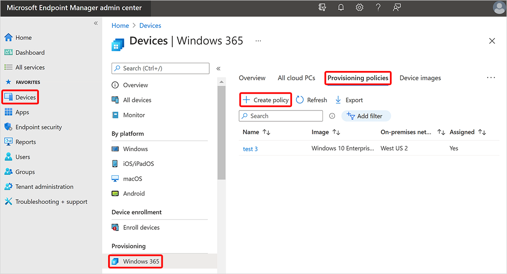

---
# required metadata
title: Create provisioning policies for Windows 365
titleSuffix:
description: Learn how to create provisioning policies for Windows 365.
keywords:
author: ErikjeMS  
ms.author: erikje
manager: dougeby
ms.date: 02/28/2023
ms.topic: how-to
ms.service: windows-365
ms.subservice:
ms.localizationpriority: high
ms.technology:
ms.assetid: 

# optional metadata

#ROBOTS:
#audience:

ms.reviewer: mattsha
ms.suite: ems
search.appverid: MET150
#ms.tgt_pltfrm:
ms.custom: intune-azure; get-started
ms.collection:
- M365-identity-device-management
- tier2
---

# Create provisioning policies

Cloud PCs are created and assigned to users based on provisioning policies. These policies hold key provisioning rules and settings that let the Windows 365 service set up and configure the right Cloud PCs for your users. After provisioning policies are created and assigned to the Azure AD user security groups or Microsoft 365 Groups, the Windows 365 service:

1. Checks for appropriate licensing for each user.
2. Configures the Cloud PCs accordingly.

A few things to keep in mind:

- If a user in an assigned group doesn’t have a Cloud PC license assigned, Windows 365 won’t provision their Cloud PC.
- For each Cloud PC license assigned to a user, only one provisioning policy is used to set up and configure the Cloud PC. The Windows 365 service always uses the first assigned policy to provision the Cloud PC.

## Create a provisioning policy

1. Sign in to the [Microsoft Intune admin center](https://go.microsoft.com/fwlink/?linkid=2109431), select **Devices** > **Windows 365** (under **Provisioning**) > **Provisioning policies** > **Create policy**.

   
2. On the **General** page, enter a **Name** and **Description** (optional) for the new policy.

   > [!TIP]
   > Your provisioning policy name cannot contain the following characters: < > & | " ^

3. On the **General** page, select a **Join type**:
    - **Hybrid Azure AD Join**: You must select an ANC to use for this policy.
    - **Azure AD Join**: You have two options for **Network**:
        - **Azure network connection**: Select an ANC to use for this policy.
        - **Microsoft hosted network**: Select a **Geography** where your Cloud PCs will be provisioned. Then, for [**Region**](requirements.md#supported-azure-regions-for-cloud-pc-provisioning), you can select:
            - **Automatic (Recommended)**: The Windows 365 service automatically chooses a region within the selected geography at the time of provisioning. This decreases the chance of provisioning failure.
            - A specific region: To make sure that your Cloud PCs are only provisioned in the region that you choose.

### Select an ANC

You must select an [ANC](azure-network-connections.md) for your provisioning policy if you selected either of these two options in the previous section:

- **Join type** = **Hybrid Azure AD Join**
- **Join type** = **Azure AD join** and **Network** = **Azure network connection**

To select an ANC, follow these steps:

1. On the **General** page, for **Azure network connection**, select one or more ANCs. For more information about using multiple ANCs, see [Alternate ANCs](azure-network-connections.md#alternate-ancs).

2. If you select more than one ANC, you can set the priority order for those ANCs. To do so, hover over an ANC > click and drag on the three dots > drag the ANC to a different position in the list.

  As long as the first ANC in the list is **Healthy**, it will always be used for provisioning Cloud PCs using this policy. If the first ANC is not healthy, the policy will use the next ANC in the list that is healthy.

### Continue creating a provisioning policy

1. If you select **Azure AD Join**, you can check the box so that your users **Use single sign-on (preview)**.
2. Select **Next**.
3. On the **Image** page, for **Image type**, select one of the following options:
    - **Gallery image**: Choose **Select** > select an image from the gallery > **Select**. Gallery images are default images provided for your use.
    - **Custom image**:  Choose **Select** > select an image from the list > **Select**. You'll see the list of images that you uploaded using the [Add device images](add-device-images.md) workflow.
4. Select **Next**.
5. On the **Configuration** page, under **Windows settings**, choose a **Language & Region**. The selected language pack will be installed on Cloud PCs provisioned with this policy.
6. Optional. Select **Apply device name template** to create a Cloud PC naming template to use when naming all Cloud CPs that are provisioned with this policy. Options and requirements for this template include:
    - Names must be between 4 and 15 characters.
    - Names can contain letters, numbers, hyphens, and undescores.
    - Names can't include blank spaces.
    - Optional. Use the %USERNAME:X% macro to add the first X letters of the username.
    - Required. Use the %RAND:Y% macro to add a random string of numbers, where Y equals the number of digits to add. Y must be 5 or more. Names must contain a randomized string.
7. Optional. Under **Additional services**, choose a service to be installed on Cloud PCs provisioned with this policy:
    - **Windows Autopatch** is a cloud service that automates updates for Windows, Microsoft 365 Apps for enterprise, Microsoft Edge, and Microsoft Teams on both physical and virtual devices. For more information, see [What is What is Windows Autopatch?](/windows/deployment/windows-autopatch/overview/windows-autopatch-overview) and the [Windows Autopatch FAQ](https://go.microsoft.com/fwlink/?linkid=2200228).
    - **Microsoft Managed Desktop** is a cloud service that helps with device deployment, service management and operations, and security. For more information, see [What is Microsoft Managed Desktop?](/managed-desktop/intro/).
8. Select **Next**.
9. On the **Assignments** page, choose **Select groups** > choose the groups you want this policy assigned to > **Select** > **Next**. Nested groups aren't currently supported.
1o. On the **Review + create** page, select **Create**. If you used Hybrid Azure AD Join as the join type, it can take up to 60 minutes for the policy creation process to complete. The time depends on when the Azure AD connect sync last happened.

<!-- ########################## -->
## Next steps

[Edit provisioning policy](edit-provisioning-policy.md).
