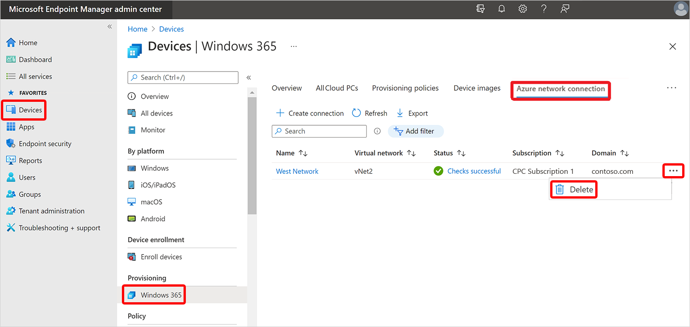

---
# required metadata
title: Delete Azure network connections for Windows 365
titleSuffix:
description: Learn how to delete Azure network connections for Windows 365.
keywords:
author: ErikjeMS  
ms.author: erikje
manager: dougeby
ms.date: 07/25/2024
ms.topic: how-to
ms.service: windows-365
ms.subservice: windows-365-enterprise
ms.localizationpriority: high
ms.assetid: 

# optional metadata

#ROBOTS:
#audience:

ms.reviewer: mattsha
ms.suite: ems
search.appverid: MET150
#ms.tgt_pltfrm:
ms.custom: intune-azure; get-started
ms.collection:
- M365-identity-device-management
- tier2
---

# Delete Azure network connection

Only an unassigned Azure network connection (ANC) can be deleted. If an ANC is in use by a provisioning policy, then you must take one of the following steps:

- Remove the ANC from all provisioning policies.
- Delete the ANC.

To delete an Azure network connection:

1. Sign in to the [Microsoft Intune admin center](https://go.microsoft.com/fwlink/?linkid=2109431) > **Devices** > **Windows 365** (under **Provisioning**) > **Azure network connection**. You must have [Intune Administrator](/azure/active-directory/roles/permissions-reference#intune-administrator) or [Windows 365 Administrator](/azure/active-directory/roles/permissions-reference) permissions.

2. Select the ellipses (**…**) next to the connection you want to delete > **Delete**.
3. Select **Confirm** when asked to delete the connection.

<!-- ########################## -->
## Next steps

[Add device images](add-device-images.md).
