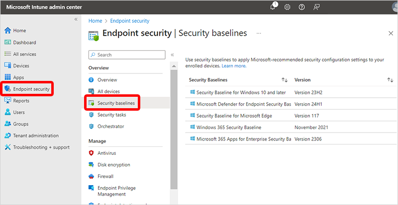

---
# required metadata
title: Deploy security baselines for Windows 365
titleSuffix:
description: Learn how to deploy security baselines for Windows 365.
keywords:
author: ErikjeMS  
ms.author: erikje
manager: dougeby
ms.date: 08/02/2021
ms.topic: how-to
ms.service: windows-365
ms.subservice:
ms.localizationpriority: high
ms.technology:
ms.assetid: 

# optional metadata

#ROBOTS:
#audience:

ms.reviewer: anbiswas
ms.suite: ems
search.appverid: MET150
#ms.tgt_pltfrm:
ms.custom: intune-azure; get-started
ms.collection: M365-identity-device-management
---

# Deploy security baselines

Windows 365 Security Baselines are a set of policy templates built on security best practices and experience from real world implementations. You can use security baselines to get security recommendations that can help lower risks. The Windows 365 baselines enable security configurations for Windows 10, Microsoft Edge, and Microsoft Defender for Endpoint. They include versioning features and help customers choose when to update user policies to the latest release.

Windows 365-branded security baselines are a group of tested and validated recommended settings available in Microsoft Endpoint Manager that apply to the following areas:

- Windows 10 settings: 1809
- MDATP settings: version 4
- Microsoft Edge settings: April 2020 (Microsoft Edge version 80 and later)

You can optionally apply Windows 365 security baselines to the Azure AD groups containing Cloud PC devices in your tenant.  

> [!TIP] 
> Like any configuration change, it is always a good idea to test the security baseline on a pilot group of Cloud PCs. For information on how to build a rollout plan in Microsoft Endpoint Manager, see the [Microsoft Intune planning guide](/mem/intune/fundamentals/intune-planning-guide#task-5-create-a-rollout-plan). For information on Microsoft Defender for Endpoint features can be tested, see [Test how Microsoft Defender for Endpoint features work in audit mode](/microsoft-365/security/defender-endpoint/audit-windows-defender).

1. Sign in to the [Microsoft Intune admin center](https://go.microsoft.com/fwlink/?linkid=2109431) select **Endpoint Security** > **View Security Baselines**.

2. Select **Cloud PC Security Baseline (Preview)**.
3. Select **Create Profile** and provide a name for your profile.
4. On the **Configuration settings** tab, view the groups of settings that are available in the baseline you selected. You can expand a group to view the settings in that group, and the default values for those settings in the baseline. To find specific settings:
    - Select a group to expand and review the available settings.
    - Use the Search bar and specify keywords that filter the view to display only those groups that contain your search criteria.

    Each setting in a baseline has a default configuration for that baseline version. Reconfigure the default settings to meet your business needs. Different baselines might contain the same setting, and use different default values for the setting, depending on the intent of the baseline.
5. On the **Assignments** tab, select a device group with the Cloud PCs to include and then assign the baseline to one or more groups with your Cloud PCs. Use **Select groups to exclude** to fine-tune the assignment.
6. When you're ready to deploy the baseline, advance to the **Review + create** tab and review the details for the baseline. Select **Create** to save and deploy the profile.

As soon as you create the profile, it's pushed to the assigned group and will apply immediately.

For more information, see [Use security baselines to configure Windows devices in Intune](/mem/intune/protect/security-baselines).

<!-- ########################## -->
## Next steps

[Set conditional access policies](set-conditional-access-policies.md)
