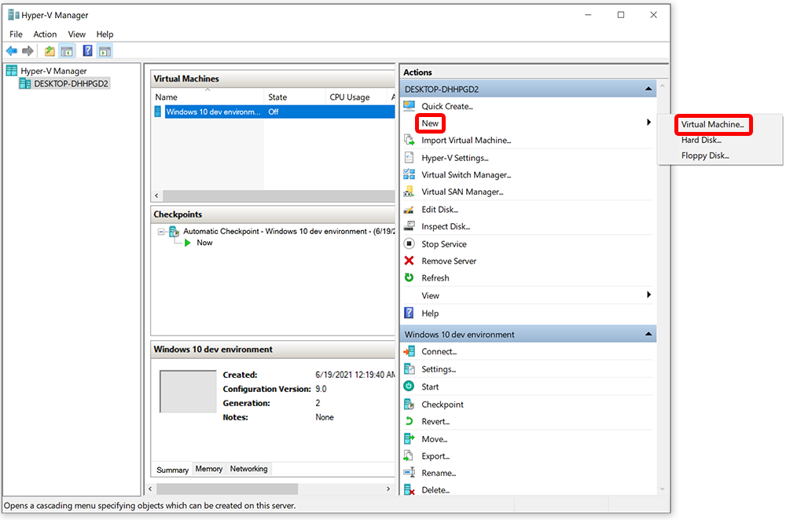
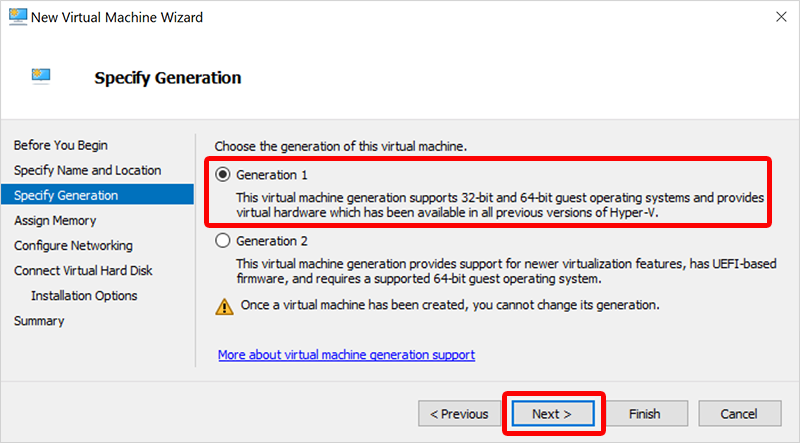
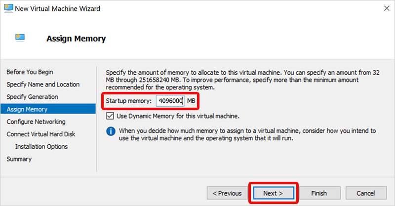
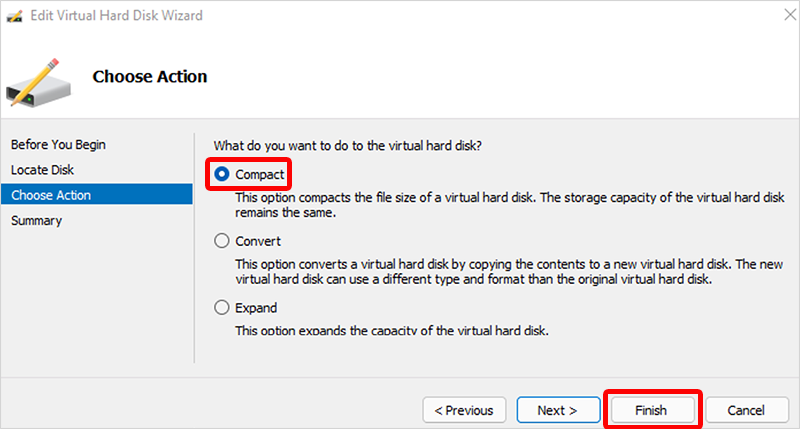
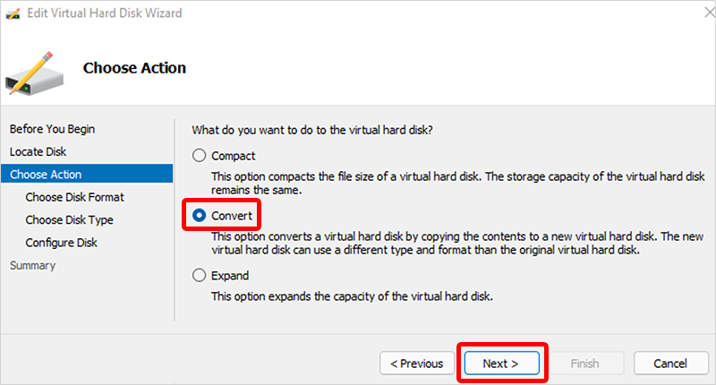
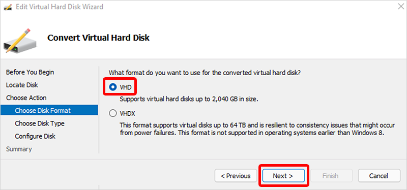
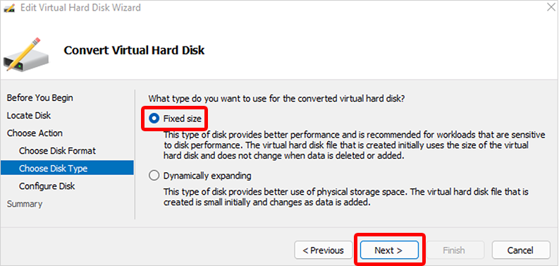

---
# required metadata
title: Convert custom device images to generation 2 virtual machines in Windows 365
titleSuffix:
description: Learn how to convert custom device images to generation 2 virtual machines in Windows 365.
keywords:
author: ErikjeMS 
ms.author: erikje
manager: dougeby
ms.date: 06/01/2023
ms.topic: how-to
ms.service: windows-365
ms.subservice:
ms.localizationpriority: high
ms.technology:
ms.assetid: 

# optional metadata

#ROBOTS:
#audience:

ms.reviewer: chbrinkh
ms.suite: ems
search.appverid: MET150
#ms.tgt_pltfrm:
ms.custom: intune-azure; get-started
ms.collection:
- M365-identity-device-management
- tier1
---

# Convert an existing custom device image to a generation 2 virtual machine

To support Windows 11, your custom device images must be based on generation 2 (Gen2) virtual machines (VMs). If you already have custom device images based on generation 1 (Gen1) virtual machines, you can convert those custom device images by following the steps below. After you've completed these steps, all future Cloud PCs provisioned from the converted device image will be based on Gen2 virtual machines.

Windows 365 won't prevent you from provisioning new Cloud PCs from existing custom images based on Gen1 VMs. However, when you want to add new custom images, Windows 365 will only accept Gen2-based images. Gen 2 VMs are required to support Windows 11.

There are four main steps to this process:

1. Create a new virtual machine
2. Convert the Master Boot Record to the GUID partition
3. Convert the disk to a fixed size and VHD format
4. Upload the converted virtual machine to Azure

## Create a new virtual machine

1. Make sure that Hyper-V is installed on your management PC. For information on how to install Hyper-V, see [Install Hyper-V on Windows 10](/virtualization/hyper-v-on-windows/quick-start/enable-hyper-v).
2. Download your existing custom image virtual hard drive (VHD) file from the Azure storage blob URL to your PC where you have Hyper-V available.
    The VHD file is the exact size of the OS disk, which can be a large file size. Make sure to use a fast, stable internet connection to download the VHD file, and prepare for long download times.
    For information on how to download a managed disk, see [Download a VHD from Azure](/azure/virtual-machines/windows/download-vhd#generate-download-url).
    You can also download the VHD by using [Azure Storage Explorer](https://azure.microsoft.com/features/storage-explorer/) directly, both as managed disk or storage blob VHDs.
3. Switch to your local PC and open Hyper-V Manager.
4. Under **Actions**, select **New** > **Virtual Machine**.
    
5. On the **Before You Begin** page, select **Next**.
6. On the **Specify Name and Location** page, type a friendly name, like CustomFinanceImageg2, and then select **Next**.
    
7. On the **Specify Generation** page, select **Generation 1** (not **Generation 2**). Gen2 is needed here to mount the disk and change the partition model to GUID Partition Table (GPT). Select **Next**.
    
  Hyper-V only supports Gen 2 images in VHDX and Gen 1 images in VHD. Azure only supports Gen 2 images in VHD. Therefore, we're creating a Gen 1 VHD image here in order to convert it to a Gen 2 VHD image.
8. On the **Assign Memory** page, set **Startup memory** to at least 1024 MB, preferably 4096 MB. Select **Next**.
    
9. On the **Configure Networking** page, select **Default Switch** > **Next**.
10. On the **Connect Virtual Hard Disk** page, select **Use an existing virtual hard disk**.
    
11. For **Location**, select **Browse** and select the VHD that you downloaded earlier.
12. Select **Next** and on the **Summary** page select **Finish**.

## Convert the Master Boot Record to the GUID partition

1. Create a WinPE media ISO. For instructions on how to create an ISO, see [Create bootable WinPE media](/windows-hardware/manufacture/desktop/winpe-create-usb-bootable-drive). Alternatively, boot from a Windows 11 ISO and press Shift + F10 to display a CMD prompt.
2. In Hyper-V Manager, under **Virtual Machines**, select the new VM, and then under **Actions** select **Settings**.
3. In the left navigation pane, under **IDE Controller 1**, select **DVD Drive**.
4. Under **DVD Drive**, under **Controller**, select **IDE Controller 1**.
5. Select **Image file** and browse to the new ISO file you created.
6. Select **OK**.
7. Under **Actions**, select **Start**.
8. Wait for the wpeinit command prompt to open.
9. To convert the Master Boot Record (MBR) to the GUID Partition Table (GPT) partition, run the following two commands in the wpeinit window. The GPT is the new standard for gen2 based VMs.
    1. To determine the correct disk for conversion and validate it, run ````mbr2gpt /validate /disk:0````.
    2. To convert the disk to the GUID Partition Table (GPT), run ````mbr2gpt /convert /disk:0````
    For more information on MBR2GPT, see the [MBR2GPT.exe documentation](/windows/deployment/mbr-to-gpt).
10. After the commands run successfully, move on to the next step.

## Convert the disk to a fixed size and VHD format

1. Shut down the virtual machine.
2. In Hyper-V Manager, select the new virtual machine > **Edit disk** (under **Actions**).
3. On the **Before You Begin** page, select **Next**.
4. On the **Locate Disk** page, **Browse** to the location of the converted disk > **Next**.
5. On the **Choose Action** page, select **Compact** > **Finish**.
    
6. After the process completes, select the new virtual machine again > **Edit disk**.
7. On the **Before You Begin** page, select **Next**.
8. On the **Locate Disk** page, **Browse** to the location of the converted disk > **Next**.
9. On the **Choose Action** page, select **Convert** > **Next**.
    
10. On the **Choose Disk Format** page, select **VHD** > **Next**.
    
11. On the **Choose Disk Type** page, select **Fixed size** > **Next**.
    
12. On the **Configure Disk** page, **Browse** to a new location for the disk to be created > **Next**.
    
13. On the **Summary** page, confirm all of the details are correct and select **Finish**.
14. After the process completes, dismount the WinPE ISO by following these steps:
    1. In Hyper-V Manager, under **Virtual Machines**, select the new VM, and then under **Actions** select **Settings**.
    2. In the left navigation pane, select **IDE Controller 1**.
    3. Under **DVD Drive**, under **Controller**, select **IDE Controller 1**.
    4. Select **OK**.

## Upload the converted VHD to Azure

1. Upload the converted VHD back to Azure. You can use [Azure Storage Explorer](https://azure.microsoft.com/features/storage-explorer/). For other upload options, see [Upload a generalized Windows VHD and use it to create new VMs in Azure](/azure/virtual-machines/windows/upload-generalized-managed).
    > [!Note]
    > Make sure that the VHD remains **VHD in fixed size**. **VHDX as format** isn’t supported on Azure.
2. Go to the [Azure portal](https://portal.azure.com), open **Images** > **Create**.
3. Fill in the required fields and make sure to select **Gen 2** for **VM generation**.
4. Select **Review + Create**.
5. (Optional) After the image is created, you can upload it. For instructions on how to upload, see [Upload a VHD to Azure or copy a managed disk to another region - Azure PowerShell](/azure/virtual-machines/windows/disks-upload-vhd-to-managed-disk-powershell).
6. You can now add the device image to Windows 365. For information on how to upload custom images, see [Add a custom device image](add-device-images.md#add-a-custom-device-image).

<!-- ########################## -->
## Next steps

[Learn about device configuration](device-configuration.md).
