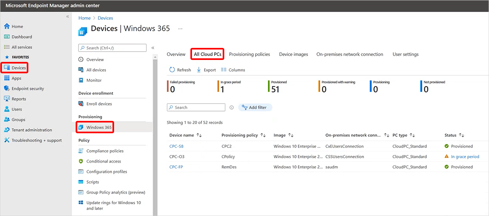
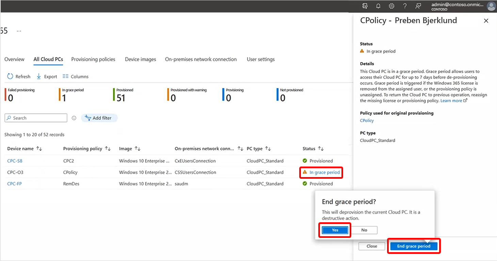

---
# required metadata
title: End grace period for Cloud PCs in Windows 365
titleSuffix:
description: Learn how to end the grace period for Cloud PCs in Windows 365.
keywords:
author: ErikjeMS  
ms.author: erikje
manager: dougeby
ms.date: 05/09/2023
ms.topic: how-to
ms.service: windows-365
ms.subservice:
ms.localizationpriority: high
ms.technology:
ms.assetid: 

# optional metadata

#ROBOTS:
#audience:

ms.reviewer: mattsha
ms.suite: ems
search.appverid: MET150
#ms.tgt_pltfrm:
ms.custom: intune-azure; get-started
ms.collection:
- M365-identity-device-management
- tier2
---

# End grace period for Cloud PCs

When a Cloud PC is in a grace period, the user can continue using the Cloud PC for seven days. After the seven-day grace period expires, the user is logged off the Cloud PC. They’ll lose access and the Cloud PC will be [deprovisioned](lifecycle.md#deprovision).

There may be situations where you don't want to wait seven days for the grace period to end normally. In this case, you can use the **End grace period** option to immediately end the grace period.

## End grace period

1. Ending the grace period is a destructive action. Before ending the grace period, notify your users to be sure that they're fully aware of the impact.
2. Sign in to the [Microsoft Intune admin center](https://go.microsoft.com/fwlink/?linkid=2109431), select **Devices** > **Windows 365** (under **Provisioning**) > **All Cloud PCs**.

3. In the **Status** column of the list, select **In grace period** > **End grace period** > **Yes**.
    > [!Important]
    > This is a destructive act. It will delete the operating system and data. The Cloud PC will no longer be available.

    

After you select **Yes**, the following steps will happen automatically:

1. The Cloud PC will start deprovisioning.
2. The user loses access to the Cloud PC.
3. The operating system and data are deleted from the Cloud PC. The Cloud PC is no longer available.
4. If the original provisioning policy was replaced with a different policy, the Cloud PC will be reprovisioned with the settings in the new policy.

<!-- ########################## -->
## Next steps

For more information on grace periods, see [Device management overview for Cloud PCs](device-management-overview.md).
