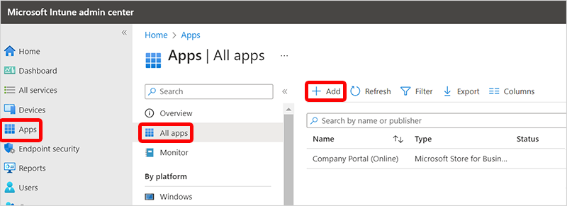

---
# required metadata
title: Using Intune, install the Windows app on devices
titleSuffix:
description: Using Intune, install the Windows app on devices
keywords:
author: ErikjeMS  
ms.author: erikje
manager: dougeby
ms.date: 06/24/2024
ms.topic: how-to
ms.service: windows-365
ms.subservice: windows-365-enterprise
ms.localizationpriority: high
ms.assetid: 

# optional metadata

#ROBOTS:
#audience:

ms.reviewer: chbrinkh
ms.suite: ems
search.appverid: MET150
#ms.tgt_pltfrm:
ms.custom: intune-azure; get-started
ms.collection:
- M365-identity-device-management
- tier2
---

# Using Intune, install the Windows app on physical devices

Some of your users might have physical devices that don't have access to the Microsoft Store to install the Windows app. In these cases, you can install the Windows app to their devices by using Intune app assignment process. By assigning the app to device groups, you can automatically install the Windows 365 app on their devices.

1. Sign in to the [Microsoft Intune admin center](https://go.microsoft.com/fwlink/?linkid=2109431) > **Apps** > **All apps** > **Add**.
    
2. On the **Select app type** pane, in the **App type** box, select **Microsoft Store app (new)** > **Select**.
3. On the **Add App** page, select **Search the Microsoft Store app (new)**, search for **Windows app** and select it > choose **Select**.
4. On the **App information** page, you can leave all the settings as is or change them > **Next**. For more information about these settings, see [Add Microsoft Store apps to Microsoft Intune](/mem/intune/apps/store-apps-microsoft).
5. (Optional) On the **Scope tags** page, you can use scope tags to ensure that the right admins have the correct access and visibility to Intune objects. For more information about scope tags, see [Use role-based access control (RBAC) and scope tags for distributed IT](/mem/intune/fundamentals/scope-tags). Select **Next**.
6. On the **Assignments** page, add device and/or user groups containing the Cloud PCs on which you want the Windows 365 app to be automatically installed. If you target a user group, the users must first sign in to their Cloud PC before the app is installed. If you target a device group, the app is installed before the user signs in.
    1. Under **Required**, select **Add group** and add the groups containing the physical devices on which you want the Windows 365 app automatically installed.
    2. Under **Available for enrolled devices**, select **Add group** and add the user groups. The Windows 365 app is displayed in the Company Portal app and website for users to optionally install.
    3. After you've selected all the groups, select **Next**
7. On the **Review + create** page, select **Create**.

## Block access to the Microsoft Store

If you want to prevent users from accessing the Microsoft Store, you should create a settings catalog configuration profile policy. In the **Settings picker**, search for **Microsoft App Store**, and select **Require Private Store Only**.

For more help using the settings catalog to create a configuration profile policy, see [Use the settings catalog to configure settings on Windows and macOS devices](/mem/intune/configuration/settings-catalog).

<!-- ########################## -->
## Next steps

[Learn more about adding apps to devices by using Intune](/mem/intune/apps/apps-add).

[Learn about device management for Cloud PCs](device-management-overview.md).
