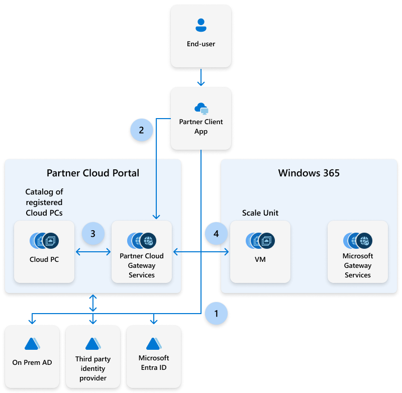

---
# required metadata
title: Partner integration scenarios for Windows 365.
titleSuffix:
description: Learn about partner integration scenarios for Windows 365.
keywords:
author: ErikjeMS  
ms.author: erikje
manager: dougeby
ms.date: 10/23/2024
ms.topic: overview
ms.service: windows-365
ms.subservice: windows-365-enterprise
ms.localizationpriority: high
ms.assetid: 

# optional metadata

#ROBOTS:
#audience:

ms.reviewer: aradinger    
ms.suite: ems
search.appverid: MET150
#ms.tgt_pltfrm:
ms.custom: intune-azure; get-started
ms.collection:
- M365-identity-device-management
- tier2
---

# Windows 365 partner integration supported scenarios

The following partner integration scenarios support partner protocols on top of Windows 365, without compromising the simplicity and predictability that Windows 365 delivers.

| Partner | Supported clients | Gateway service | Connection protocol | Supported service plans |
| --- | --- | --- | --- | --- |
| Citrix | Citrix Workspace web client Citrix Workspace desktop clients for supported platforms | Citrix Cloud Gateway Service | Citrix HDX | Enterprise, Frontline
| HP | HP Anyware web client HP Anyware desktop clients for supported platforms | HP Anyware Cloud Gateway Service | HP Anyware | Enterprise |
| Omnissa | Omnissa Workspace ONE web client Omnissa ONE desktop clients for supported platforms | Omnissa Cloud Gateway Service |  Omnissa Blast | Enterprise |

While scenarios not listed here might still work in customers’ production environment, they aren't supported by Microsoft.

> [!NOTE]
>
> On-premises gateway services aren't supported.

## User connection process with partner integration

1. A user authenticates using Microsoft Entra ID, on-premises Active Directory, or a third party identity provider.
2. Windows 365 establishes a connection to the partner cloud gateway using partner protocols.
3. A Cloud PC is assigned to the user and is accessible from the web/workspace portals.
4. Windows 365 establishes a connection to the Cloud PC using partner protocols. 

<!-- ########################## -->
## Next steps

[Set up Citrix HDX Plus for Windows 365 Enterprise](set-up-citrix.md).

[Set up HP Anywhere for Windows 365 Enterprise](set-up-citrix.md).

[Set up Omnissa Horizon for Windows 365 Enterprise](set-up-citrix.md).
