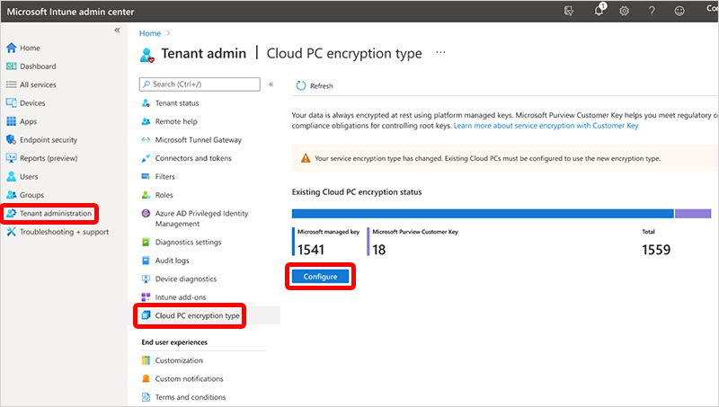
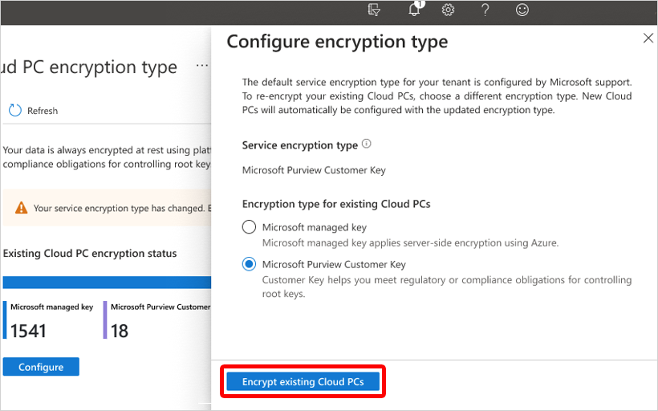

---
# required metadata
title: Set up Microsoft Purview Customer Key for Windows 365 Cloud PCs
titleSuffix:
description: Learn how to set up Microsoft Purview Customer Key for Windows 365 Cloud PCs.
keywords:
author: ErikjeMS  
ms.author: erikje
manager: dougeby
ms.date: 03/11/2024
ms.topic: how-to
ms.service: windows-365
ms.subservice: windows-365-enterprise
ms.localizationpriority: high
ms.assetid: 

# optional metadata

#ROBOTS:
#audience:

ms.reviewer: ryclark
ms.suite: ems
search.appverid: 
#ms.tgt_pltfrm:
ms.custom: intune-azure
ms.collection:
- M365-identity-device-management
- tier1
- essentials-security
---

# Microsoft Purview Customer Key for Windows 365 Cloud PCs

[Microsoft Purview Customer Key](/purview/customer-key-overview) is a security feature that lets you add an extra layer of encryption to your data within Microsoft 365 services.

When you use Customer Key with Windows 365 Cloud PCs:

- Your Cloud PC disks, snapshots, and images are encrypted at rest with customer-managed keys.
- These keys are supplied by you and managed using Azure Key Vault.
- Microsoft manages all other keys, supporting a secure and controlled environment.

## Set up Customer Keys for your Windows 365 Cloud PCs

1. [Set up Customer Key]( /purview/customer-key-set-up) as explained in the [Microsoft Purview Customer Key documentation]( /purview/customer-key-overview).
2. [Create a data encryption policy for use with multiple workloads for all tenant users]( /purview/customer-key-manage#create-a-dep-for-use-with-multiple-workloads-for-all-tenant-users). This step includes [assigning a multi-workload policy]( /purview/customer-key-manage#assign-multi-workload-policy).
After completing this step, it takes 3-4 hours to update your Intune admin center to include the **Configure** button.
3. Sign in to the [Microsoft Intune admin center](https://go.microsoft.com/fwlink/?linkid=2109431) > **Tenant administration** > **Cloud PC encryption type** > **Configure**.

    

4. Under **Configure encryption type**, select **Microsoft Purview Customer Key** > **Encrypt existing Cloud PCs**.

    

5. In the confirmation window, select **Encrypt**. A notification states that encrypting started.

Encryption forces a restart for each Cloud PC.

Encryption is limited to 20,000 Cloud PCs at a time. You can repeat these steps to encrypt more Cloud PCs.

Encryption can take a long time based on the number of Cloud PCs and the size of the disks. The **Cloud PC encryption type** page is updated with a notification when the encryption is complete.

## Next steps

For more information about Microsoft Purview Customer Key, see [Overview of service encryption with Microsoft Purview Customer Key](/purview/customer-key-overview).
