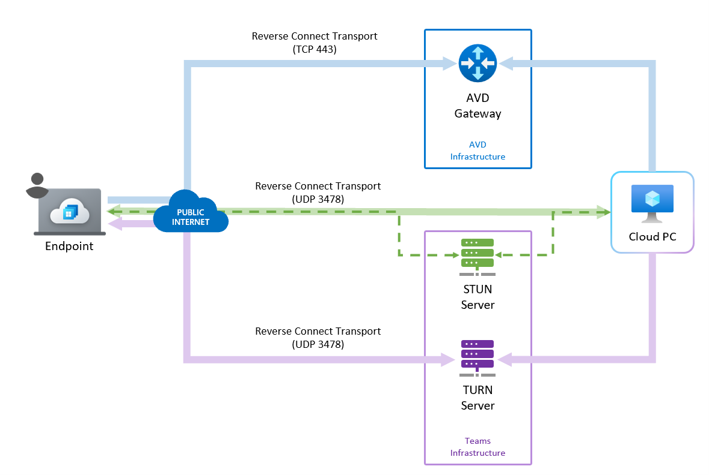

---
# required metadata
title: Use RDP Shortpath for private networks with Windows 365 Cloud PCs.
titleSuffix:
description: Learn how to use RDP Shortpath for private networks with Windows 365 Cloud PCs.
keywords:
author: ErikjeMS  
ms.author: erikje
manager: dougeby
ms.date: 05/24/2022
ms.topic: how-to
ms.service: windows-365
ms.subservice:
ms.localizationpriority: high
ms.technology:
ms.assetid: 

# optional metadata

#ROBOTS:
#audience:

ms.reviewer: ridalwan
ms.suite: ems
search.appverid: MET150
#ms.tgt_pltfrm:
ms.custom: intune-azure; get-started
ms.collection:
- M365-identity-device-management
- tier2
---

# Use RDP Shortpath for private networks with Windows 365  

You can use Remote Desktop Protocol (RDP) Shortpath for private networks with your Windows 365 Cloud PCs.

## Requirements

To use RDP Shortpath for public networks with Windows 365, you must meet these requirements:

- Cloud PCs provisioned on the customer's private network.
- Session Host (Cloud PC)
  - Enable a UDP listener on the UDP port 3390.
- Direct line-of-sight connectivity between the client and the session host. This means that the client can connect directly to the session host on port 3390 (default):
  - Without being blocked by firewalls (including the Windows Firewall) or Network Security Group
  - Using a managed network such as:
    - [ExpressRoute private peering](/azure/expressroute/expressroute-circuit-peerings).
    - Site-to-site or Point-to-site VPN (IPsec), like [Azure VPN Gateway](/azure/vpn-gateway/vpn-gateway-about-vpngateways).

If you're using other VPN types to connect to Azure, a UDP-based VPN provides better performance. While most TCP-based VPN solutions support nested UDP, they add inherited overhead of TCP congestion control, which slows down RDP performance.

## Enable RDP Shortpath for private networks

To enable RDP Shortpath for private networks, visit the following Azure Virtual Desktop documentation page and follow the instructions:

[Configure RDP Shortpath for Azure Virtual Desktop](/azure/virtual-desktop/configure-rdp-shortpath?tabs=managed-networks).

## RDP Shortpath benefits

The default connectivity to a Windows 365 Cloud PC is through a TCP connection that traverses a gateway using the [reverse connect](/azure/virtual-desktop/network-connectivity) transport. The reverse transport means that there’s no need for inbound connectivity to the session host (Cloud PC) to connect RDP traffic.

RDP Shortpath builds on the TCP connection and provides, when possible, another direct connection between the Remote Desktop client and the Windows 365 Cloud PC. This connection uses UDP as the underlying  transport protocol. The direct path and protocol deliver improved connection reliability, lower latency, and higher available bandwidth.

For more information about RDP Shortpath benefits, see [Key benefits](/azure/virtual-desktop/shortpath-public#key-benefits).

## RDP Shortpath connection process

When you use RDP Shortpath, the connection with the Cloud PC proceeds as follows:

1. The RDP connection establishes a TCP-based connection using the reverse connect transport through the Gateway (in the same way as it does for connectivity without RDP Shortpath).
2. The session host sends the list of its IPv4 and IPv6 addresses to the client.
3. The client starts the background thread to establish a parallel UDP-based transport directly to one of the session host's IP addresses.
4. While the client is probing the provided IP addresses, it continues to establish the initial connection over the reverse connect transport to ensure there's no delay in the user connection.
5. If the client has a direct connection to the session host, the client establishes a secure connection using TLS over reliable UDP.
6. After establishing the RDP Shortpath transport, all Dynamic Virtual Channels (DVCs), including remote graphics, input, and device redirection, are moved to the new transport. However, if a firewall or network topology prevents the client from establishing direct UDP connectivity, RDP continues with a reverse connect transport.

## Next steps

For complete information, see [RDP Shortpath for Azure Virtual Desktop](/azure/virtual-desktop/rdp-shortpath?tabs=managed-networks).
