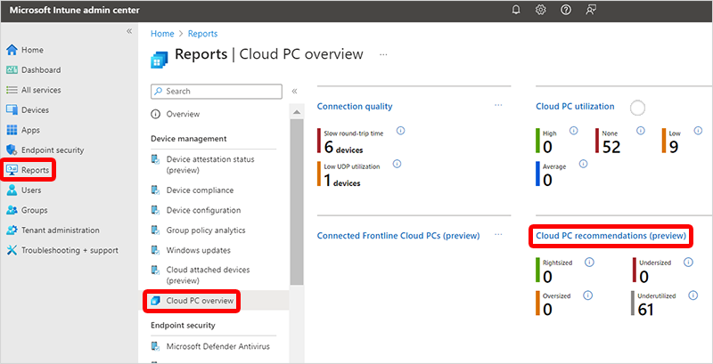

---
# required metadata
title: Cloud PC recommendations report for Windows 365
titleSuffix:
description: Learn about the Cloud PC recommendations report in for Windows 365 Cloud PCs.
keywords:
author: ErikjeMS  
ms.author: erikje
manager: dougeby
ms.date: 03/27/2024
ms.topic: overview
ms.service: windows-365
ms.subservice: windows-365-enterprise
ms.localizationpriority: high
ms.assetid: 

# optional metadata

#ROBOTS:
#audience:

ms.reviewer: benmurphy
ms.suite: ems
search.appverid: MET150
#ms.tgt_pltfrm:
ms.custom: intune-azure;
ms.collection:
- M365-identity-device-management
- tier2
---

# Cloud PC recommendations report

The **Cloud PC recommendations** report is an AI-powered feature that helps Windows 365 administrators determine the correct size for Cloud PCs. It's designed to help you find the optimal configuration for Cloud PCs based on:

- End user Cloud PC usage patterns.
- Platform level resource utilization data.
- Performance needs.

An evolving model analyzes this data to determine whether Cloud PCs are:

- Under-used.
- Sized appropriately.

The Cloud PC recommendations report is in [public preview](..\public-preview.md).

## Use the Cloud PC recommendations report

To get to the **Cloud PC recommendations** report, sign in to [Microsoft Intune admin center](https://go.microsoft.com/fwlink/?linkid=2109431), select **Reports** > **Cloud PC Overview** > **Cloud PC recommendations (preview)**.

## Overview tab

The Overview tab starts with various Cloud PC insights.

- **Rightsized**: Cloud PCs used frequently and sized appropriately for the workload that end users are putting on them.
- **Undersized**: Cloud PCs underpowered for the workload they’re supporting. Users might be having a poor experience. To improve results, increase the device’s resources by resizing to a larger SKU.
- **Oversized**: Cloud PCs overpowered for the workload they’re supporting. The same quality of experience can be delivered to users with fewer resources. To free up resources, resize them to a smaller SKU.
- **Underutilized**: Cloud PCs used rarely or not at all. They might not be needed. Any Cloud PC with less than 40 hours of active connected time over a 28 day period falls into this category.

## Insights by device tab

Recommendations for specific Cloud PCs are shown on this tab. Only Cloud PCs with some level of user utilization have details on the CPU and RAM used. Select a Cloud PC to see more information and an explanation of the recommendation.

The report shows the following columns:

- **Device name**
- **User name**
- **Insight**: Rightsized, Undersized, Oversized, or Underutilized.
- **Current size**
- **Recommended size**: The recommended size to change the Cloud PC's categorization to Rightsized.
- **Total time connected (last 4 weeks)**

## Insights by model

A summary of recommendations by the type of Cloud PC. The report shows the **PC type** and the number of Cloud PCs in each category. PC types that have many Cloud PCs in non-Rightsized columns might indicate the type isn't a good fit for your workloads.

<!-- ########################## -->
## Next steps

[Remoting connection report](report-remoting-connection.md)
