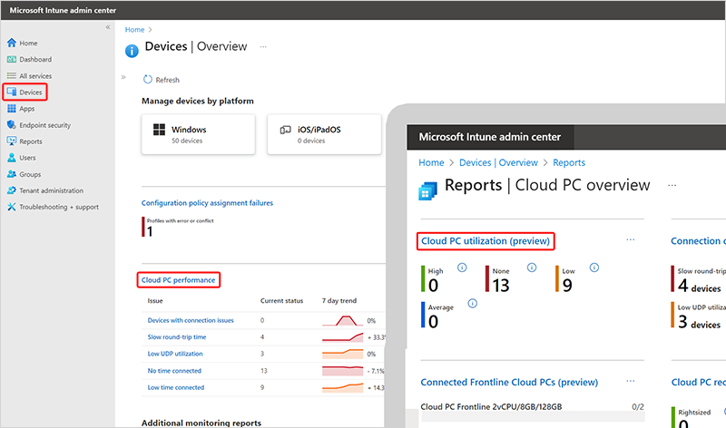

---
# required metadata
title: Cloud PC utilization report for Windows 365
titleSuffix:
description: Learn about the Cloud PC utilization report in Endpoint analytics for Windows 365 Cloud PCs.
keywords:
author: ErikjeMS  
ms.author: erikje
manager: dougeby
ms.date: 08/16/2022
ms.topic: overview
ms.service: cloudpc
ms.subservice:
ms.localizationpriority: high
ms.technology:
ms.assetid: 

# optional metadata

#ROBOTS:
#audience:

ms.reviewer: mattsha
ms.suite: ems
search.appverid: MET150
#ms.tgt_pltfrm:
ms.custom: intune-azure;
ms.collection: M365-identity-device-management
---

# Cloud PC utilization report

The Cloud PC utilization report helps you make sure that your licenses are assigned to active users. By reviewing Cloud PCs with low usage, you can decide if a Windows 365 license would better serve other users who might use these resources more often.

## Use the Cloud PC utilization report

To get to the **Cloud PC utilization** report, sign in to [Microsoft Endpoint Manager admin center](https://go.microsoft.com/fwlink/?linkid=2109431), select **Devices** > **Cloud PC performance** > **View report** (under **Cloud PCs with low utilization**).

The report shows:

- Aggregated data over the last 28 days: This histogram shows user connection time in three sections:
    - **High time connected**: More than 80 hours.
    - **Average time connected**: 40-80 hours.
    - **Low time connected**: Less than 40 hours.
- List of individual Cloud PCs with the following columns:
    - **Device name**
    - **Primary user UPN**
    - **Total time connected**: The total hours that the user has been connected to the Cloud PC over the last 28 days.
    - **Days since last sign in**

You can use the filter to see only data for a specific usage group.

<!-- ########################## -->
## Next steps

[Remoting connection report](report-remoting-connection.md)
