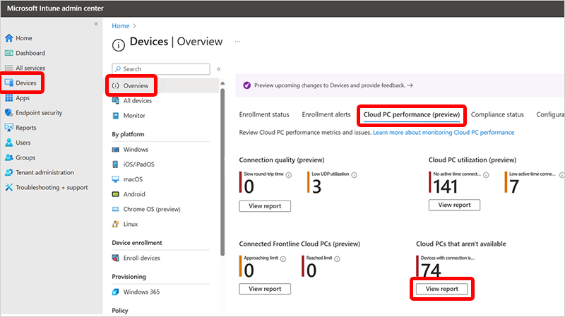

---
# required metadata
title: Cloud PCs that aren't available report for Windows 365
titleSuffix:
description: Learn about the Cloud PCs that aren't available report for Windows 365 Cloud PCs.
keywords:
author: ErikjeMS  
ms.author: erikje
manager: dougeby
ms.date: 10/18/2024
ms.topic: overview
ms.service: windows-365
ms.subservice: windows-365-enterprise
ms.localizationpriority: high
ms.assetid: 

# optional metadata

#ROBOTS:
#audience:

ms.reviewer: docoombs
ms.suite: ems
search.appverid: MET150
#ms.tgt_pltfrm:
ms.custom: intune-azure;
ms.collection:
- M365-identity-device-management
- tier2
---

# Cloud PCs that aren't available report

The **Cloud PCs that aren't available** helps Windows 365 administrators identify Cloud PCs that might be currently unavailable.

This report displays recent conditions up to 5 to 15 minutes ago. Therefore, Cloud PCs in the report might have already recovered since the condition was recorded. Also, Cloud PCs that recently became unavailable might not be in the report.

## Use the Cloud PCs that aren't available report

To get to the **Cloud PCs that aren't available** report, sign in to [Microsoft Intune admin center](https://go.microsoft.com/fwlink/?linkid=2109431), select **Reports** > **Cloud PC overview** > **Cloud PCs that aren't available**.

The device list shows the individual Cloud PCs with the following columns:

- **Device name**
- **User name**
- **Host health**: Most recent Cloud PC Host Health check error, if any.
- **Connection error**: Most recent connection error, if any.
- **System status**: Current system status for the Cloud PC.
- **Region**: Azure region where the Cloud PC resides.
- **Device status**: Current status of the Cloud PC.
- **Last event**: Date and time of the most recent event suggesting that the Cloud PC isn't available.
- **Issue details**: Details about the event.

The lack of data in a column indicates that there's nothing to report for that area. That area is probably not the root cause of the unavailability.

You can use the **Columns** and **Add filter** options to customize the report:

- Choose which columns are displayed.
- Filter the range for each column.

You can use the **View details** link to see the recent history of the Cloud PC. You can then cross-reference multiple conditions and timelines to find potential root causes of Cloud PC unavailability.

By using the various columns together, an experienced admin may draw clues to the state of the device and the underlying cause of any problems. For example, a user complains to your help desk that they can't access their Cloud PC. you check this report and see no data in the **Host health** or **System status** columns, the **Device status** is **Provisioned**, and the **Connection error** says **Client Disconnect**. Other Cloud PCs in the same region aren't in the list. This issue is probably specific to this user, possibly something to do with the physical client configuration, network configuration, or network infrastructure.

<!-- ########################## -->
## Next steps

[Remoting connection report](report-remoting-connection.md)
