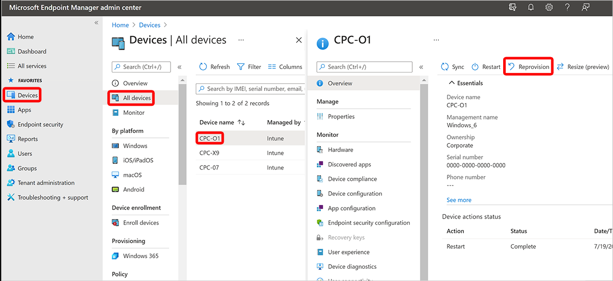

---
# required metadata
title: Reprovision a Cloud PC
titleSuffix:
description: Learn how to Reprovision a Cloud PC by using Microsoft Intune.
keywords:
author: ErikjeMS  
ms.author: erikje
manager: dougeby
ms.date: 07/25/2024
ms.topic: overview
ms.service: windows-365
ms.subservice: windows-365-enterprise
ms.localizationpriority: high
ms.assetid: 

# optional metadata

#ROBOTS:
#audience:

ms.reviewer: abpineda
ms.suite: ems
search.appverid: MET150
#ms.tgt_pltfrm:
ms.custom: intune-azure; get-started
ms.collection:
- M365-identity-device-management
- tier2
---

# Reprovision a Cloud PC

The **Reprovision** remote action deletes a user's current Cloud PC and creates a brand new Cloud PC for the same user.

When the **Reprovision** remote action starts, the user is signed off. The original Cloud PC is deleted, including all user data, applications, customizations, and so on.

To **Reprovision** a Cloud PC, it must have a status of **Failed** or **Provisioned** in the Windows 365 provisioning node.

For information on when to use the **Reprovision** action, see [Reprovisioning](provisioning.md#reprovisioning).

[!INCLUDE [Reprovision a Frontline shared Cloud PC](../includes/reprovision-frontline-shared-cloud-pc.md)]

## Reprovision a Cloud PC 

1. Sign in to the [Microsoft Intune admin center](https://go.microsoft.com/fwlink/?linkid=2109431), select **Devices** > **All Devices** > choose a Cloud PC device > **Reprovision**.

2. In the **Reprovision** box, select **Yes**. The reprovision process will begin.
3. After the new Cloud PC is created, Windows 365 sends access information to the new user.

<!-- ########################## -->
## Next steps

For more information, see [Provisioning](provisioning.md).
