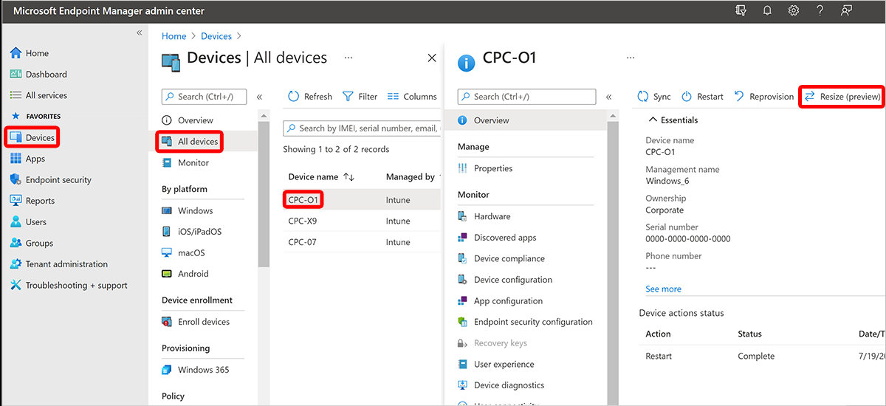

---
# required metadata
title: Resize a Cloud PC (preview) 
titleSuffix:
description: Learn how to resize a Cloud PC by using Microsoft Endpoint Manager.
keywords:
author: ErikjeMS  
ms.author: erikje
manager: dougeby
ms.date: 06/01/2022
ms.topic: overview
ms.service: cloudpc
ms.subservice:
ms.localizationpriority: high
ms.technology:
ms.assetid: 

# optional metadata

#ROBOTS:
#audience:

ms.reviewer: abpineda
ms.suite: ems
search.appverid: MET150
#ms.tgt_pltfrm:
ms.custom: intune-azure; get-started
ms.collection: M365-identity-device-management
---

# Resize a Cloud PC (preview)

The **Resize** remote action lets you upgrade a Windows 365 Enterprise Cloud PC’s RAM, CPU, and storage size to meet the user’s needs. Resizing is important for users that need:

- More powerful Cloud PCs to run CPU intensive applications.
- More disk space for file storing.

## Requirements

To resize a Cloud PC, the admin must have any of the following built in Azure Active Directory (Azure AD) roles:

- Global Admin
- Intune Service Admin

Alternatively, you can assign a custom role that includes the permissions of the built-in roles above.

To **Resize** a Cloud PC, it must have a status of **Provisioned** in the Windows 365 provisioning node

The **Resize** remote action is supported for paid, preview, and trial licenses.

Resizing isn’t supported for:

- Cloud PCs provisioned through group-based licenses.
- Cloud PCs that are Azure AD joined.

## Resize a Cloud PC

1. Contact your end users and have them save their work and sign out. Resizing automatically disconnects the user from their session and any unsaved work might be lost. Therefore, it's best to coordinate any resizing with the user before you begin.
2. Sign in to the [Microsoft Endpoint Manager admin center](https://go.microsoft.com/fwlink/?linkid=2109431), select **Devices** > **All Devices** > choose a device > **Resize**.

3. You’ll see a list with all the possible SKUs that you can upgrade to. You can only increase a Cloud PC’s storage and specifications. Options with lower storage or specifications are grayed out. Select one of the available options.
4. Select **Resize**.
    - When triggering a resize, the Cloud PC will be rebooted and the user will be immediately disconnected from their current session. Make sure the user saves all their work to avoid any potential data loss.
    - If there are available licenses, the upgrade will take place.
    - If you have a combination of paid and trial licenses, the resize feature will use your paid licenses first. After these licenses run out, the resize operation will use your trial licenses.
    - If there are no licenses in your inventory, the resizing will fail. You can contact your procurement admin to request more licenses. After the license has been purchased and added to the inventory in the Microsoft Admin Center, you can retry the resize operation.

<!-- ########################## -->
## Next steps

For more information on Cloud PC sizes, see [Cloud PC size recommendations](cloud-pc-size-recommendations.md).
