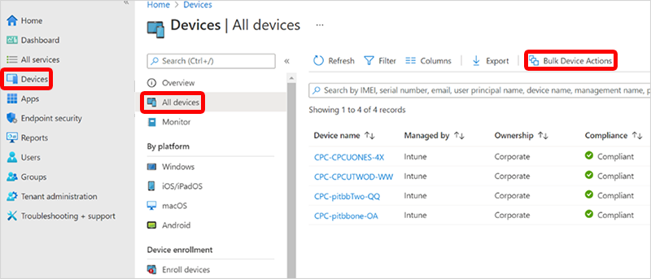
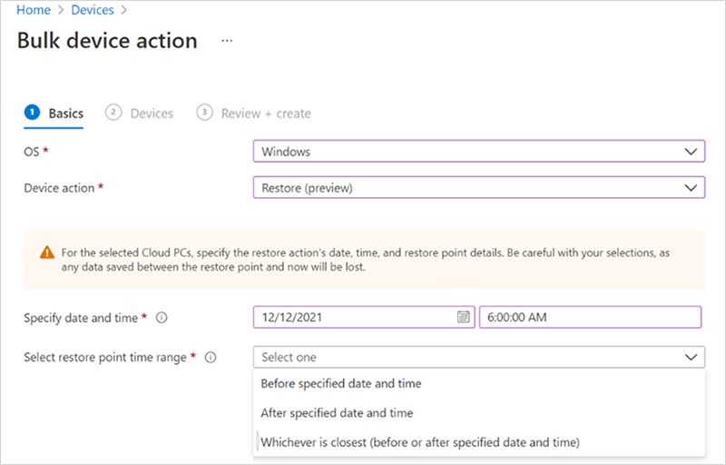
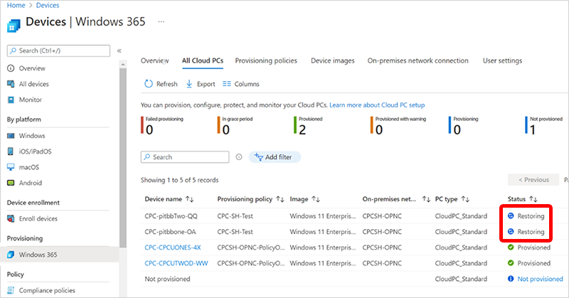
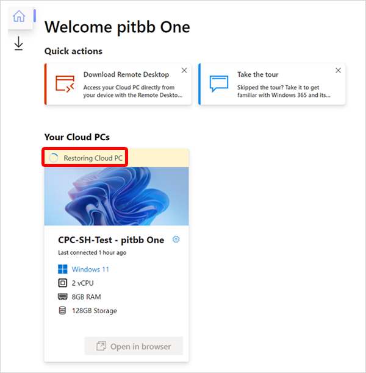

---
# required metadata
title: Restore multiple Cloud PCs in bulk
titleSuffix:
description: Learn how to restore multiple Cloud PCs using the Microsoft Endpoint Manager admin center.
keywords:
author: ErikjeMS 
ms.author: erikje
manager: dougeby
ms.date: 03/02/2022
ms.topic: conceptual
ms.service: cloudpc
ms.subservice:
ms.localizationpriority: high
ms.technology:
ms.assetid: 

# optional metadata

#ROBOTS:
#audience:

ms.reviewer: docoombs
ms.suite: ems
search.appverid: MET150
#ms.tgt_pltfrm:
ms.custom: 
ms.collection: M365-identity-device-management
---

# Restore multiple Cloud PCs in bulk

You can use the Microsoft Endpoint Manager admin center to bulk restore multiple Cloud PCs.

1. Sign in to the [Microsoft Endpoint Manager admin center](https://go.microsoft.com/fwlink/?linkid=2109431) > **Devices** > **All devices** > **Bulk Device Actions**.

2. On the **Basics** page, select the following options:
    1. **OS**: Windows
    2. **Device action**: Restore (preview)
    3. **Specify date and time**: Choose a date and time. This setting defines the time that you’d like to restore the Cloud PCs to. The following options will help determine exactly which restore point that will be used.
    4. **Select restore point time range**: Choose one of the following options:
        - **Before specified date and time**: If you choose this option, the Cloud PCs will be restored to the closest restore point before the date and time you specified.
        - **After specified date and time**: If you choose this option, the Cloud PCs will be restored to the closest restore point after the date and time you specified.
        - **Whichever is closest (before or after specified date and time)**: If you choose this option, the Cloud PCs will be restored to the closest restore point to the date and time you specified.
    
3. Select **Next**.
4. On the **Devices** page, select the Cloud PCs that you want to restore > **Next**.
5. On the **Review + create** page, confirm your choices > **Create**.

On the **All Cloud PCs** page, the status of each device will change to **Restoring** until each is complete.

On each user’s windows365.microsoft.com page, their Cloud PC will show as restoring until it’s complete.

<!-- ########################## -->
## Next steps

- [Restore a single Cloud PC](restore-single-cloud-pc.md)
