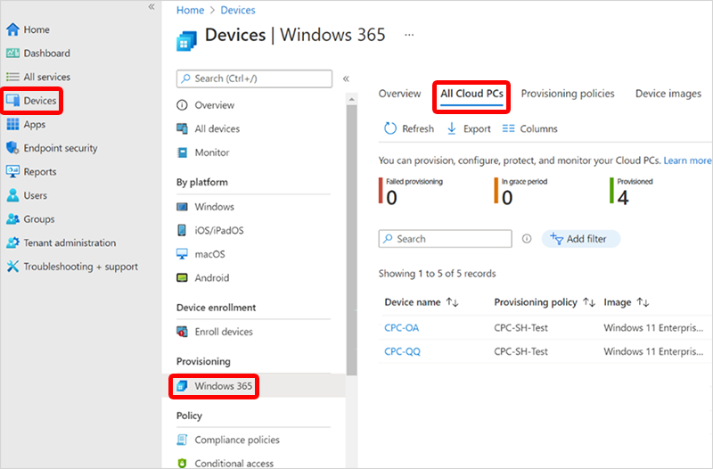
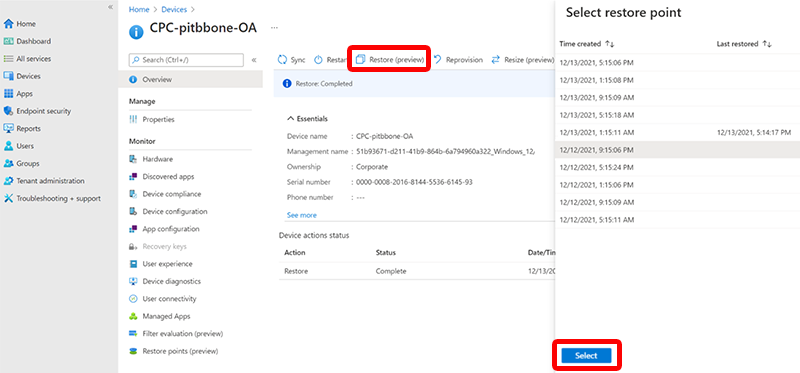
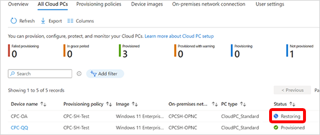

---
# required metadata
title: Restore a single Cloud PC to a previous state
titleSuffix:
description: Learn how to restore a single Cloud PC to a previous state using the Microsoft Intune admin center.
keywords:
author: ErikjeMS 
ms.author: erikje
manager: dougeby
ms.date: 07/25/2024
ms.topic: conceptual
ms.service: windows-365
ms.subservice: windows-365-enterprise
ms.localizationpriority: high
ms.assetid: 

# optional metadata

#ROBOTS:
#audience:

ms.reviewer: docoombs
ms.suite: ems
search.appverid: MET150
#ms.tgt_pltfrm:
ms.custom: 
ms.collection:
- M365-identity-device-management
- tier2
---

# Restore a single Cloud PC to a previous state

You can use the Microsoft Intune admin center to restore a Cloud PC to a previous state.

1. Sign in to the [Microsoft Intune admin center](https://go.microsoft.com/fwlink/?linkid=2109431) > **Devices** > **Windows 365** > **All Cloud PCs** > choose the Cloud PC to restore.

2. Select **Restore** > under **Select restore point**, select the point that you want to restore the Cloud PC to > **Select**.

3. In the confirmation dialog box, select **Restore**.

On the **All Cloud PCs** page, the status of the device will change to **Restoring** until it’s complete.

On the user’s windows365.microsoft.com page, the Cloud PC will show as restoring until it’s complete.

<!-- ########################## -->
## Next steps

- [Bulk restore multiple Cloud PCs](restore-bulk.md)
