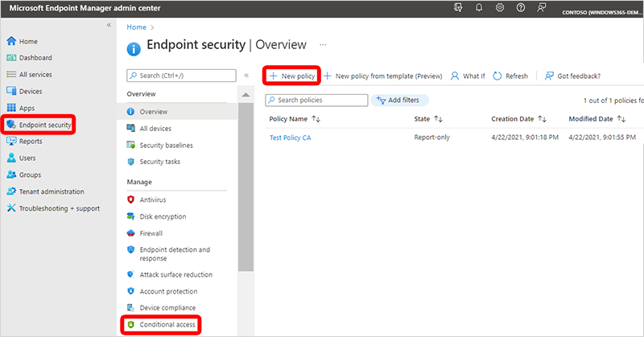
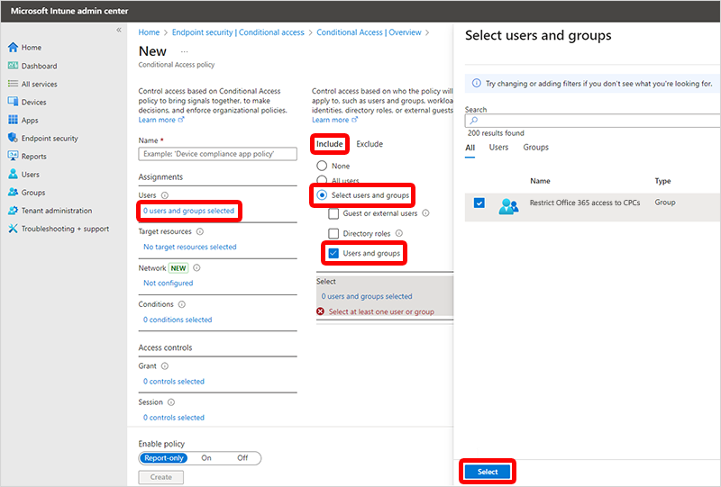
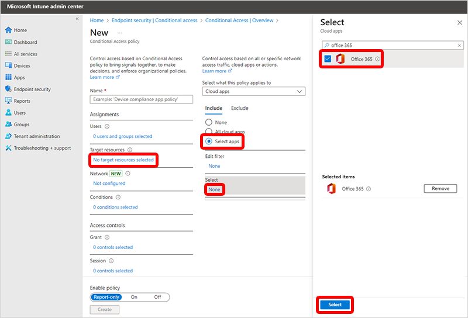
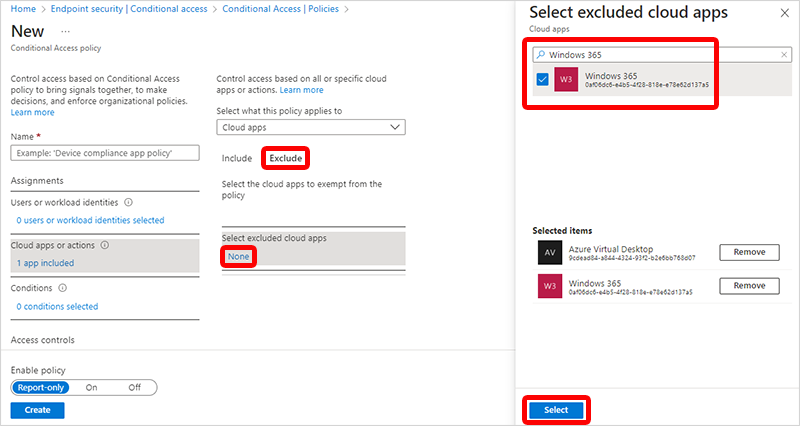
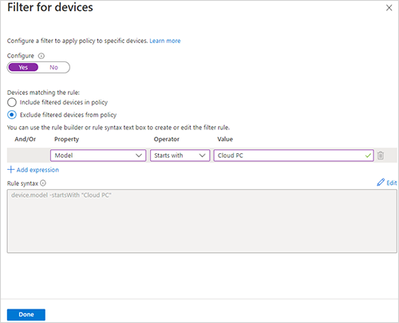
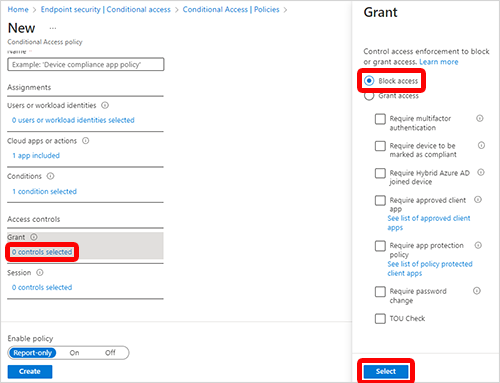

---
# required metadata
title: Restrict Office 365 services to Cloud PCs
titleSuffix:
description: Learn how to restrict Office 365 services to Cloud PCs with Windows 365
keywords:
author: ErikjeMS  
ms.author: erikje
manager: dougeby
ms.date: 08/23/2021
ms.topic: how-to
ms.service: windows-365
ms.subservice:
ms.localizationpriority: high
ms.technology:
ms.assetid: 

# optional metadata

#ROBOTS:
#audience:

ms.reviewer: ranandag
ms.suite: ems
search.appverid: MET150
#ms.tgt_pltfrm:
ms.custom: intune-azure; get-started
ms.collection:
- M365-identity-device-management
- tier2
---

# Restrict Office 365 services to Cloud PCs

Administrators can deny access to Office 365 services on any device other than a Cloud PC. To do so, you can configure Azure Active Directory (Azure AD) Conditional Access policies and [device filters](/azure/active-directory/conditional-access/concept-condition-filters-for-devices) as described in this article. By following these steps, you can make sure that users use their Cloud PCs as their primary device. In this way, you can improve security for your corporate resources and services.

This article describes how to limit access to Office 365 services. You can use the same strategy with any cloud service that uses Azure Active Directory as the authentication source.

1. Create an Azure AD security group to manage which users are controlled by the new policy. Add to this group all the Cloud PC users who will be subjected to the new policy. Only users in this group will be restricted to using Cloud PCs when accessing Office 365 services. If you want to change a user’s access, you can just remove them from this group.
2. Sign in to [Microsoft Endpoint Manager admin center](https://go.microsoft.com/fwlink/?linkid=2109431), select **Endpoint security** > **Conditional Access** > **New Policy**.
    
3. Type a **Name** for your new Conditional Access policy. For example, “Restrict Office 365 access to CPCs”.
4. Select **0 users or workload identities selected** > **Include** > **Select users and groups** > **Users and groups** > select the Azure AD security group that you created > **Select**.
    
5. Select **No cloud apps, actions, or authentication contexts selected** > **Include** > **Select apps** > search for and select **Office 365** > **Select**.
    
6. Select **Exclude** > **None** (under **Select excluded cloud apps**) > search for and select **Azure Virtual Desktop** and **Windows 365** apps > **Select**.
    
7. Select **0 conditions selected** > **Not configured** (under **Filter for devices**).
    
8. In the **Filter for devices** pane:
    1. Set **Configure** to **Yes**.
    2. Select **Exclude filtered devices from policy**.
    3. Select the dropdown option under **Property** > **Model**.
    4. Select the dropdown option under **Operator** > **Starts with**.
    5. In the text box under **Value**, type the value as **Cloud PC**. If the Cloud PC naming conventions change, change the filter value to match the device names.
    6. Select **Done** to set the filter.

   

    You can set more options in this policy as needed, but such additions are outside the scope of this article.
9. Select **0 controls selected** (under *Grant** > **Block Access** >**Select**.
    
10. Select **On** (under **Enable policy**). This policy will restrict users from accessing Office 365 services on non-Cloud PC devices. You may want to select **Report-only** to monitor the policy and build confidence prior to enforcing it.
11. Select **Create** to complete the creation of policy.

>[!NOTE]
>If you have configured a provisioning policy to **Use single sign-on (preview)**, you may need to also add the **Microsoft Remote Desktop** to the exclude list in Step 6 for single sign-on connections to work as expected.

## Other devices

This sample policy can be extended to meet other use cases, like also permitting access to Office 365 services from users' mobile and tablet devices. To do so, make the following changes to the policy:

1. Select **Device Platforms**.
2. Select **Yes** to turn on the configuration option.
3. Select **Include** > **Any device**.
4. Select **Exclude** > **Android** and **iOS**.
5. Select **Done** to set the filter.

<!-- ########################## -->
## Next steps

[Learn more about Conditional Access](/en-us/azure/active-directory/conditional-access/overview).
