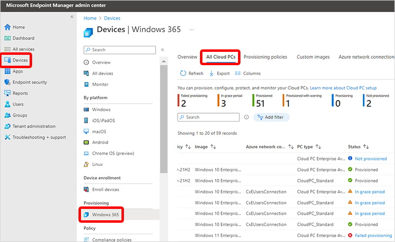
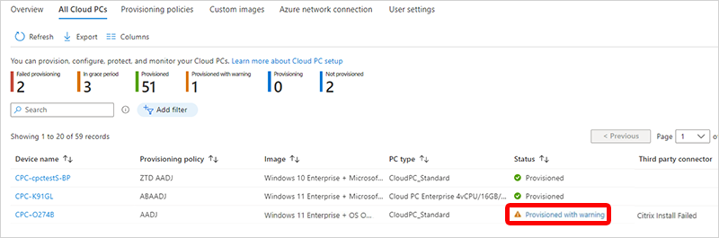
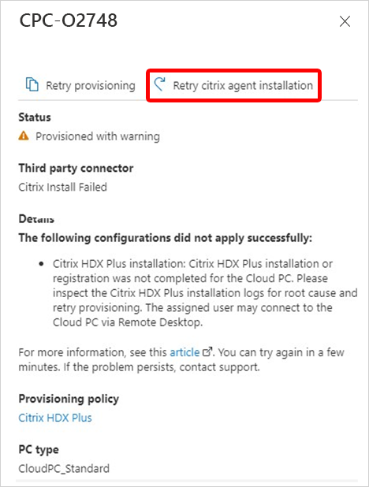

---
# required metadata
title: Retry Citrix agent installation in Windows 365 Enterprise
titleSuffix:
description: Learn about retrying the installation of the Citrix agent for a Cloud PC.
keywords:
author: ErikjeMS  
ms.author: erikje
manager: dougeby
ms.date: 12/15/2022
ms.topic: overview
ms.service: windows-365
ms.subservice:
ms.localizationpriority: high
ms.technology:
ms.assetid: 

# optional metadata

#ROBOTS:
#audience:

ms.reviewer: aradinger    
ms.suite: ems
search.appverid: MET150
#ms.tgt_pltfrm:
ms.custom: intune-azure; get-started
ms.collection:
- M365-identity-device-management
- tier2
---

# Retry Citrix agent installation

If provisioning for a Citrix HDX Plus Cloud PC succeeds, but the Citrix agent installation fails, you can retry installing the Citrix agent. You don't need to reprovision the Cloud PC.

To retry the Citrix agent installation, follow these steps:

1. Sign in to the [Microsoft Endpoint Manager admin center](https://go.microsoft.com/fwlink/?linkid=2109431).
2. Select **Devices** > **Windows 365** > **All Cloud PCs**.

3. Make sure that the **Third party connector** column is displayed. You can add this column by selecting **Columns** > **Third party connector**.
4. In the **Third party connector** column, locate a row that says **Citrix install failed**.
5. Select the warning (like **Provisioned with warning**) in the **Status** column.

6. In the new pane, select **Retry Citrix agent installation**. Because the Cloud PC was successfully provisioned, you don't need to retry provisioning.

   

For more information about Citrix, see [Set up Citrix HDX Plus for Windows 365 Enterprise](set-up-citrix.md).
