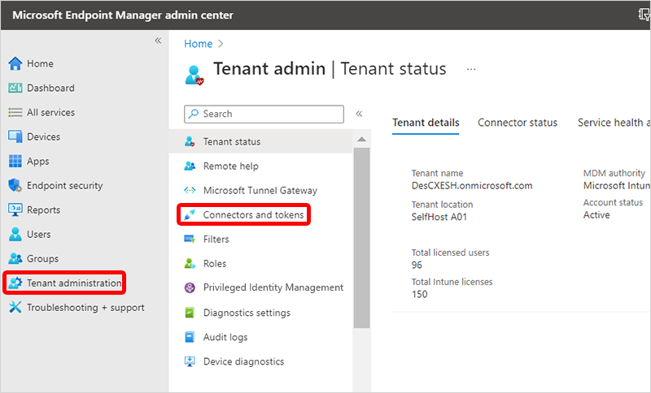
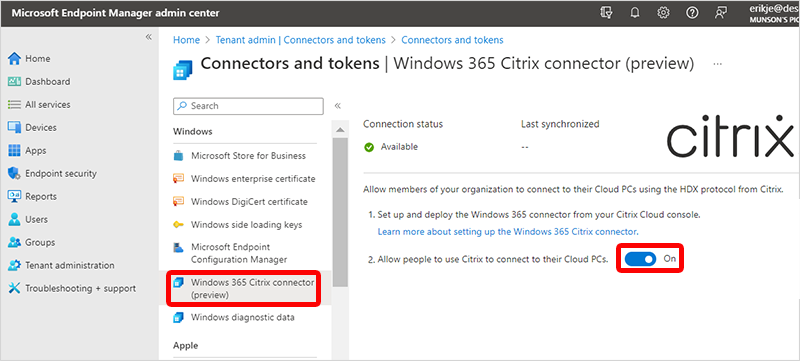

---
# required metadata
title: Set up Citrix HDX Plus for Windows 365 Enterprise
titleSuffix:
description: Learn about using Citrix HDX Plus with Windows 365 Enterprise.
keywords:
author: ErikjeMS  
ms.author: erikje
manager: dougeby
ms.date: 10/12/2022
ms.topic: overview
ms.service: windows-365
ms.subservice:
ms.localizationpriority: high
ms.technology:
ms.assetid: 

# optional metadata

#ROBOTS:
#audience:

ms.reviewer: aradinger    
ms.suite: ems
search.appverid: MET150
#ms.tgt_pltfrm:
ms.custom: intune-azure; get-started
ms.collection:
- M365-identity-device-management
- tier2
---

# Set up Citrix HDX Plus for Windows 365 Enterprise

Citrix HDX Plus for Windows 365 lets you integrate Citrix Cloud with Windows 365. This integration gives you access to Citrix HDX technologies for enhanced Cloud PC security and manageability.

## Set up overview

To set up Citrix HDX Plus for Windows 365 Enterprise, follow these steps. The first two steps are explained here at learn.microsoft.com. The remaining steps are explained on the citrix.com web site.

1. [Fulfill requirements](requirements-citrix.md).
2. [Turn on the Citrix connector in Intune](#turn-on-the-windows-365-citrix-connector-in-intune).
3. [Connect Azure Active Directory to Citrix Cloud](https://docs.citrix.com/en-us/citrix-hdxplus-w365).
4. [Configure Citrix Workspace](https://docs.citrix.com/en-us/citrix-hdxplus-w365).
5. [Connect Windows 365 to Citrix Cloud](https://docs.citrix.com/en-us/citrix-hdxplus-w365).
6. [Assign Citrix licenses to users](https://docs.citrix.com/en-us/citrix-hdxplus-w365).
7. [Provision Cloud PCs](https://docs.citrix.com/en-us/citrix-hdxplus-w365).

### Turn on the Windows 365 Citrix connector in Intune

To turn on the Citrix connector, follow these steps:

1. As a Global administrator, sign in to [Microsoft Intune admin center](https://go.microsoft.com/fwlink/?linkid=2109431), select **Tenant administration** > **Connectors and tokens**.

2. Select **Windows 365 Citrix connector** > next to **Allow people to use Citrix to connect to their Cloud PCs**, set the toggle to **On**.

<!-- ########################## -->
## Next steps

Proceed to the Citrix Cloud to complete the integration. For more information about Citrix HDX Plus set up in Citrix Cloud, see [https://docs.citrix.com/en-us/citrix-hdxplus-w365](https://docs.citrix.com/en-us/citrix-hdxplus-w365).
