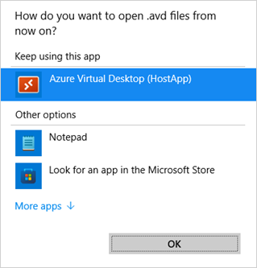

---
# required metadata
title: Troubleshoot the Windows 365  app.
titleSuffix:
description: Troubleshoot the Windows 365 app.
keywords:
author: ErikjeMS
ms.author: erikje
manager: dougeby
ms.date: 03/28/2024
ms.topic: how-to
ms.service: windows-365
ms.subservice: windows-365-enterprise
ms.localizationpriority: high
ms.assetid: 

# optional metadata

#ROBOTS:
#audience:

ms.reviewer: chbrinkhoff
ms.suite: ems
search.appverid: MET150
#ms.tgt_pltfrm:
ms.custom: intune-azure; get-started
ms.collection:
- M365-identity-device-management
- tier2
---

# Troubleshoot the Windows 365 app

This article describes issues with the Windows 365 app for Windows client and how to fix them.

## Limitations

The Windows 365 app doesn't currently support:

- Windows 11 IoT
- Configuring Remote Desktop Protocol properties.

## Can't connect to Cloud PC error

You may get a **Can't connect to Cloud PC** error when you click on the **Connect** button.

To fix this issue:

1. Open Windows **Settings** > **Apps** > **Default apps**.
2. Find the **AVD host app** and update the default app for .avd files.
3. Run this command to remove the old Remote Desktop Client cache that could cause this issue:

```reg delete "HKEY_CLASSES_ROOT\progF3672D4C2FFE4422A53C78C345774E2D" /f```

## The Windows 365 app asks to select a new default app 

When the Remote Desktop Client is installed, you'll see a file type association message after trying to connect to your Cloud PC. Make sure to select **Azure Virtual Desktop (HostApp)** to launch the Cloud PC session.



## Change Cloud PC session from full screen to window mode  

The Windows 365 app supports windowed mode to work more efficiently side-by-side with your local PC. To activate window mode, click on the window mode button in the connection bar.  

## Windows 365 app doesn't show any Cloud PCs

You might be signed in as the wrong user. You must be signed in with an account that is enrolled with the Microsoft Entra account that has Cloud PCs provisioned. Make sure that you sign in the Windows 365 app with the right user account.

<!-- ########################## -->
## Next steps

[Learn more about Windows 365 App](https://support.microsoft.com/topic/cbb0d4d5-69d4-4f00-b050-6dc7a02d02d0).
