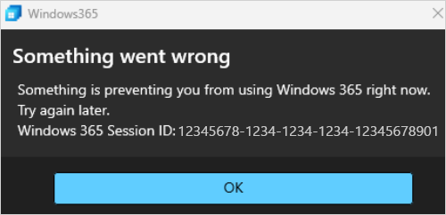
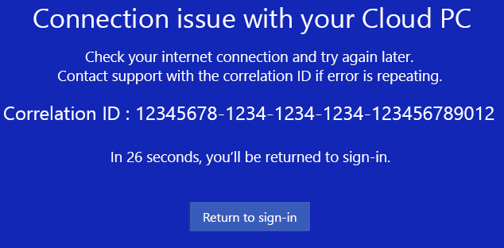

---
# required metadata
title: Troubleshoot Windows 365 Boot
titleSuffix:
description: Troubleshoot Windows 365 Boot.
keywords:
author: ErikjeMS  
ms.author: erikje
manager: dougeby
ms.date: 09/26/2024
ms.topic: troubleshooting
ms.service: windows-365
ms.subservice: windows-365-enterprise
ms.localizationpriority: high
ms.assetid: 

# optional metadata

#ROBOTS:
#audience:

ms.reviewer: elluthra
ms.suite: ems
search.appverid: MET150
#ms.tgt_pltfrm:
ms.custom: intune-azure; get-started
ms.collection:
- M365-identity-device-management
- tier2
---

# Troubleshoot Windows 365 Boot

If you encounter problems while setting up or managing Windows 365 Boot devices, check below to find out how to troubleshoot.

## User can't access the Cloud PC from the Windows 365 Boot physical device

If the user can't access the Cloud PC from the Windows 365 Boot physical device, try these troubleshooting steps:

1. Check to see if you can sign in to the Cloud PC from either:
    - The browser at windows365.microsoft.com.
    - The Windows App on another (non-Windows 365 Boot) device.
2. If a user has more than one Cloud PC, make sure they have selected a default Cloud PC to use each time they sign in. To set this default:
   - Navigate to https://windows365.microsoft.com.
   - In the card for the Cloud PC you want to set as default, select the ellipses (...) > Settings.
   - In the **Integrated experiences** tab, under **Boot to this Cloud PC**, select **Connect while signed into device**.
   - Select **Save**.
3. If you can sign into the Cloud PC from the app or web, and a default Cloud PC has been set, then there's an issue with the Windows 365 Boot physical device. In this case, confirm that the physical device is correctly configured and has the requisite software versions. For more information, see [Windows 365 Boot physical device requirements](windows-365-boot-physical-device-requirements.md).
4. Admins can try to manually click on **Device sync** to get the policies delivered faster on the device. Users can try to restart the device.


## Physical device registry key configuration

Confirm that the physical device has been correctly configured to run Windows 365 Boot. Make sure that the following registry keys are set:

| Registry key name | Registry value name | Registry value |
| --- | --- | --- |
| HKLM\Software\Microsoft\PolicyManager\current\device\CloudDesktop | BootToCloudMode | 1 |
| HKLM\Software\Microsoft\PolicyManager\current\device\WindowsLogon | OverrideShellProgram | 1 |
| HKLM\Software\Microsoft\Windows\CurrentVersion\SharedPC\NodeValues | 18 | 1 |
| HKLM\Software\Microsoft\Windows\CurrentVersion\SharedPC\NodeValues | 01 | 1 |

## Physical device's versions of Windows 365, Azure Virtual Desktop Apps, and Windows

Windows 365 Boot requires that the physical device runs specific versions of both Windows 365 and Azure Virtual Desktop (HostApp) apps. To see which versions are installed, run the following PowerShell command in Admin mode:

```azurepowershell
Get-AppxPackage –AllUsers -name *MicrosoftCorporationII*
```

This command shows all the Microsoft-maintained apps (like QuickAssist, Microsoft Family, and so on) on the physical device. In order for Windows 365 Boot to work correctly, confirm the following versions:

- Windows App version 1.1.162.0 or later.
- Azure Virtual Desktop (HostApp) app version 1.2.4159. or later.

Windows 365 Boot also requires the latest version of Windows 11.

## Remove Windows 365 Boot from the physical device

If you're unable to identify the source of the issue, you can try to removing and re-adding Windows 365 Boot from the physical device.

### Remove Windows 365 Boot from the physical device

1. Sign in to the [Microsoft Intune admin center](https://go.microsoft.com/fwlink/?linkid=2109431) > **Groups** > **All groups**.
2. Select the group for your Windows 365 boot devices > **Members**.
3. Select the physical device > **Remove** > **Yes**.
4. Select **Devices** > **All devices** > select the physical device > **Overview** > **Sync**.

It takes about 10 minuets for the removal to finalize. After that, the physical device will no longer be set up for Windows 365 Boot.

### Add Windows 365 Boot back onto the physical device

1. Sign in to the [Microsoft Intune admin center](https://go.microsoft.com/fwlink/?linkid=2109431) > **Groups** > **All groups**.
2. Select the group for your Windows 365 boot devices > **Members**.
3. Select **Add members** > select the physical device.
4. Wait about 10 minutes.
5. Select **Devices** > **All devices** > select the physical device > **Overview** > **Sync**.

The physical device will again be set up for Windows 365 Boot. Retest it to see if it's working.

## Contact Microsoft support

If you're still unable to troubleshoot the problem, you can contact Microsoft support. To help expedite a solution, collect logs and session IDs beforehand.

## Collect local logs

Windows 365 and Microsoft Entra ID log information is helpful to Microsoft support. Collect it beforehand from the following locations:

- C:\Users\\{username}\AppData\Local\Temp\DiagOutputDir\Windows365\Logs  
- C:\Users\\{username}\AppData\Local\Temp\DiagOutputDir\RdClientAutoTrace

Put these logs in a zip file and provide it to the Microsoft support team for further investigation.

## Windows 365 error and session IDs

When contacting Microsoft support about Windows 365 Boot issues, make sure to collect relevant IDs to help in the investigation.

On the physical device, get the CorrelationId, SessionID, or ActivityID.

### Session ID

You can find the Windows 365 Session ID in error dialog boxes. For example, the error dialog box that says **Something went wrong**.



### Correlation ID

You can find the Correlation ID in the interstitial screen displayed during a five-minute timeout.



<!-- ########################## -->
## Next steps

[Learn about Windows 365 Boot](windows-365-boot-overview.md).
