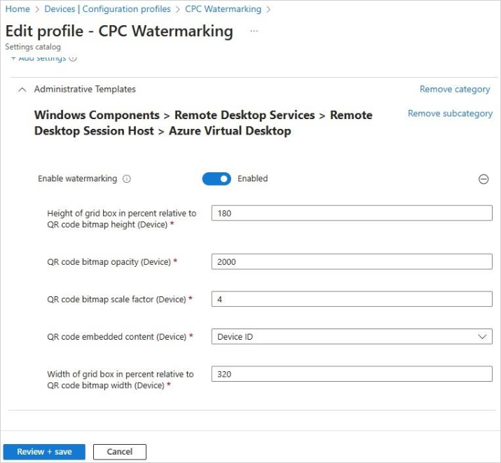

---
# required metadata
title: Watermarking in Windows 365
titleSuffix:
description: Learn watermarking your Cloud PCs in Windows 365.
keywords:
author: ErikjeMS  
ms.author: erikje
manager: dougeby
ms.date: 08/07/2024
ms.topic: how-to
ms.service: windows-365
ms.subservice: windows-365-enterprise
ms.localizationpriority: high
ms.assetid: 

# optional metadata

#ROBOTS:
#audience:

ms.reviewer: ryclark
ms.suite: ems
search.appverid: MET150
#ms.tgt_pltfrm:
ms.custom: 
ms.collection: 
---

# Watermarking in Windows 365

Watermarking, alongside screen capture protection, discourages sensitive information from being captured on client endpoints. When you enable watermarking, QR code watermarks appear as part of remote desktops. The QR code contains:

- The connection ID of a remote session that admins can use to trace the session.
- Cloud PC device ID.
- Timestamp.  

Watermarking is configured on session hosts and enforced by the Remote Desktop client.

>[!Important]
>- After watermarking is enabled on a session host, only clients that support watermarking can connect to that session host. If you try to connect from an unsupported client, the connection will fail and you'll get an error message that is not specific.
>- Watermarking is for remote desktops and Cloud PCs only. With RemoteApp, watermarking is not applied and the connection is allowed.
>- Watermarking and screen capture help deter unauthorized data leakage, assisting in maintaining data integrity. Unlike a security feature or an implementation of Digital Rights Management (DRM), there is no guarantee that using watermarking or screen capture protection will strictly protect windowed content, for example where someone takes a photograph of the screen.

## Requirements

To add watermarking to your Cloud PCs, you need:

- A Remote Desktop client that supports watermarking. The following clients currently support watermarking:

  - [Windows Desktop client](/azure/virtual-desktop/users/connect-windows), version 1.2.3317 or later, on Windows 10 and later.
  - [Web client](/azure/virtual-desktop/users/connect-windows).

## Enable watermarking for Cloud PCs

To turn on watermarking for Cloud PCs, follow these steps:

1. Follow the steps to make the [Administrative template for Azure Virtual Desktop](/azure/virtual-desktop/administrative-template?tabs=intune) available.

2. Verify that the administrative template is available.
3. Open the policy setting **Enable watermarking** and set it to **Enabled**.
4. You can configure the following options:

  | Option | Values | Description |
  |--|:--:|--|
  | Height of the grid box in percent relative to the QR code bitmap height (device) | 100 to 1000M (default=180) | The distance between the QR codes in percent. When combined with the width, a value of 100 would make the QR codes appear side-by-side and fill the entire screen. |
  | QR code bitmap opacity (device) | 100 to 9999 (default = 2000) | The opacity of the watermark. 100 is fully transparent and higher values grow increasingly opaque. |
  | QR code bitmap scale factor (device)| 1 to 10 (*default = 4*) | The size in pixels of each QR code dot. This value determines how many the number of squares per dot in the QR code. |
  | QR code bitmap opacity | 100 to 9999 (*default = 700*) | How transparent the watermark is, where 100 is fully transparent. |
  | QR code embedded content (device) | Connection ID and Device ID | Set this option to Device ID when configuring watermarks for Windows 365 Cloud PCs. The Device ID option is valid only for target  devices that are Microsoft Entra joined or Microsoft Entra hybrid joined.|
  | Width of grid box in percent relevant to QR code bitmap width | 100 to 1000 (*default = 320*) | The distance between the QR codes in percent. When combined with the height, a value of 100 would make the QR codes appear side-by-side and fill the entire screen. |
  | Width of the grid box in percent relevant to the QR code bitmap width (device) | 100 to 1000 (default = 180) | The distance between the QR codes in percent. When combined with the width, a value of 100 would make the QR codes appear side-by-side and fill the entire screen. |

  

   > [!TIP]
   > We recommend trying out different opacity values to find a balance between the readability of the remote session and being able to scan the QR code, but keeping the default values for the other parameters.

5. Connect to a remote session with a supported client, where you should see QR codes appear. Any existing sessions must sign out and back in again for the change to take effect.

## Find session information

After you enable watermarking, you can find more details from the session by following these steps:

1. Scan the QR code and make a note of the Device ID GUID.
2. Sign in to the [Microsoft Intune admin center](https://go.microsoft.com/fwlink/?linkid=2109431).
3. Select **Devices** > **All devices**.
4. In the search box, enter the Device ID GUID.

<!-- ########################## -->
## Next steps

[Learn about Security guidelines in Windows 365](security-guidelines.md).
